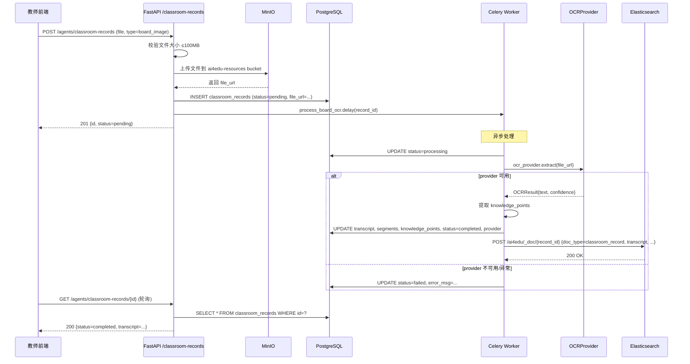
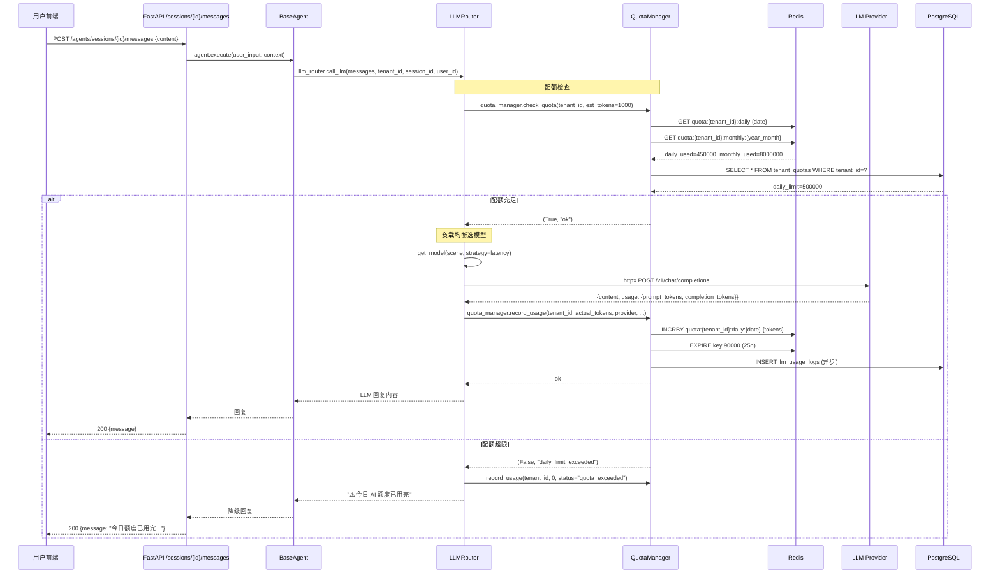
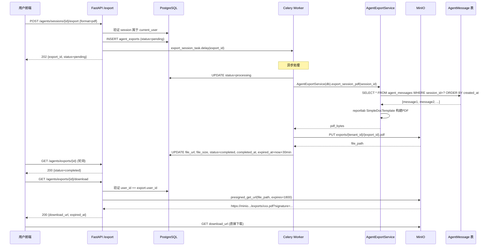
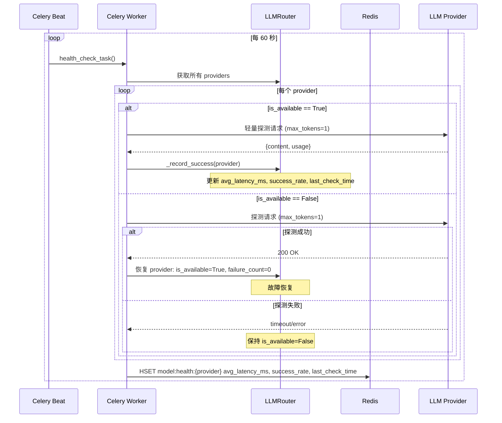
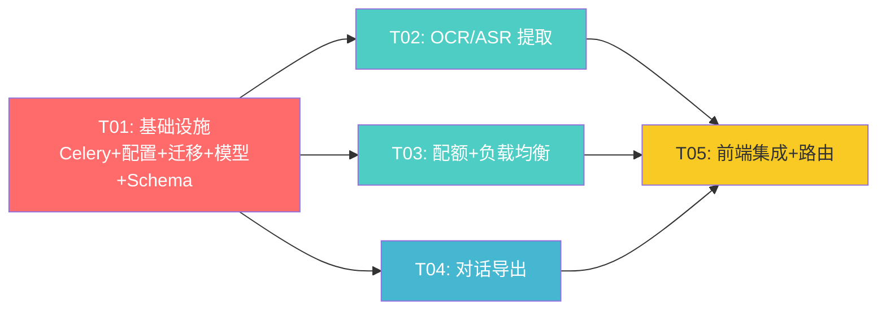

# AI 智能体中心 v2 — 系统架构设计文档

> **文档版本**: v2.0
> **架构师**: 高见远
> **日期**: 2025-01
> **基于**: `docs/prd-ai-agent-center-v2.md`（增量 PRD）
> **前置文档**: `docs/architecture-ai-agent-center.md`（v1 架构，P0 MVP 已实现）

---

## 1. 实现方案概述

本增量架构在 v1 P0 MVP 基础上新增 4 项能力，所有设计遵循 **复用现有基础设施**、**mock-first 渐进集成**、**最小侵入改动** 三大原则。

### 1.1 板书/录播 OCR/ASR 提取

| 维度 | 方案 |
|------|------|
| **核心挑战** | 多 OCR/ASR 厂商 API 差异大，需统一抽象；音视频文件大，需异步处理；提取结果需结构化并索引到 ES |
| **框架选择** | Celery + Redis broker（requirements.txt 已声明 `celery[redis]==5.4.0`，需创建 `celery_app.py`）；httpx 直调厂商 API（与现有 LLMRouter 模式一致） |
| **Provider 抽象** | `BaseOCRProvider` / `BaseASRProvider` 抽象基类，各厂商实现子类；`OCRProviderFactory` / `ASRProviderFactory` 工厂方法按优先级链 aliyun → tencent → mock 降级 |
| **文件上传** | 后端中转上传 MinIO（≤100MB），返回 resource_id；Celery 任务异步处理 |
| **ES 索引** | 提取完成后更新 `ai4edu` 索引，`doc_type=classroom_record`，支持全文检索 |
| **架构模式** | Strategy + Factory 模式，与现有 LLMRouter 多模型路由一致 |

### 1.2 多租户模型配额计量

| 维度 | 方案 |
|------|------|
| **核心挑战** | 高频 LLM 调用需实时计数，不能每次查库；多租户隔离；超限需平滑降级 |
| **计数方案** | Redis Hash 计数器：`quota:{tenant_id}:daily:{date}`（TTL 25h）、`quota:{tenant_id}:monthly:{year_month}`（TTL 35d）；每次调用 INCRBY，定时同步到 DB |
| **计量维度** | 以 **token 用量** 为主计量单位，请求次数为辅 |
| **集成点** | `LLMRouter.call_llm()` 内部，调用前 `check_quota()` → 调用后 `record_usage()`；超限走 `_demo_reply()` 降级 |
| **管理后台** | 复用现有 `/admin` 路由，新增 `/admin/quotas` 端点 + `QuotaDashboard.vue` 看板 |
| **降级策略** | 超限 → 返回配额不足提示 → 前端展示"今日额度已用完" + 降级回复 |

### 1.3 对话导出 PDF/Markdown

| 维度 | 方案 |
|------|------|
| **核心挑战** | 对话内容含 Markdown 格式、代码块、表格，PDF 需正确渲染；大对话导出需异步 |
| **PDF 生成** | reportlab（项目 `export_service.py` 已使用，复用其 Paragraph/ParagraphStyle 模式） |
| **Markdown 生成** | 纯字符串拼接，直接从 AgentMessage 表读取 |
| **异步处理** | Celery 任务 `export_session_task`，完成后上传 MinIO，生成预签名 URL（30min 有效） |
| **权限控制** | 仅会话创建者可下载，URL 30 分钟过期 |
| **存储** | MinIO bucket `ai4edu-exports`，路径 `exports/{tenant_id}/{export_id}.{ext}` |

### 1.4 模型负载均衡

| 维度 | 方案 |
|------|------|
| **核心挑战** | 多模型可用时需智能选择；故障自动剔除与恢复；教师可指定推荐模型 |
| **健康指标** | Redis Hash `model:health:{provider}` 存 latency_ms / success_rate / failure_count / last_check_time |
| **均衡策略** | `latency`（按平均延迟排序）、`weighted`（按成功率加权随机）、`sticky`（优先教师 recommended_model，默认关闭） |
| **健康检查** | Celery beat 每 60s 执行 `health_check_task`，轻量探测各 provider（1 token 请求） |
| **故障剔除** | failure_count ≥ `LLM_MAX_FAILURES`（现有配置）自动标记 `is_available=False`；健康检查成功后恢复 |
| **改造点** | `LLMRouter.get_model()` 增加策略选择逻辑；`ModelProvider` dataclass 增加健康指标字段 |
| **API** | `GET /agents/models/balancer` 返回各 provider 健康状态与当前策略 |

---

## 2. 关键设计决策

| # | 决策 | 理由 |
|---|------|------|
| D1 | OCR/ASR 采用 **mock-first** 策略 | 开发阶段无需真实 API Key，mock provider 返回模拟数据；生产环境自动按 aliyun → tencent → mock 降级 |
| D2 | Celery 使用 **Redis broker** | requirements.txt 已声明 `celery[redis]==5.4.0`；config.py 已有 `CELERY_BROKER_URL` / `CELERY_RESULT_BACKEND`；与 Redis 复用 |
| D3 | PDF 生成使用 **reportlab** | 项目 `export_service.py` 已使用 reportlab 生成笔记 PDF，复用现有 `SimpleDocTemplate` / `Paragraph` 模式 |
| D4 | 配额以 **token 用量** 为主计量 | token 是 LLM 成本的直接单位；请求次数为辅助指标 |
| D5 | `recommended_model` 为 **教师可选字段** | teacher_methods 表新增 `recommended_model` 列，教师可指定偏好模型；sticky 策略默认关闭，开启时优先使用 |
| D6 | 管理后台 **复用现有 admin 路由** | 前端 `admin-routes.ts` 已有 `/admin` 路由，新增 `quota` 子路由即可 |
| D7 | 数据库迁移使用 **Alembic** | 项目已有 2 个 revision，新建第 3 个迁移文件 |
| D8 | 文件上传采用 **后端中转**，限制 ≤100MB | 安全可控，前端直传 MinIO 需暴露密钥；100MB 覆盖板书图片和短视频 |
| D9 | 导出文件 **仅创建者可下载**，URL 30min 过期 | MinIO 预签名 URL，30 分钟有效期；下载接口校验 `user_id == export.user_id` |
| D10 | sticky 策略 **默认关闭** | 避免教师指定模型故障时无法自动切换；教师可通过配置开启 |

---

## 3. 文件列表

### 3.1 后端新增文件

```
backend/app/core/celery_app.py                          # Celery 应用实例 + beat 调度配置
backend/app/models/usage.py                             # LLMUsageLog + TenantQuota 模型
backend/app/models/export.py                            # AgentExport 模型
backend/app/schemas/quota.py                            # 配额相关 Pydantic Schema
backend/app/schemas/export.py                           # 导出相关 Pydantic Schema
backend/app/schemas/classroom.py                        # 课堂记录相关 Pydantic Schema
backend/app/services/ocr_service.py                     # OCR 多 provider 抽象层
backend/app/services/asr_service.py                     # ASR 多 provider 抽象层
backend/app/services/quota_manager.py                   # 配额管理器（Redis 计数）
backend/app/services/agent_export_service.py            # 对话导出服务（PDF/Markdown）
backend/app/tasks/__init__.py                           # Celery tasks 包初始化
backend/app/tasks/extraction_tasks.py                   # OCR/ASR 提取 Celery 任务
backend/app/tasks/export_tasks.py                       # 对话导出 Celery 任务
backend/app/tasks/health_check.py                       # 模型健康检查 Celery beat 任务
backend/app/api/v1/classroom.py                         # 课堂记录 API 端点
backend/app/api/v1/quota.py                             # 配额管理 API 端点
backend/app/api/v1/export.py                            # 导出 API 端点
backend/migrations/versions/c8e2a4f7b901_add_v2_models.py  # Alembic 迁移
```

### 3.2 后端修改文件

```
backend/app/config.py                    # 新增 OCR/ASR/Celery beat/负载均衡/导出配置项
backend/app/agents/llm_router.py         # 集成配额检查 + 负载均衡策略改造
backend/app/models/teacher_method.py     # classroom_records 加 error_msg/updated_at/file_url/provider；teacher_methods 加 recommended_model
backend/app/models/__init__.py           # 注册新模型
backend/app/schemas/agent.py             # 新增 ModelBalancerResponse Schema
backend/app/api/v1/router.py             # 注册新路由
backend/app/api/v1/agents.py             # 新增 /agents/models/balancer 端点
backend/requirements.txt                 # 显式添加 reportlab
```

### 3.3 前端新增文件

```
frontend/src/components/teacher/TeacherUploadDialog.vue  # 板书/录播上传对话框
frontend/src/components/agent/ExportDialog.vue            # 对话导出对话框
frontend/src/views/admin/QuotaDashboard.vue               # 配额管理看板
```

### 3.4 前端修改文件

```
frontend/src/services/agent.ts              # 新增 classroom-records/export/balancer API 方法
frontend/src/stores/agent.ts                # 新增导出/课堂记录相关 state 和 actions
frontend/src/router/routes/admin-routes.ts  # 新增 /admin/quota 路由
frontend/src/router/routes/teacher-routes.ts # 新增 /teacher/methods 路由
frontend/src/views/agent/AgentCenterView.vue # 集成导出按钮
```

---

## 4. 数据结构和接口设计

### 4.1 SQLAlchemy 模型

#### 4.1.1 修改：`ClassroomRecord`（classroom_records 表，已存在，新增字段）

```python
# backend/app/models/teacher_method.py — 在现有 ClassroomRecord 基础上新增字段

class ClassroomRecord(Base):
    __tablename__ = "classroom_records"

    # === 现有字段（不修改） ===
    id = Column(Integer, primary_key=True, autoincrement=True)
    tenant_id = Column(String(36), nullable=False, index=True)
    classroom_id = Column(String(36), nullable=True, index=True)
    course_id = Column(String(36), nullable=True, index=True)
    record_type = Column(String(20), nullable=False)  # board_image / video_record
    resource_id = Column(String(36), nullable=True)
    transcript = Column(Text, nullable=True)
    segments = Column(JSON, nullable=True)  # [{start, end, text}]
    knowledge_points = Column(JSON, nullable=True)
    status = Column(String(20), nullable=False, default="pending")  # pending/processing/completed/failed
    created_at = Column(DateTime, default=datetime.utcnow)

    # === v2 新增字段 ===
    file_url = Column(String(500), nullable=True)       # MinIO 文件路径
    provider = Column(String(50), nullable=True)         # 使用了哪个 provider（aliyun/tencent/mock）
    error_msg = Column(Text, nullable=True)              # 失败时的错误信息
    updated_at = Column(DateTime, default=datetime.utcnow, onupdate=datetime.utcnow)
```

#### 4.1.2 修改：`TeacherMethod`（teacher_methods 表，已存在，新增字段）

```python
# backend/app/models/teacher_method.py — 在现有 TeacherMethod 基础上新增字段

class TeacherMethod(Base):
    __tablename__ = "teacher_methods"

    # === 现有字段（不修改） ===
    # id, tenant_id, teacher_id, course_id, classroom_id, title, content,
    # method_type, knowledge_points, source_resource_id, source_url,
    # subject, is_active, created_at, updated_at

    # === v2 新增字段 ===
    recommended_model = Column(String(100), nullable=True)  # 教师推荐模型，如 "deepseek-chat"
```

#### 4.1.3 新增：`LLMUsageLog`（llm_usage_logs 表）

```python
# backend/app/models/usage.py

class LLMUsageLog(Base):
    """LLM 调用用量日志，每次 call_llm 记录一条"""
    __tablename__ = "llm_usage_logs"

    id = Column(Integer, primary_key=True, autoincrement=True)
    tenant_id = Column(String(36), nullable=False, index=True)
    user_id = Column(String(36), nullable=True, index=True)
    session_id = Column(String(36), nullable=True, index=True)
    provider = Column(String(50), nullable=False)       # deepseek / hunyuan / qwen
    model_name = Column(String(100), nullable=False)    # deepseek-chat / hunyuan-pro / qwen-plus
    input_tokens = Column(Integer, default=0)
    output_tokens = Column(Integer, default=0)
    total_tokens = Column(Integer, default=0)
    latency_ms = Column(Integer, default=0)
    status = Column(String(20), default="success")      # success / failed / quota_exceeded
    created_at = Column(DateTime, default=datetime.utcnow, index=True)

    def to_dict(self) -> dict:
        return {
            "id": self.id,
            "tenant_id": self.tenant_id,
            "user_id": self.user_id,
            "session_id": self.session_id,
            "provider": self.provider,
            "model_name": self.model_name,
            "input_tokens": self.input_tokens,
            "output_tokens": self.output_tokens,
            "total_tokens": self.total_tokens,
            "latency_ms": self.latency_ms,
            "status": self.status,
            "created_at": self.created_at.isoformat() if self.created_at else None,
        }
```

#### 4.1.4 新增：`TenantQuota`（tenant_quotas 表）

```python
# backend/app/models/usage.py

class TenantQuota(Base):
    """租户配额配置"""
    __tablename__ = "tenant_quotas"

    id = Column(Integer, primary_key=True, autoincrement=True)
    tenant_id = Column(String(36), nullable=False, unique=True, index=True)
    daily_token_limit = Column(Integer, default=500000)     # 每日 token 上限
    monthly_token_limit = Column(Integer, default=10000000) # 每月 token 上限
    strategy = Column(String(20), default="latency")        # latency / weighted / sticky
    sticky_model = Column(String(100), nullable=True)       # sticky 策略下锁定的模型
    is_active = Column(Boolean, default=True)
    created_at = Column(DateTime, default=datetime.utcnow)
    updated_at = Column(DateTime, default=datetime.utcnow, onupdate=datetime.utcnow)
```

#### 4.1.5 新增：`AgentExport`（agent_exports 表）

```python
# backend/app/models/export.py

class AgentExport(Base):
    """对话导出记录"""
    __tablename__ = "agent_exports"

    id = Column(Integer, primary_key=True, autoincrement=True)
    session_id = Column(String(36), nullable=False, index=True)
    tenant_id = Column(String(36), nullable=False, index=True)
    user_id = Column(String(36), nullable=False, index=True)
    format = Column(String(20), nullable=False)           # pdf / markdown
    status = Column(String(20), default="pending")        # pending / processing / completed / failed
    file_url = Column(String(500), nullable=True)         # MinIO 路径
    file_size = Column(Integer, default=0)                # 文件大小（字节）
    error_msg = Column(Text, nullable=True)
    created_at = Column(DateTime, default=datetime.utcnow)
    completed_at = Column(DateTime, nullable=True)
    expired_at = Column(DateTime, nullable=True)          # 预签名 URL 过期时间

    def to_dict(self) -> dict:
        return {
            "id": self.id,
            "session_id": self.session_id,
            "format": self.format,
            "status": self.status,
            "file_size": self.file_size,
            "created_at": self.created_at.isoformat() if self.created_at else None,
            "completed_at": self.completed_at.isoformat() if self.completed_at else None,
            "expired_at": self.expired_at.isoformat() if self.expired_at else None,
        }
```

### 4.2 核心服务类设计

#### 4.2.1 `QuotaManager` — 配额管理器

```python
# backend/app/services/quota_manager.py

class QuotaManager:
    """基于 Redis 的多租户配额管理器

    Redis Key 设计:
      - quota:{tenant_id}:daily:{YYYY-MM-DD}     -> int, TTL 25h
      - quota:{tenant_id}:monthly:{YYYY-MM}      -> int, TTL 35d
      - quota:{tenant_id}:daily_req:{YYYY-MM-DD} -> int, TTL 25h (请求次数)
    """

    def __init__(self, redis_client=None):
        self._redis = redis_client  # 延迟初始化

    async def _get_redis(self):
        if self._redis is None:
            self._redis = await get_redis_client()
        return self._redis

    async def check_quota(self, tenant_id: str, estimated_tokens: int = 1000) -> tuple[bool, str]:
        """检查租户配额是否充足

        Returns:
            (is_allowed, reason): 允许返回 (True, "ok")；拒绝返回 (False, "daily_limit_exceeded" 等)
        """
        ...

    async def record_usage(self, tenant_id: str, tokens: int, provider: str, model_name: str,
                           session_id: str = None, user_id: str = None, latency_ms: int = 0,
                           status: str = "success") -> None:
        """记录一次 LLM 调用的用量（Redis INCRBY + 异步写 DB 日志）"""
        ...

    async def get_usage(self, tenant_id: str) -> dict:
        """获取租户当前用量"""
        ...
        # return {"daily_used": 123456, "daily_limit": 500000, "monthly_used": ..., ...}

    async def get_tenant_strategy(self, tenant_id: str, db: AsyncSession) -> str:
        """从 DB 读取租户负载均衡策略"""
        ...

# 全局单例
quota_manager = QuotaManager()
```

#### 4.2.2 `BaseOCRProvider` / OCR Provider 工厂

```python
# backend/app/services/ocr_service.py

@dataclass
class OCRResult:
    text: str
    confidence: float = 0.0
    provider: str = "unknown"
    raw_response: dict = None

class BaseOCRProvider(ABC):
    """OCR 提供者抽象基类"""

    @property
    @abstractmethod
    def provider_name(self) -> str: ...

    @abstractmethod
    async def extract(self, image_url: str) -> OCRResult: ...

class AliyunOCRProvider(BaseOCRProvider):
    """阿里云 OCR（通用文字识别）"""
    provider_name = "aliyun"
    # API: https://ocr-api.cn-hangzhou.aliyuncs.com/api/v1/services/ocr/general
    async def extract(self, image_url: str) -> OCRResult: ...

class TencentOCRProvider(BaseOCRProvider):
    """腾讯云 OCR（通用印刷体识别）"""
    provider_name = "tencent"
    # API: tbp.tencentcloudapi.com / ocr.tencentcloudapi.com
    async def extract(self, image_url: str) -> OCRResult: ...

class MockOCRProvider(BaseOCRProvider):
    """Mock OCR，开发环境使用"""
    provider_name = "mock"
    async def extract(self, image_url: str) -> OCRResult:
        return OCRResult(
            text="[Mock OCR] 检测到板书内容：函数与极限\n1. 函数定义\n2. 极限概念\n3. 连续性",
            confidence=0.95,
            provider="mock"
        )

class OCRProviderFactory:
    """OCR Provider 工厂，按优先级链降级"""

    PROVIDER_CHAIN = ["aliyun", "tencent", "mock"]

    @classmethod
    def get_provider(cls) -> BaseOCRProvider:
        """按 aliyun → tencent → mock 优先级返回第一个可用的 provider"""
        for name in cls.PROVIDER_CHAIN:
            provider = cls._create_provider(name)
            if provider is not None:
                return provider
        return MockOCRProvider()  # 兜底

    @classmethod
    def _create_provider(cls, name: str) -> BaseOCRProvider | None:
        if name == "aliyun":
            if settings.ALIYUN_OCR_API_KEY:
                return AliyunOCRProvider()
        elif name == "tencent":
            if settings.TENCENT_OCR_SECRET_ID:
                return TencentOCRProvider()
        elif name == "mock":
            return MockOCRProvider()
        return None

ocr_provider = OCRProviderFactory.get_provider()
```

#### 4.2.3 `BaseASRProvider` / ASR Provider 工厂

```python
# backend/app/services/asr_service.py

@dataclass
class ASRResult:
    transcript: str
    segments: list[dict]  # [{"start": 0.0, "end": 2.5, "text": "..."}]
    provider: str = "unknown"
    duration_seconds: float = 0.0

class BaseASRProvider(ABC):
    """ASR 语音识别提供者抽象基类"""

    @property
    @abstractmethod
    def provider_name(self) -> str: ...

    @abstractmethod
    async def transcribe(self, audio_url: str) -> ASRResult: ...

class AliyunASRProvider(BaseASRProvider):
    """阿里云 ASR（录音文件识别）"""
    provider_name = "aliyun"
    # 异步模式：提交任务 → 轮询结果
    async def transcribe(self, audio_url: str) -> ASRResult: ...

class TencentASRProvider(BaseASRProvider):
    """腾讯云 ASR（录音文件识别）"""
    provider_name = "tencent"
    async def transcribe(self, audio_url: str) -> ASRResult: ...

class MockASRProvider(BaseASRProvider):
    """Mock ASR，开发环境使用"""
    provider_name = "mock"
    async def transcribe(self, audio_url: str) -> ASRResult:
        return ASRResult(
            transcript="[Mock ASR] 今天我们来学习函数与极限。首先，什么是函数？...",
            segments=[
                {"start": 0.0, "end": 5.2, "text": "今天我们来学习函数与极限。"},
                {"start": 5.2, "end": 10.5, "text": "首先，什么是函数？"},
            ],
            provider="mock",
            duration_seconds=10.5
        )

class ASRProviderFactory:
    """ASR Provider 工厂，按优先级链降级"""
    PROVIDER_CHAIN = ["aliyun", "tencent", "mock"]
    # 结构与 OCRProviderFactory 一致
    ...

asr_provider = ASRProviderFactory.get_provider()
```

#### 4.2.4 `AgentExportService` — 对话导出服务

```python
# backend/app/services/agent_export_service.py

class AgentExportService:
    """对话导出服务，支持 Markdown 和 PDF 格式"""

    def __init__(self, db: AsyncSession):
        self.db = db

    async def export_session_markdown(self, session_id: str, tenant_id: str, user_id: str) -> str:
        """导出对话为 Markdown 字符串

        格式:
        # {session_title}
        > 会话类型: {agent_type} | 创建时间: {created_at}
        ---
        ## 👤 用户
        {message_content}

        ## 🤖 助手
        {message_content}
        ...
        """
        ...

    async def export_session_pdf(self, session_id: str, tenant_id: str, user_id: str) -> bytes:
        """导出对话为 PDF 字节流

        使用 reportlab SimpleDocTemplate，复用 export_service.py 的样式模式。
        包含：标题、会话信息、逐条消息（用户/助手不同样式）、代码块等。
        """
        ...

    async def upload_to_minio(self, content: bytes, filename: str, content_type: str) -> str:
        """上传到 MinIO exports bucket，返回文件路径"""
        ...

    async def generate_presigned_url(self, file_path: str, expires: int = 1800) -> str:
        """生成 30 分钟有效的预签名下载 URL"""
        ...
```

#### 4.2.5 `LLMRouter` 改造（配额 + 负载均衡集成）

```python
# backend/app/agents/llm_router.py — 改造点说明

@dataclass
class ModelProvider:
    # === 现有字段（不修改） ===
    provider: str
    api_key: str
    api_base: str
    model_name: str
    is_available: bool = True
    failure_count: int = 0
    last_error_time: float = 0
    request_count: int = 0
    window_start: float = 0

    # === v2 新增：健康指标字段 ===
    avg_latency_ms: float = 0.0       # 平均延迟（毫秒）
    success_rate: float = 1.0         # 成功率（0.0 ~ 1.0）
    last_check_time: float = 0.0      # 最近健康检查时间


class LLMRouter:
    # === 现有方法保持不变 ===
    # _initialize(), get_model(), call_llm(), call_llm_stream(),
    # health_check(), has_any_configured(), _get_candidate_chain(),
    # _should_skip(), _record_failure(), _record_success()

    # === v2 改造：call_llm() 增加配额检查 ===
    async def call_llm(self, messages, scene=None, preferred_model=None,
                       tenant_id=None, session_id=None, user_id=None) -> str:
        # 1. [新增] 配额检查
        if tenant_id:
            allowed, reason = await quota_manager.check_quota(tenant_id, estimated_tokens=1000)
            if not allowed:
                # 记录配额超限日志
                await quota_manager.record_usage(tenant_id, 0, provider="none",
                    model_name="none", session_id=session_id, user_id=user_id,
                    status="quota_exceeded")
                # 返回降级提示
                return "⚠️ 今日 AI 额度已用完，请明天再试或联系管理员。"

        # 2. [现有] 选模型 + 调用
        start_time = time.time()
        result = await self._call_with_retry(messages, scene, preferred_model)
        latency_ms = int((time.time() - start_time) * 1000)

        # 3. [新增] 记录用量
        if tenant_id:
            actual_tokens = self._estimate_tokens(messages, result)
            await quota_manager.record_usage(
                tenant_id, actual_tokens,
                provider=self._last_provider,
                model_name=self._last_model_name,
                session_id=session_id, user_id=user_id,
                latency_ms=latency_ms
            )

        return result

    # === v2 改造：get_model() 增加负载均衡策略 ===
    async def get_model(self, scene=None, preferred_model=None,
                        tenant_id=None, strategy="latency") -> ModelProvider | None:
        """
        根据策略从候选链中选择最优 provider

        策略:
        - latency: 按 avg_latency_ms 升序选择第一个可用
        - weighted: 按 success_rate 加权随机选择
        - sticky: 优先 preferred_model（teacher_methods.recommended_model），不可用则降级 latency
        """
        candidates = self._get_candidate_chain(scene, preferred_model)
        available = [p for p in candidates if self._should_skip(p) is False]

        if not available:
            return None

        if strategy == "sticky" and preferred_model:
            for p in available:
                if p.model_name == preferred_model:
                    return p
            # sticky 降级到 latency

        if strategy == "weighted":
            return self._weighted_select(available)

        # 默认 latency 策略
        return min(available, key=lambda p: p.avg_latency_ms or 9999)

    def _weighted_select(self, providers: list[ModelProvider]) -> ModelProvider:
        """按 success_rate 加权随机选择"""
        ...

    def _estimate_tokens(self, messages: list, result: str) -> int:
        """粗略估算 token 数（中文 ~1.5 token/字，英文 ~0.75 token/word）"""
        input_text = " ".join(m.get("content", "") for m in messages)
        input_tokens = int(len(input_text) * 1.5)
        output_tokens = int(len(result) * 1.5)
        return input_tokens + output_tokens

    # === v2 新增：获取负载均衡状态 ===
    def get_balancer_status(self) -> list[dict]:
        """返回所有 provider 的健康状态摘要"""
        ...
        # return [{"provider": "deepseek", "model_name": "deepseek-chat",
        #          "is_available": True, "avg_latency_ms": 1200, "success_rate": 0.98, ...}]
```

#### 4.2.6 Celery 应用配置

```python
# backend/app/core/celery_app.py

from celery import Celery
from app.config import settings

celery_app = Celery(
    "ai4edu",
    broker=settings.CELERY_BROKER_URL,
    backend=settings.CELERY_RESULT_BACKEND,
)

celery_app.conf.update(
    task_serializer="json",
    accept_content=["json"],
    result_serializer="json",
    timezone="Asia/Shanghai",
    enable_utc=True,
    task_track_started=True,
    task_time_limit=600,           # 单任务最大 10 分钟
    task_soft_time_limit=540,      # 软超时 9 分钟
    worker_prefetch_multiplier=1,  # 一次只取一个任务，避免长任务阻塞
    # Beat 调度
    beat_schedule={
        "model-health-check": {
            "task": "app.tasks.health_check.health_check_task",
            "schedule": 60.0,  # 每 60 秒执行一次
        },
    },
)

# 自动发现任务模块
celery_app.autodiscover_tasks(["app.tasks"])
```

#### 4.2.7 Celery 任务定义

```python
# backend/app/tasks/extraction_tasks.py

@celery_app.task(name="app.tasks.extraction_tasks.process_board_ocr")
def process_board_ocr(record_id: int) -> dict:
    """板书图片 OCR 提取任务

    流程:
    1. 从 DB 读取 ClassroomRecord（status=pending）
    2. 标记 status=processing
    3. 调用 ocr_provider.extract(file_url)
    4. 更新 transcript + knowledge_points + status=completed
    5. 更新 ES 索引（doc_type=classroom_record）
    6. 异常 → status=failed + error_msg
    """
    ...

@celery_app.task(name="app.tasks.extraction_tasks.process_video_asr")
def process_video_asr(record_id: int) -> dict:
    """录播视频 ASR 语音转文字任务

    流程与 process_board_ocr 类似，调用 asr_provider.transcribe()
    """
    ...


# backend/app/tasks/export_tasks.py

@celery_app.task(name="app.tasks.export_tasks.export_session_task")
def export_session_task(export_id: int) -> dict:
    """对话导出 Celery 任务

    流程:
    1. 从 DB 读取 AgentExport（status=pending）
    2. 标记 status=processing
    3. 调用 AgentExportService.export_session_pdf/markdown
    4. 上传 MinIO
    5. 更新 file_url + status=completed + expired_at
    6. 异常 → status=failed + error_msg
    """
    ...


# backend/app/tasks/health_check.py

@celery_app.task(name="app.tasks.health_check.health_check_task")
def health_check_task() -> dict:
    """模型健康检查任务（Celery beat 每 60s 执行）

    流程:
    1. 遍历 LLMRouter 所有 provider
    2. 对 is_available=True 的 provider 发送轻量探测请求（1 token）
    3. 更新 ModelProvider.avg_latency_ms / success_rate / last_check_time
    4. 对 is_available=False 的 provider，若探测成功则恢复
    5. 同步健康指标到 Redis Hash
    """
    ...
```

### 4.3 Pydantic Schema 定义

```python
# backend/app/schemas/classroom.py

class ClassroomRecordCreate(BaseModel):
    classroom_id: str | None = None
    course_id: str | None = None
    record_type: str  # board_image / video_record

class ClassroomRecordResponse(BaseModel):
    id: int
    classroom_id: str | None
    course_id: str | None
    record_type: str
    status: str
    transcript: str | None
    segments: list | None
    knowledge_points: list | None
    provider: str | None
    error_msg: str | None
    created_at: str
    updated_at: str | None
    class Config:
        from_attributes = True


# backend/app/schemas/quota.py

class TenantQuotaResponse(BaseModel):
    tenant_id: str
    daily_token_limit: int
    monthly_token_limit: int
    daily_used: int
    monthly_used: int
    strategy: str
    sticky_model: str | None
    is_active: bool
    usage_percentage: float  # daily_used / daily_token_limit * 100

class TenantQuotaUpdate(BaseModel):
    daily_token_limit: int | None = None
    monthly_token_limit: int | None = None
    strategy: str | None = None  # latency / weighted / sticky
    sticky_model: str | None = None
    is_active: bool | None = None

class QuotaDashboardData(BaseModel):
    tenants: list[TenantQuotaResponse]
    total_daily_used: int
    total_daily_limit: int
    top_consumers: list[dict]  # Top 5 消费租户


# backend/app/schemas/export.py

class ExportCreate(BaseModel):
    format: str  # pdf / markdown

class ExportResponse(BaseModel):
    id: int
    session_id: str
    format: str
    status: str
    file_size: int
    created_at: str
    completed_at: str | None
    expired_at: str | None
    class Config:
        from_attributes = True

class ExportDownloadResponse(BaseModel):
    download_url: str
    expired_at: str


# backend/app/schemas/agent.py — 新增

class ModelBalancerResponse(BaseModel):
    providers: list[dict]  # [{provider, model_name, is_available, avg_latency_ms, success_rate, ...}]
    current_strategy: str
    recommended_model: str | None
```

### 4.4 API 端点定义

#### 4.4.1 课堂记录 API（`/api/v1/agents/classroom-records`）

| 方法 | 路径 | 描述 | 角色 |
|------|------|------|------|
| POST | `/agents/classroom-records` | 上传板书/录播文件，创建记录 + 触发 Celery 任务 | teacher/admin |
| GET | `/agents/classroom-records` | 分页列表（支持 classroom_id/course_id/status 筛选） | teacher/admin |
| GET | `/agents/classroom-records/{id}` | 获取记录详情（含 transcript/segments） | teacher/admin |
| DELETE | `/agents/classroom-records/{id}` | 删除记录 | teacher/admin |
| POST | `/agents/classroom-records/{id}/reprocess` | 重新处理失败的记录 | teacher/admin |

```python
# backend/app/api/v1/classroom.py

router = APIRouter(prefix="/agents/classroom-records", tags=["课堂记录"])

@router.post("", response_model=ClassroomRecordResponse)
async def create_classroom_record(
    background_tasks: BackgroundTasks,
    classroom_id: str = Form(None),
    course_id: str = Form(None),
    record_type: str = Form(...),  # board_image / video_record
    file: UploadFile = File(...),
    db: AsyncSession = Depends(get_db),
    current_user: User = Depends(get_current_user),
):
    """上传板书图片或录播视频，创建课堂记录并异步处理"""
    # 1. 校验文件大小 ≤100MB
    # 2. 上传到 MinIO
    # 3. 创建 ClassroomRecord（status=pending）
    # 4. 根据 record_type 触发对应 Celery 任务
    # 5. 返回 record

@router.get("", response_model=list[ClassroomRecordResponse])
async def list_classroom_records(
    classroom_id: str = None,
    course_id: str = None,
    status: str = None,
    page: int = 1,
    page_size: int = 20,
    db: AsyncSession = Depends(get_db),
    current_user: User = Depends(get_current_user),
): ...

@router.get("/{record_id}", response_model=ClassroomRecordResponse)
async def get_classroom_record(record_id: int, ...): ...

@router.delete("/{record_id}")
async def delete_classroom_record(record_id: int, ...): ...

@router.post("/{record_id}/reprocess", response_model=ClassroomRecordResponse)
async def reprocess_record(record_id: int, ...): ...
```

#### 4.4.2 配额管理 API（`/api/v1/admin/quotas`）

| 方法 | 路径 | 描述 | 角色 |
|------|------|------|------|
| GET | `/admin/quotas` | 获取所有租户配额列表 | super_admin |
| GET | `/admin/quotas/{tenant_id}` | 获取指定租户配额详情 | super_admin |
| PUT | `/admin/quotas/{tenant_id}` | 更新租户配额配置 | super_admin |
| GET | `/admin/quotas/{tenant_id}/usage` | 获取租户用量明细（含最近 N 天趋势） | super_admin |
| GET | `/admin/quotas/dashboard` | 配额看板汇总数据 | super_admin |

#### 4.4.3 导出 API（`/api/v1/agents/`）

| 方法 | 路径 | 描述 | 角色 |
|------|------|------|------|
| POST | `/agents/sessions/{id}/export` | 创建导出任务（触发 Celery） | session 创建者 |
| GET | `/agents/exports/{id}` | 查询导出状态 | 导出创建者 |
| GET | `/agents/exports/{id}/download` | 获取预签名下载 URL（30min 有效） | 导出创建者 |
| GET | `/agents/sessions/{id}/exports` | 列出会话的所有导出记录 | session 创建者 |

#### 4.4.4 负载均衡 API（`/api/v1/agents/models/balancer`）

| 方法 | 路径 | 描述 | 角色 |
|------|------|------|------|
| GET | `/agents/models/balancer` | 获取各 provider 健康状态 + 当前策略 | admin/super_admin |

### 4.5 配置项扩展（`config.py`）

```python
# backend/app/config.py — Settings 类新增字段

class Settings(BaseSettings):
    # ... 现有配置 ...

    # === v2 新增：OCR/ASR 配置 ===
    ALIYUN_OCR_API_KEY: str = ""
    ALIYUN_OCR_ENDPOINT: str = "https://ocr-api.cn-hangzhou.aliyuncs.com"
    ALIYUN_ASR_APP_KEY: str = ""
    ALIYUN_ASR_ENDPOINT: str = "https://nls-meta.cn-shanghai.aliyuncs.com"
    TENCENT_OCR_SECRET_ID: str = ""
    TENCENT_OCR_SECRET_KEY: str = ""
    TENCENT_OCR_REGION: str = "ap-guangzhou"
    TENCENT_ASR_SECRET_ID: str = ""
    TENCENT_ASR_SECRET_KEY: str = ""
    TENCENT_ASR_REGION: str = "ap-guangzhou"
    OCR_PROVIDER_PRIORITY: str = "aliyun,tencent,mock"  # 逗号分隔

    # === v2 新增：Celery beat 配置 ===
    CELERY_BEAT_HEALTH_CHECK_INTERVAL: int = 60  # 秒

    # === v2 新增：负载均衡配置 ===
    LLM_BALANCER_STRATEGY: str = "latency"  # latency / weighted / sticky
    LLM_STICKY_DEFAULT: bool = False  # sticky 默认关闭
    LLM_HEALTH_CHECK_TIMEOUT: int = 10  # 健康检查超时秒数

    # === v2 新增：导出配置 ===
    EXPORT_MINIO_BUCKET: str = "ai4edu-exports"
    EXPORT_PRESIGN_EXPIRE: int = 1800  # 预签名 URL 有效期秒数（30min）
    EXPORT_MAX_FILE_SIZE: int = 104857600  # 100MB

    # === v2 新增：配额配置 ===
    QUOTA_DEFAULT_DAILY_TOKENS: int = 500000
    QUOTA_DEFAULT_MONTHLY_TOKENS: int = 10000000
    QUOTA_REDIS_KEY_PREFIX: str = "quota"
    QUOTA_DAILY_TTL: int = 90000   # 25h in seconds
    QUOTA_MONTHLY_TTL: int = 3024000  # 35d in seconds
```

---

## 5. 程序调用流程

### 5.1 板书/录播 OCR/ASR 提取流程



### 5.2 配额检查 + LLM 调用流程



### 5.3 对话导出流程



### 5.4 模型健康检查流程



---

## 6. 任务列表

### T01: 项目基础设施（Celery + 配置 + 迁移 + 模型 + Schema）

| 字段 | 值 |
|------|-----|
| **Task ID** | T01 |
| **任务名称** | 项目基础设施（Celery 应用 + 配置扩展 + 数据库迁移 + 模型定义 + Schema） |
| **优先级** | P0 |
| **依赖** | 无 |

**源文件**:

| 文件 | 操作 | 说明 |
|------|------|------|
| `backend/app/core/celery_app.py` | 新建 | Celery 应用实例 + beat 调度配置（health_check 60s） |
| `backend/app/config.py` | 修改 | 新增 OCR/ASR/Celery beat/负载均衡/导出/配额配置项（见 4.5） |
| `backend/migrations/versions/c8e2a4f7b901_add_v2_models.py` | 新建 | Alembic 迁移：新增 llm_usage_logs/tenant_quotas/agent_exports 表；classroom_records 加 file_url/provider/error_msg/updated_at；teacher_methods 加 recommended_model |
| `backend/app/models/usage.py` | 新建 | LLMUsageLog + TenantQuota 模型 |
| `backend/app/models/export.py` | 新建 | AgentExport 模型 |
| `backend/app/models/teacher_method.py` | 修改 | ClassroomRecord 加 4 个字段；TeacherMethod 加 recommended_model |
| `backend/app/models/__init__.py` | 修改 | 注册 LLMUsageLog, TenantQuota, AgentExport |
| `backend/app/schemas/quota.py` | 新建 | TenantQuotaResponse, TenantQuotaUpdate, QuotaDashboardData |
| `backend/app/schemas/export.py` | 新建 | ExportCreate, ExportResponse, ExportDownloadResponse |
| `backend/app/schemas/classroom.py` | 新建 | ClassroomRecordCreate, ClassroomRecordResponse |
| `backend/app/schemas/agent.py` | 修改 | 新增 ModelBalancerResponse |
| `backend/app/api/v1/router.py` | 修改 | 注册 classroom/quota/export 路由 |
| `backend/app/tasks/__init__.py` | 新建 | Celery tasks 包初始化 |
| `backend/requirements.txt` | 修改 | 显式添加 reportlab==4.1.0 |

**验收标准**:
- `alembic upgrade head` 成功，所有新表/字段存在
- `from app.core.celery_app import celery_app` 可正常导入
- Celery worker `celery -A app.core.celery_app worker -l info` 可启动
- Celery beat `celery -A app.core.celery_app beat -l info` 可启动
- 所有模型可正常 import，ORM 映射无冲突

---

### T02: OCR/ASR 提取能力

| 字段 | 值 |
|------|-----|
| **Task ID** | T02 |
| **任务名称** | OCR/ASR 多 Provider 抽象 + Celery 提取任务 + 课堂记录 API + 前端上传组件 |
| **优先级** | P1 |
| **依赖** | T01 |

**源文件**:

| 文件 | 操作 | 说明 |
|------|------|------|
| `backend/app/services/ocr_service.py` | 新建 | BaseOCRProvider ABC + AliyunOCRProvider + TencentOCRProvider + MockOCRProvider + OCRProviderFactory + OCRResult dataclass |
| `backend/app/services/asr_service.py` | 新建 | BaseASRProvider ABC + AliyunASRProvider + TencentASRProvider + MockASRProvider + ASRProviderFactory + ASRResult dataclass |
| `backend/app/tasks/extraction_tasks.py` | 新建 | process_board_ocr(record_id) + process_video_asr(record_id) Celery 任务 |
| `backend/app/api/v1/classroom.py` | 新建 | POST/GET/DELETE/reprocess 端点；文件上传 MinIO + 触发 Celery |
| `frontend/src/components/teacher/TeacherUploadDialog.vue` | 新建 | Element Plus 对话框：文件选择（图片/视频）、上传进度、轮询状态、结果展示 |

**关键实现细节**:

1. **OCRProviderFactory 降级逻辑**: 遍历 `OCR_PROVIDER_PRIORITY`（默认 "aliyun,tencent,mock"），对每个 provider 检查配置是否可用（API Key 非空），返回第一个可用的。Mock 始终可用。

2. **Celery 任务同步 DB**: Celery worker 使用同步 SQLAlchemy session（`from sqlalchemy import create_engine; from sqlalchemy.orm import Session`），因为 Celery 任务是同步函数。需创建同步 engine：
   ```python
   # 在 celery_app.py 或 tasks 模块中
   sync_engine = create_engine(settings.DATABASE_URL.replace("+asyncpg", ""))
   SyncSessionLocal = sessionmaker(bind=sync_engine)
   ```

3. **ES 索引更新**: 提取完成后，使用 `httpx` POST 到 `http://{ELASTICSEARCH_URL}/ai4edu/_doc/{record_id}`，body 包含 `doc_type=classroom_record`、`transcript`、`knowledge_points`、`tenant_id` 等字段，与现有 `search_service.py` 的 `_es_request()` 模式一致。

4. **文件上传校验**:
   - 图片：`content_type in [image/jpeg, image/png, image/webp]`
   - 视频：`content_type in [video/mp4, video/quicktime]`
   - 大小：≤100MB（`settings.EXPORT_MAX_FILE_SIZE`）

5. **前端轮询**: 上传成功后返回 `record_id`，前端每 3 秒轮询 `GET /agents/classroom-records/{id}`，`status` 为 `completed` 或 `failed` 时停止。

**验收标准**:
- Mock provider 可完整跑通：上传图片 → Celery 处理 → 返回 mock 文本 → ES 索引更新
- Mock provider 可完整跑通：上传视频 → Celery 处理 → 返回 mock 转录文本
- 失败场景：上传 >100MB 文件返回 413
- 前端上传对话框可正常选择文件、显示进度、展示提取结果

---

### T03: 配额计量 + 负载均衡

| 字段 | 值 |
|------|-----|
| **Task ID** | T03 |
| **任务名称** | QuotaManager 配额计数 + LLMRouter 负载均衡改造 + 健康检查任务 + 管理 API + 前端看板 |
| **优先级** | P1 |
| **依赖** | T01 |

**源文件**:

| 文件 | 操作 | 说明 |
|------|------|------|
| `backend/app/services/quota_manager.py` | 新建 | QuotaManager 类：check_quota() / record_usage() / get_usage() / get_tenant_strategy()；Redis 计数 + 异步 DB 日志 |
| `backend/app/agents/llm_router.py` | 修改 | call_llm() 集成配额检查+用量记录；get_model() 增加 latency/weighted/sticky 策略；ModelProvider 加健康指标字段；新增 get_balancer_status() |
| `backend/app/tasks/health_check.py` | 新建 | health_check_task() Celery beat 任务：轻量探测 + 更新健康指标 + 故障恢复 |
| `backend/app/api/v1/quota.py` | 新建 | GET /admin/quotas, GET /admin/quotas/{id}, PUT /admin/quotas/{id}, GET /admin/quotas/{id}/usage, GET /admin/quotas/dashboard |
| `backend/app/api/v1/agents.py` | 修改 | 新增 GET /agents/models/balancer 端点 |
| `frontend/src/views/admin/QuotaDashboard.vue` | 新建 | Element Plus + ECharts 看板：租户配额列表、用量进度条、日/月趋势折线图、Top 5 消费者 |

**关键实现细节**:

1. **QuotaManager Redis Key 命名**:
   ```
   quota:{tenant_id}:daily:{YYYY-MM-DD}      → int (daily token usage), TTL 25h (90000s)
   quota:{tenant_id}:monthly:{YYYY-MM}       → int (monthly token usage), TTL 35d (3024000s)
   quota:{tenant_id}:daily_req:{YYYY-MM-DD}  → int (daily request count), TTL 25h
   ```

2. **配额检查逻辑**:
   ```python
   async def check_quota(self, tenant_id, estimated_tokens=1000):
       redis = await self._get_redis()
       daily_key = f"quota:{tenant_id}:daily:{date.today().isoformat()}"
       monthly_key = f"quota:{tenant_id}:monthly:{date.today().strftime('%Y-%m')}"
       daily_used = int(await redis.get(daily_key) or 0)
       monthly_used = int(await redis.get(monthly_key) or 0)
       # 从 DB 读取限额
       quota = await self._get_quota_from_db(tenant_id)
       if daily_used + estimated_tokens > quota.daily_token_limit:
           return False, "daily_limit_exceeded"
       if monthly_used + estimated_tokens > quota.monthly_token_limit:
           return False, "monthly_limit_exceeded"
       return True, "ok"
   ```

3. **LLMRouter.call_llm() 改造**: 在现有 `_call_with_retry()` 前后包裹配额检查和用量记录。注意 `call_llm()` 当前是 async 方法，`quota_manager` 也是 async，可直接 await。

4. **负载均衡策略实现**:
   - `latency`: `min(available, key=lambda p: p.avg_latency_ms or 9999)`
   - `weighted`: 按 `success_rate` 作为权重做加权随机
   - `sticky`: 优先匹配 `preferred_model`（从 `teacher_methods.recommended_model` 传入），不可用则降级到 latency

5. **健康检查任务**: Celery beat 每 60s 执行。对每个 `is_available=True` 的 provider 发送 `max_tokens=1` 的轻量请求，记录延迟和成功率。对 `is_available=False` 的 provider 也探测，成功则恢复。

6. **健康指标 Redis 存储**:
   ```
   model:health:{provider}  → Hash {avg_latency_ms, success_rate, failure_count, last_check_time, is_available}
   ```

7. **Token 估算**: 粗略估算（中文 ~1.5 token/字），不依赖 tokenizer 库：
   ```python
   def _estimate_tokens(self, messages, result):
       input_text = " ".join(m.get("content", "") for m in messages)
       input_tokens = int(len(input_text) * 1.5)
       output_tokens = int(len(result) * 1.5)
       return input_tokens + output_tokens
   ```

8. **前端看板数据**: 后端 `/admin/quotas/dashboard` 返回汇总数据，前端用 ECharts 渲染：
   - 进度条：各租户 daily_used / daily_limit
   - 折线图：最近 7 天 daily_used 趋势（从 `llm_usage_logs` 聚合）
   - 表格：Top 5 消费租户

**验收标准**:
- 配额检查生效：模拟 daily_used 接近 limit 时，下次调用返回降级提示
- 负载均衡策略可切换：修改 `tenant_quotas.strategy` 后，`get_model()` 选择逻辑变化
- 健康检查任务正常运行：Celery beat 每 60s 执行，Redis 健康指标更新
- 故障恢复：手动将某 provider `is_available=False`，健康检查探测成功后自动恢复
- 前端看板可展示配额列表、用量进度条、趋势图
- `GET /agents/models/balancer` 返回各 provider 健康状态

---

### T04: 对话导出

| 字段 | 值 |
|------|-----|
| **Task ID** | T04 |
| **任务名称** | 对话导出服务（PDF/Markdown）+ Celery 导出任务 + API + 前端导出对话框 |
| **优先级** | P2 |
| **依赖** | T01 |

**源文件**:

| 文件 | 操作 | 说明 |
|------|------|------|
| `backend/app/services/agent_export_service.py` | 新建 | AgentExportService 类：export_session_markdown() / export_session_pdf() / upload_to_minio() / generate_presigned_url() |
| `backend/app/tasks/export_tasks.py` | 新建 | export_session_task(export_id) Celery 任务 |
| `backend/app/api/v1/export.py` | 新建 | POST /sessions/{id}/export, GET /exports/{id}, GET /exports/{id}/download, GET /sessions/{id}/exports |
| `frontend/src/components/agent/ExportDialog.vue` | 新建 | Element Plus 对话框：选择格式（PDF/Markdown）、创建导出、轮询状态、下载链接 |

**关键实现细节**:

1. **PDF 生成复用现有 reportlab 模式**: 参考 `export_service.py` 中的 `export_note_pdf()` 方法：
   ```python
   from reportlab.lib.pagesizes import A4
   from reportlab.lib.styles import getSampleStyleSheet, ParagraphStyle
   from reportlab.platypus import SimpleDocTemplate, Paragraph, Spacer
   from reportlab.lib.units import mm
   from io import BytesIO

   buffer = BytesIO()
   doc = SimpleDocTemplate(buffer, pagesize=A4, ...)
   styles = getSampleStyleSheet()
   # 用户消息样式（左对齐、灰色背景模拟）
   user_style = ParagraphStyle('UserMsg', parent=styles['Normal'], ...)
   # 助手消息样式（左对齐、蓝色标题）
   assistant_style = ParagraphStyle('AssistantMsg', parent=styles['Normal'], ...)
   # 遍历 messages，逐条添加 Paragraph
   doc.build(story)
   return buffer.getvalue()
   ```

2. **Markdown 导出格式**:
   ```markdown
   # {session_title}

   > 会话类型: {agent_type_display} | 创建时间: {created_at} | 消息数: {count}

   ---

   ## 👤 用户
   {user_message_1}

   ## 🤖 助手
   {assistant_message_1}

   ## 👤 用户
   {user_message_2}

   ## 🤖 助手
   {assistant_message_2}
   ```

3. **MinIO 预签名 URL**:
   ```python
   from minio import Minio
   from datetime import timedelta

   client = Minio(settings.MINIO_ENDPOINT, ...)
   url = client.presigned_get_object(
       settings.EXPORT_MINIO_BUCKET,
       f"exports/{tenant_id}/{export_id}.{ext}",
       expires=timedelta(seconds=settings.EXPORT_PRESIGN_EXPIRE)
   )
   ```

4. **权限控制**: 下载接口校验 `current_user.id == export.user_id`，否则返回 403。

5. **Celery 任务同步 DB**: 与 T02 相同，使用同步 SQLAlchemy session。

6. **前端轮询**: 创建导出后，每 2 秒轮询 `GET /agents/exports/{id}`，`status` 为 `completed` 时展示下载按钮，点击触发 `GET /agents/exports/{id}/download` 获取 URL 并跳转下载。

**验收标准**:
- Markdown 导出：内容完整、格式正确
- PDF 导出：reportlab 生成、中文显示正常、消息分段清晰
- 导出状态流转：pending → processing → completed
- 预签名 URL 30 分钟内可下载，过期后返回 410
- 非创建者下载返回 403

---

### T05: 前端集成与路由

| 字段 | 值 |
|------|-----|
| **Task ID** | T05 |
| **任务名称** | 前端路由配置 + Service/Store 扩展 + 页面集成 |
| **优先级** | P2 |
| **依赖** | T01, T02, T03, T04 |

**源文件**:

| 文件 | 操作 | 说明 |
|------|------|------|
| `frontend/src/router/routes/admin-routes.ts` | 修改 | 新增 `/admin/quota` 路由 → QuotaDashboard.vue |
| `frontend/src/router/routes/teacher-routes.ts` | 修改 | 新增 `/teacher/methods` 路由（板书管理页面，复用 TeacherUploadDialog） |
| `frontend/src/services/agent.ts` | 修改 | 新增 API 方法：uploadClassroomRecord/listClassroomRecords/getClassroomRecord/deleteClassroomRecord/reprocessRecord/createExport/getExport/getDownloadUrl/listExports/getBalancerStatus |
| `frontend/src/stores/agent.ts` | 修改 | 新增 state: exports, classroomRecords；新增 actions: createExport, pollExport, fetchClassroomRecords |
| `frontend/src/views/agent/AgentCenterView.vue` | 修改 | 在会话列表项或对话页面右上角添加"导出"按钮，点击打开 ExportDialog |

**关键实现细节**:

1. **路由配置**:
   ```typescript
   // admin-routes.ts 新增
   {
     path: 'quota',
     name: 'AdminQuota',
     component: () => import('@/views/admin/QuotaDashboard.vue'),
     meta: { title: '配额管理', roles: ['super_admin'] }
   }

   // teacher-routes.ts 新增
   {
     path: 'methods',
     name: 'TeacherMethods',
     component: () => import('@/views/teacher/TeacherMethodsView.vue'),
     meta: { title: '教学方法管理', roles: ['teacher', 'admin'] }
   }
   ```

2. **agent.ts Service 扩展**:
   ```typescript
   // 课堂记录
   uploadClassroomRecord: (formData: FormData) => api.post('/agents/classroom-records', formData, { headers: { 'Content-Type': 'multipart/form-data' } }),
   listClassroomRecords: (params) => api.get('/agents/classroom-records', { params }),
   getClassroomRecord: (id: number) => api.get(`/agents/classroom-records/${id}`),
   deleteClassroomRecord: (id: number) => api.delete(`/agents/classroom-records/${id}`),
   reprocessRecord: (id: number) => api.post(`/agents/classroom-records/${id}/reprocess`),

   // 导出
   createExport: (sessionId: string, format: string) => api.post(`/agents/sessions/${sessionId}/export`, { format }),
   getExport: (id: number) => api.get(`/agents/exports/${id}`),
   getDownloadUrl: (id: number) => api.get(`/agents/exports/${id}/download`),
   listExports: (sessionId: string) => api.get(`/agents/sessions/${sessionId}/exports`),

   // 负载均衡
   getBalancerStatus: () => api.get('/agents/models/balancer'),
   ```

3. **AgentCenterView 集成**: 在对话页面 header 区域添加导出按钮（Element Plus `el-dropdown`，选择 PDF/Markdown），点击调用 `createExport`，弹出 ExportDialog 展示进度。

**验收标准**:
- `/admin/quota` 页面可正常访问，展示配额看板
- `/teacher/methods` 页面可正常访问，展示板书管理
- 导出按钮在对话页面可见，点击可创建导出
- 前端 API 调用与后端端点匹配
- 路由守卫正常工作（角色限制）

---

## 7. 任务依赖图



**任务并行度**: T01 完成后，T02/T03/T04 可并行开发（3 人同时进行）。T05 依赖前 4 个任务完成。最小关键路径：T01 → T03 → T05（配额+负载均衡链路最长）。

---

## 8. 共享知识

### 8.1 配置字段命名规范

| 分类 | 字段前缀 | 示例 |
|------|---------|------|
| OCR | `ALIYUN_OCR_*` / `TENCENT_OCR_*` | `ALIYUN_OCR_API_KEY` |
| ASR | `ALIYUN_ASR_*` / `TENCENT_ASR_*` | `ALIYUN_ASR_APP_KEY` |
| Celery | `CELERY_*` | `CELERY_BEAT_HEALTH_CHECK_INTERVAL` |
| 负载均衡 | `LLM_BALANCER_*` / `LLM_STICKY_*` / `LLM_HEALTH_*` | `LLM_BALANCER_STRATEGY` |
| 导出 | `EXPORT_*` | `EXPORT_MINIO_BUCKET` |
| 配额 | `QUOTA_*` | `QUOTA_DEFAULT_DAILY_TOKENS` |

### 8.2 Redis Key 命名规范

```
quota:{tenant_id}:daily:{YYYY-MM-DD}        # 日配额 token 计数，TTL 25h
quota:{tenant_id}:monthly:{YYYY-MM}         # 月配额 token 计数，TTL 35d
quota:{tenant_id}:daily_req:{YYYY-MM-DD}    # 日请求次数计数，TTL 25h
model:health:{provider}                      # 模型健康指标 Hash
```

### 8.3 MinIO Bucket 规范

| Bucket | 用途 | 路径模式 |
|--------|------|---------|
| `ai4edu-resources` | 原始文件（板书图片、录播视频） | `classroom/{tenant_id}/{record_id}.{ext}` |
| `ai4edu-exports` | 导出文件（PDF/Markdown） | `exports/{tenant_id}/{export_id}.{ext}` |

### 8.4 Provider 名称规范

| provider 值 | 厂商 | 用途 |
|------------|------|------|
| `deepseek` | DeepSeek | LLM（现有） |
| `hunyuan` | 腾讯混元 | LLM（现有） |
| `qwen` | 阿里通义千问 | LLM（现有） |
| `aliyun` | 阿里云 | OCR / ASR（新增） |
| `tencent` | 腾讯云 | OCR / ASR（新增） |
| `mock` | Mock | OCR / ASR 兜底（新增） |

### 8.5 Celery 任务命名规范

所有 Celery 任务使用完整模块路径作为 `name`：
```python
@celery_app.task(name="app.tasks.extraction_tasks.process_board_ocr")
@celery_app.task(name="app.tasks.extraction_tasks.process_video_asr")
@celery_app.task(name="app.tasks.export_tasks.export_session_task")
@celery_app.task(name="app.tasks.health_check.health_check_task")
```

### 8.6 Celery 任务同步 DB Session

Celery 任务是同步函数，不能使用 async SQLAlchemy session。需要在任务模块中创建同步 engine：

```python
# 在 celery_app.py 中
from sqlalchemy import create_engine
from sqlalchemy.orm import sessionmaker

sync_engine = create_engine(settings.DATABASE_URL.replace("+asyncpg", "+psycopg2"))
SyncSessionLocal = sessionmaker(bind=sync_engine)
```

### 8.7 API 响应格式

所有 API 响应遵循现有格式：
- 成功：直接返回数据（FastAPI response_model 序列化）
- 失败：HTTP 状态码 + `{"detail": "错误描述"}`

### 8.8 ES 索引规范

- 索引名：`ai4edu`（现有）
- 课堂记录文档：`doc_type=classroom_record`，字段包含 `tenant_id`、`transcript`、`knowledge_points`、`record_type`、`created_at`
- 使用 `httpx` 直接调用 ES REST API（与 `search_service.py` 一致）

### 8.9 现有代码复用清单

| 现有代码 | 复用方式 |
|---------|---------|
| `app/core/redis.py` → `get_redis_client()` | QuotaManager 直接使用 |
| `app/services/resource_service.py` → `_get_minio_client()` / `_upload_to_minio()` | 课堂记录文件上传、导出文件上传复用 |
| `app/services/search_service.py` → `_es_request()` | 课堂记录 ES 索引更新复用 |
| `app/services/export_service.py` → reportlab 使用模式 | 导出 PDF 复用 Paragraph/ParagraphStyle 模式 |
| `app/agents/llm_router.py` → `LLMRouter` | 配额+负载均衡在此集成 |
| `app/agents/base.py` → `BaseAgent._call_llm()` | 透传 tenant_id/session_id/user_id 到 LLMRouter |
| `app/api/v1/router.py` → `api_v1_router` | 新路由注册到此 |
| `app/config.py` → `Settings` | 新配置项添加到此类 |
| `app/core/security.py` → `get_current_user` | 新 API 端点权限校验复用 |

---

## 9. 风险与规避

| # | 风险 | 影响 | 规避措施 |
|---|------|------|---------|
| R1 | Celery worker 与 FastAPI 共用 Redis broker，高并发时消息堆积 | 导出/提取任务延迟 | 生产环境建议独立 Redis 实例作为 Celery broker；MVP 阶段可复用 |
| R2 | Token 估算不精确（无 tokenizer） | 配额计数偏差 ±30% | MVP 可接受；后续可集成 `tiktoken` 库精确计算 |
| R3 | 阿里云/腾讯云 ASR 为异步模式（提交→轮询），Celery 任务需轮询等待 | 任务执行时间长 | ASR provider 内部实现轮询逻辑，设置最大等待时间（如 5 分钟）；超时标记 failed |
| R4 | reportlab 中文字体渲染 | PDF 中文乱码 | 注册系统字体：`reportlab.pdfbase.pdfmetrics.registerFont(TTFont('SimSun', 'simsun.ttc'))`；或使用项目已有字体方案 |
| R5 | Celery beat 单点故障 | 健康检查不执行 | MVP 单实例可接受；生产环境可配置 `redbeat` 或多 worker 抢占 |
| R6 | 配额 Redis 计数与 DB 不一致（Redis 宕机） | 配额数据丢失 | Redis 配置持久化（AOF）；启动时从 `llm_usage_logs` 重建当日计数 |
| R7 | sticky 策略下教师指定模型故障 | 对话不可用 | sticky 降级到 latency 策略；前端提示"推荐模型暂不可用，已切换" |
| R8 | 大文件上传超时（100MB 视频） | 上传失败 | FastAPI 配置 `--limit-max-body-size`；前端分块上传（MVP 可不分块，设置足够超时） |
| R9 | 多 provider 健康检查并发请求 | API 限流 | 健康检查任务串行遍历 provider，不并发；每个 provider 探测间隔 ≥60s |
| R10 | 导出大对话（100+ 消息）PDF 生成慢 | Celery 任务超时 | reportlab 流式构建（不一次性加载所有内容）；任务超时 10 分钟兜底 |

---

## 10. Anything UNCLEAR

| # | 问题 | 假设 |
|---|------|------|
| U1 | `teacher_methods.recommended_model` 的值从何而来？教师手动输入还是从 `GET /agents/models` 列表选择？ | **假设**: 前端提供模型选择下拉框，值来自 `GET /agents/models` 返回的已配置模型列表 |
| U2 | 配额看板是否需要实时刷新？ | **假设**: MVP 阶段手动刷新即可，不做 WebSocket 实时推送 |
| U3 | 课堂记录的 `knowledge_points` 如何从 OCR/ASR 文本中提取？ | **假设**: MVP 阶段在 Celery 任务中调用 LLM（通过 LLMRouter）提取知识点；若 LLM 不可用则 `knowledge_points=[]` |
| U4 | 多租户的 `tenant_id` 从哪里获取？ | **假设**: 从 `current_user.tenant_id` 获取（现有 User 模型已有此字段） |
| U5 | 前端 `/teacher/methods` 页面是否需要独立创建？ | **假设**: MVP 阶段在现有教师页面中嵌入 `TeacherUploadDialog` 组件即可，不单独创建 `TeacherMethodsView.vue`（T05 中简化） |
| U6 | Celery worker 部署方式？ | **假设**: 与 FastAPI 同机部署，通过 `docker-compose` 或 `supervisor` 管理 |

---

> **文档结束** — 工程师可直接基于第 6 节任务列表开始实现。建议按 T01 → (T02/T03/T04 并行) → T05 的顺序推进。
