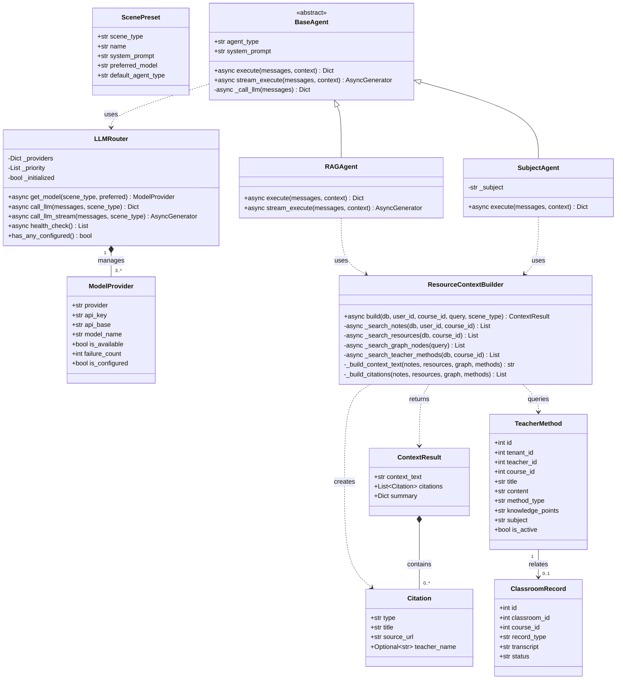
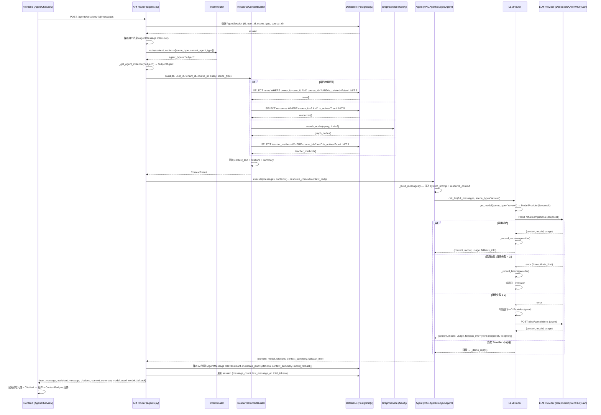
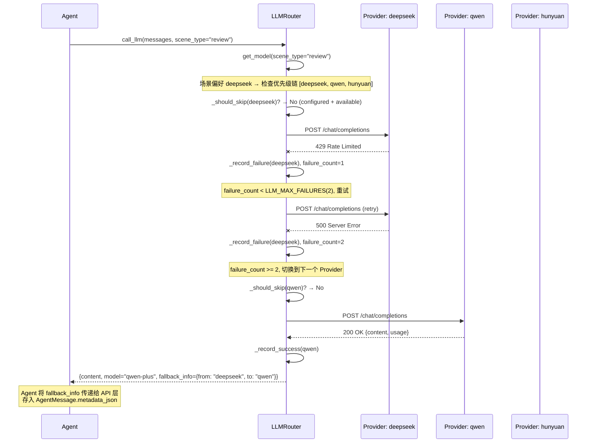
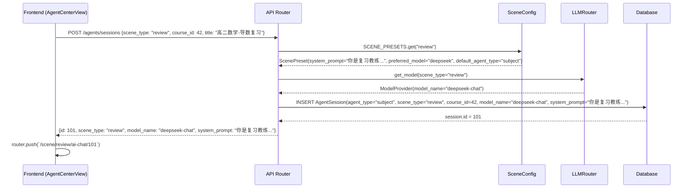
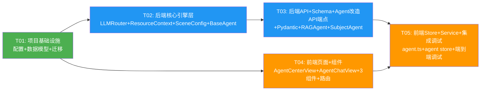

# 架构设计：AI 智能体中心（AI Agent Center）

> **项目**: AI4EDU - AI 驱动的智慧教学平台
> **模块**: 架构设计文档 - AI 智能体中心
> **文档版本**: v1.0
> **创建日期**: 2025-07-04
> **架构师**: Bob（高见远）
> **基于 PRD**: `docs/prd-ai-agent-center.md` v1.0
> **分支**: `陈安国的代码——AI智能体中心`

---

## 目录

1. [实现方案](#1-实现方案)
2. [框架选型与依赖包](#2-框架选型与依赖包)
3. [文件列表及相对路径](#3-文件列表及相对路径)
4. [数据结构和接口设计](#4-数据结构和接口设计)
5. [程序调用流程](#5-程序调用流程)
6. [任务列表（按实现顺序）](#6-任务列表按实现顺序)
7. [共享知识 / 跨文件约定](#7-共享知识--跨文件约定)
8. [待明确事项](#8-待明确事项)

---

## 1. 实现方案

### 1.1 核心技术挑战分析

| 挑战 | 难点 | 解决方案 |
|------|------|---------|
| **多模型路由与容灾** | 3 个模型提供商（DeepSeek/混元/千问）需统一调用、自动 fallback、健康检查 | 新增 `LLMRouter` + `ModelProvider` 抽象层，三者均提供 OpenAI 兼容 `/chat/completions` 接口，复用现有 httpx 调用模式 |
| **学习资源感知** | 需按 user_id + course_id 隔离检索笔记/资源/图谱，并控制 Token 预算 | 新增 `ResourceContextBuilder`，封装多源检索逻辑，返回结构化上下文文本 + 引用来源列表 |
| **老师方法一致性** | 需从老师板书/录播中提取方法，按知识点匹配注入提示词 | 新增 `teacher_methods` 表 + `ClassroomRecord` 关联表；`ResourceContextBuilder` 内集成老师方法检索 |
| **场景化入口** | 4 类场景各有独立的系统提示词、资源范围、模型偏好 | 新增 `SceneConfig` 常量配置模块（非 DB 表），场景创建时自动注入预设 |
| **引用来源展示** | AI 回答需标注引用来源（笔记/资源/老师方法/图谱节点），前端可点击跳转 | 后端在 `AgentMessage.metadata_json` 中存储 `citations` 数组；前端新增 `CitationList` 组件渲染 |
| **BaseAgent 改造** | 11 个 Agent 共享 `_call_llm()`，需统一改造且不破坏 demo 模式 | `BaseAgent._call_llm()` 改为通过 `LLMRouter` 获取模型配置；无任何 API Key 时仍降级为 `_demo_reply()` |

### 1.2 关键设计决策

#### 决策 1：LLMRouter 采用「Provider 配置 + httpx 直调」而非 openai SDK

**理由**：现有 `BaseAgent._call_llm()` 已使用 `httpx` 直接调用 OpenAI 兼容接口，三个提供商（DeepSeek/混元/千问）均提供 OpenAI 兼容的 `/chat/completions` 端点。保持 httpx 方式可：
- 零额外依赖（httpx 已在 requirements.txt 中）
- 统一超时/重试/fallback 控制
- 避免引入 openai SDK 的版本兼容问题

**实现**：`LLMRouter` 维护 `List[ModelProvider]`，每个 Provider 封装 `api_key / api_base / model_name`。`call_llm()` 按优先级尝试，失败后自动切换。

#### 决策 2：ResourceContextBuilder 作为独立服务类，而非嵌入 Agent

**理由**：
- `RAGAgent` 和 `SubjectAgent` 都需要资源上下文，抽取为独立类避免代码重复
- 资源检索涉及多张表（Note / Resource / TeacherMethod / Neo4j 图谱），独立类便于测试和维护
- 返回值同时包含「上下文文本」和「引用来源列表」，Agent 只需注入文本，API 层负责将引用返回前端

#### 决策 3：场景配置使用 Python 常量模块，而非数据库表

**理由**：
- MVP 阶段仅 4 个固定场景，无需动态管理
- 常量模块启动即加载，无额外 DB 查询开销
- 后续如需动态配置，可平滑迁移到 `Scene` 表（已有 `scenes` 表）

#### 决策 4：引用来源（Citations）存储在 `AgentMessage.metadata_json`

**理由**：
- `AgentMessage` 已有 `metadata_json` 字段（Text 类型，存 JSON）
- 引用来源与 AI 回复消息一一对应，存入 metadata 天然关联
- 前端渲染消息时从 `metadata.citations` 读取，无需额外查询

#### 决策 5：保持 demo 模式兼容

**理由**：现有 `BaseAgent._demo_reply()` 在无 API Key 时提供基于规则的回复，确保 Demo 可用。改造后：
- 所有 3 个模型均无 API Key → 降级为 `_demo_reply()`
- 至少 1 个模型有 Key → 正常调用 LLMRouter

### 1.3 架构模式

沿用现有 **MVC + Service Layer** 架构：

```
┌─────────────────────────────────────────────────────────────┐
│                      Frontend (Vue3)                         │
│  AgentCenterView → AgentChatView ←→ Pinia Store ←→ API Service
└──────────────────────────┬──────────────────────────────────┘
                           │ HTTP / WebSocket
┌──────────────────────────┴──────────────────────────────────┐
│                    Backend (FastAPI)                          │
│  ┌─────────────┐  ┌──────────────┐  ┌─────────────────────┐ │
│  │ API Router  │→ │ Agent Layer  │→ │   Service Layer     │ │
│  │ agents.py   │  │ BaseAgent    │  │ LLMRouter           │ │
│  │             │  │ RAGAgent     │  │ ResourceContextBuilder│ │
│  │             │  │ SubjectAgent │  │ SceneConfig          │ │
│  │             │  │ IntentRouter │  │ search_service       │ │
│  │             │  │              │  │ graph_service        │ │
│  └─────────────┘  └──────────────┘  └─────────────────────┘ │
│  ┌─────────────────────────────────────────────────────────┐ │
│  │              Data Layer (SQLAlchemy Models)              │ │
│  │  AgentSession │ AgentMessage │ TeacherMethod │ ...       │ │
│  └─────────────────────────────────────────────────────────┘ │
└─────────────────────────────────────────────────────────────┘
```

### 1.4 改造范围总览

```
新增文件 (8个):
  backend/app/agents/llm_router.py          ← 多模型路由器
  backend/app/agents/resource_context.py     ← 学习资源上下文构建器
  backend/app/agents/scene_config.py         ← 场景预设配置
  backend/app/models/teacher_method.py       ← TeacherMethod + ClassroomRecord 模型
  backend/migrations/versions/xxxx_add_teacher_methods.py  ← Alembic 迁移
  frontend/src/views/agent/AgentCenterView.vue       ← 场景入口页
  frontend/src/views/agent/components/SceneCard.vue   ← 场景卡片组件
  frontend/src/views/agent/components/CitationList.vue ← 引用来源组件

修改文件 (10个):
  backend/app/config.py                     ← 新增多模型配置项
  backend/app/agents/base.py                ← _call_llm() 改用 LLMRouter
  backend/app/agents/rag_agent.py           ← 注入 ResourceContextBuilder
  backend/app/agents/subject_agent.py       ← 注入 ResourceContextBuilder
  backend/app/schemas/agent.py              ← 新增场景/模型/引用 Schema
  backend/app/api/v1/agents.py              ← 新增端点 + 改造消息发送
  backend/app/models/__init__.py            ← 注册新模型
  backend/.env.example                      ← 新增多模型环境变量
  frontend/src/views/agent/AgentChatView.vue ← 引用展示 + 场景适配
  frontend/src/stores/agent.ts              ← 新增场景/模型/引用状态
  frontend/src/services/agent.ts            ← 新增 API 调用方法
  frontend/src/router/routes/scene-routes.ts ← 新增 /agent 路由
```

---

## 2. 框架选型与依赖包

### 2.1 后端依赖

**结论：无需新增任何 Python 包。** 所有需要的库已在 `backend/requirements.txt` 中：

| 包 | 版本 | 用途 | 状态 |
|----|------|------|------|
| `httpx` | 0.27.0 | 异步 HTTP 调用 LLM API（已有） | ✅ 已有 |
| `sqlalchemy` | 2.0.30 | ORM（已有） | ✅ 已有 |
| `redis` | 5.0.4 | 速率限制计数（已有） | ✅ 已有 |
| `pydantic` | 2.7.0 | Schema 验证（已有） | ✅ 已有 |
| `alembic` | 1.13.1 | 数据库迁移（已有） | ✅ 已有 |

> **说明**：三个模型提供商（DeepSeek / 腾讯混元 / 阿里通义千问）均提供 OpenAI 兼容的 `/chat/completions` 接口，因此复用现有 `httpx` 调用逻辑即可，无需引入 `openai` SDK（虽然 requirements.txt 中已有 `openai==1.30.0`，但现有代码使用 httpx 直调，保持一致）。

### 2.2 前端依赖

**结论：无需新增任何 npm 包。** 所有需要的库已在 `frontend/package.json` 中：

| 包 | 版本 | 用途 | 状态 |
|----|------|------|------|
| `element-plus` | ^2.7.0 | UI 组件（卡片/下拉/标签等） | ✅ 已有 |
| `pinia` | ^2.1.0 | 状态管理 | ✅ 已有 |
| `axios` | ^1.7.0 | HTTP 请求 | ✅ 已有 |
| `marked` | ^12.0.0 | Markdown 渲染 | ✅ 已有 |
| `vue-router` | ^4.3.0 | 路由 | ✅ 已有 |
| `@element-plus/icons-vue` | ^2.3.0 | 图标 | ✅ 已有 |

### 2.3 环境变量新增

在 `backend/.env.example` 和 `backend/.env` 中新增以下配置：

```bash
# ============ 多模型配置 ============
# 多模型路由开关（false 时回退到单一 OPENAI_* 配置）
LLM_MULTI_MODEL_ENABLED=true

# DeepSeek
DEEPSEEK_API_KEY=sk-xxx
DEEPSEEK_API_BASE=https://api.deepseek.com/v1
DEEPSEEK_MODEL=deepseek-chat

# 腾讯混元（OpenAI 兼容模式）
HUNYUAN_API_KEY=xxx
HUNYUAN_API_BASE=https://api.hunyuan.cloud.tencent.com/v1
HUNYUAN_MODEL=hunyuan-pro

# 阿里通义千问（DashScope OpenAI 兼容模式）
QWEN_API_KEY=sk-xxx
QWEN_API_BASE=https://dashscope.aliyuncs.com/compatible-mode/v1
QWEN_MODEL=qwen-plus

# 模型优先级（逗号分隔，从高到低）
LLM_MODEL_PRIORITY=deepseek,qwen,hunyuan

# 单模型连续失败次数阈值（超过后切换备选）
LLM_MAX_FAILURES=2

# 速率限制（每分钟最大请求数，0=不限制）
LLM_RATE_LIMIT_PER_MINUTE=60
```

---

## 3. 文件列表及相对路径

### 3.1 后端文件

| # | 文件路径 | 类型 | 说明 |
|---|---------|------|------|
| 1 | `backend/app/config.py` | **修改** | 新增多模型配置字段（DEEPSEEK_*、HUNYUAN_*、QWEN_*、LLM_*） |
| 2 | `backend/.env.example` | **修改** | 新增多模型环境变量模板 |
| 3 | `backend/app/models/teacher_method.py` | **新增** | `TeacherMethod` + `ClassroomRecord` ORM 模型 |
| 4 | `backend/app/models/__init__.py` | **修改** | 注册 `TeacherMethod`、`ClassroomRecord` |
| 5 | `backend/migrations/versions/xxxx_add_teacher_methods.py` | **新增** | Alembic 迁移脚本：建 `teacher_methods` + `classroom_records` 表 |
| 6 | `backend/app/agents/llm_router.py` | **新增** | `ModelProvider` 数据类 + `LLMRouter` 多模型路由器 |
| 7 | `backend/app/agents/resource_context.py` | **新增** | `ResourceContextBuilder` 学习资源上下文构建器 |
| 8 | `backend/app/agents/scene_config.py` | **新增** | `SCENE_PRESETS` 场景预设常量 + `ScenePreset` 数据类 |
| 9 | `backend/app/agents/base.py` | **修改** | `_call_llm()` / `stream_execute()` 改用 `LLMRouter`；`execute()` 返回 citations |
| 10 | `backend/app/agents/rag_agent.py` | **修改** | `execute()` / `stream_execute()` 注入 `ResourceContextBuilder` |
| 11 | `backend/app/agents/subject_agent.py` | **修改** | `execute()` / `stream_execute()` 注入 `ResourceContextBuilder` |
| 12 | `backend/app/schemas/agent.py` | **修改** | 新增 `ModelInfoResponse`、`ScenePresetResponse`、`Citation`、`ContextSummary`、`SendMessageResponse` |
| 13 | `backend/app/api/v1/agents.py` | **修改** | 新增 `GET /agents/models`、`GET /agents/scenes`、`GET /agents/sessions/{id}/context`；改造 `POST /agents/sessions`（场景预设）、`POST /agents/sessions/{id}/messages`（资源上下文 + 引用）、`WS /agents/ws/{session_id}`（流式 + 引用） |

### 3.2 前端文件

| # | 文件路径 | 类型 | 说明 |
|---|---------|------|------|
| 14 | `frontend/src/views/agent/AgentCenterView.vue` | **新增** | 场景入口页：4 个场景卡片 + 最近会话列表 + 模型状态指示灯 |
| 15 | `frontend/src/views/agent/components/SceneCard.vue` | **新增** | 场景卡片组件（图标/标题/描述/CTA 按钮） |
| 16 | `frontend/src/views/agent/components/CitationList.vue` | **新增** | 引用来源列表组件（类型图标/标题/跳转链接） |
| 17 | `frontend/src/views/agent/components/ContextBadges.vue` | **新增** | 上下文标签组件（笔记N/资源N/图谱N/方法N） |
| 18 | `frontend/src/views/agent/AgentChatView.vue` | **修改** | 顶栏模型状态 + 消息气泡引用来源 + 底部上下文标签 + 场景标题 |
| 19 | `frontend/src/stores/agent.ts` | **修改** | 新增 `scenes`、`models`、`currentScene` 状态；`createSession` 支持场景参数 |
| 20 | `frontend/src/services/agent.ts` | **修改** | 新增 `listModels`、`listScenes`、`getSessionContext` 方法 + 类型定义 |
| 21 | `frontend/src/router/routes/scene-routes.ts` | **修改** | 新增 `/agent` 路由指向 `AgentCenterView` |

---

## 4. 数据结构和接口设计

### 4.1 新增数据模型（SQLAlchemy）

#### TeacherMethod 模型

```python
# backend/app/models/teacher_method.py

class TeacherMethod(Base):
    """老师方法表 - 存储老师讲授的解题方法/知识点讲解"""
    __tablename__ = "teacher_methods"

    id: Mapped[int]                          # PK, autoincrement
    tenant_id: Mapped[int]                   # FK → tenants.id, index
    teacher_id: Mapped[int]                  # FK → users.id, index
    course_id: Mapped[Optional[int]]         # FK → courses.id, index, nullable
    classroom_id: Mapped[Optional[int]]      # FK → classrooms.id, nullable
    title: Mapped[str]                       # String(300), 方法标题
    content: Mapped[str]                     # Text, 方法内容(结构化文本)
    method_type: Mapped[str]                 # String(30): board_note/video_transcript/textbook_solution/manual
    knowledge_points: Mapped[Optional[str]]  # Text, 关联知识点(JSON数组), nullable
    source_resource_id: Mapped[Optional[int]] # FK → resources.id, nullable
    source_url: Mapped[Optional[str]]        # String(1000), 来源链接
    subject: Mapped[str]                     # String(50), index, 学科
    is_active: Mapped[bool]                  # Boolean, default=True
    created_at: Mapped[datetime]             # DateTime, default=utcnow
    updated_at: Mapped[datetime]             # DateTime, default=utcnow, onupdate=utcnow
```

#### ClassroomRecord 模型

```python
class ClassroomRecord(Base):
    """课堂记录表 - 录播视频与板书的结构化记录"""
    __tablename__ = "classroom_records"

    id: Mapped[int]                          # PK, autoincrement
    tenant_id: Mapped[int]                   # FK → tenants.id, index
    classroom_id: Mapped[int]                # FK → classrooms.id, index
    course_id: Mapped[int]                   # FK → courses.id, index
    record_type: Mapped[str]                 # String(20): video/board_photo/transcript
    resource_id: Mapped[Optional[int]]       # FK → resources.id, nullable
    transcript: Mapped[Optional[str]]        # Text, 转录/OCR文本
    segments: Mapped[Optional[str]]          # Text, 分段时间戳文本(JSON)
    knowledge_points: Mapped[Optional[str]]  # Text, 覆盖知识点(JSON)
    status: Mapped[str]                      # String(20), default="pending": pending/processing/ready/failed
    created_at: Mapped[datetime]             # DateTime, default=utcnow
```

### 4.2 核心服务类设计

#### ModelProvider 数据类

```python
# backend/app/agents/llm_router.py

@dataclass
class ModelProvider:
    """单个模型提供商配置"""
    provider: str                    # "deepseek" / "qwen" / "hunyuan"
    api_key: str
    api_base: str
    model_name: str
    is_available: bool = True        # 健康状态
    failure_count: int = 0           # 连续失败计数
    last_error_time: Optional[datetime] = None
    last_error_msg: str = ""

    @property
    def is_configured(self) -> bool:
        """是否配置了有效的 API Key"""
        return bool(self.api_key) and self.api_key != "sk-xxx"
```

#### LLMRouter 类

```python
class LLMRouter:
    """多模型路由器 - 全局单例"""

    def __init__(self):
        self._providers: Dict[str, ModelProvider] = {}
        self._priority: List[str] = []
        self._initialized: bool = False

    async def _initialize(self) -> None:
        """从 settings 加载所有 Provider 配置（懒加载）"""

    async def get_model(
        self,
        scene_type: Optional[str] = None,
        preferred: Optional[str] = None,
    ) -> Optional[ModelProvider]:
        """获取可用模型：preferred → 场景偏好 → 优先级链"""

    async def call_llm(
        self,
        messages: List[Dict[str, str]],
        scene_type: Optional[str] = None,
        preferred: Optional[str] = None,
        temperature: float = 0.7,
        max_tokens: int = 2048,
    ) -> Dict[str, Any]:
        """调用 LLM，自动 fallback。返回 {content, model, usage, fallback_info}"""

    async def call_llm_stream(
        self,
        messages: List[Dict[str, str]],
        scene_type: Optional[str] = None,
        preferred: Optional[str] = None,
        temperature: float = 0.7,
        max_tokens: int = 2048,
    ) -> AsyncGenerator[str, None]:
        """流式调用 LLM，自动 fallback"""

    async def health_check(self) -> List[Dict[str, Any]]:
        """检查所有模型可用性，返回 [{provider, model, status, is_configured}]"""

    def _should_skip(self, provider: ModelProvider) -> bool:
        """判断是否应跳过该 Provider（未配置/不可用/速率限制）"""

    async def _call_provider(
        self,
        provider: ModelProvider,
        messages: List[Dict[str, str]],
        temperature: float,
        max_tokens: int,
    ) -> Dict[str, Any]:
        """调用单个 Provider 的 OpenAI 兼容接口"""

    async def _call_provider_stream(
        self,
        provider: ModelProvider,
        messages: List[Dict[str, str]],
        temperature: float,
        max_tokens: int,
    ) -> AsyncGenerator[str, None]:
        """流式调用单个 Provider"""

    def _record_failure(self, provider: ModelProvider, error: str) -> None:
        """记录失败，累加 failure_count"""

    def _record_success(self, provider: ModelProvider) -> None:
        """记录成功，重置 failure_count"""

    def has_any_configured(self) -> bool:
        """是否有至少一个 Provider 配置了有效 API Key"""

# 全局单例
llm_router = LLMRouter()
```

#### ResourceContextBuilder 类

```python
# backend/app/agents/resource_context.py

@dataclass
class Citation:
    """引用来源数据结构"""
    type: str           # "note" / "resource" / "teacher_method" / "graph_node"
    title: str
    source_url: str     # 前端跳转路径
    teacher_name: Optional[str] = None  # 仅 teacher_method 类型

@dataclass
class ContextResult:
    """资源上下文构建结果"""
    context_text: str           # 注入到提示词的上下文文本
    citations: List[Citation]   # 引用来源列表
    summary: Dict[str, int]     # {notes_count, resources_count, graph_nodes_count, teacher_methods_count}

class ResourceContextBuilder:
    """学习资源上下文构建器"""

    async def build(
        self,
        db: AsyncSession,
        user_id: int,
        tenant_id: int,
        course_id: Optional[int] = None,
        query: Optional[str] = None,
        scene_type: Optional[str] = None,
    ) -> ContextResult:
        """
        构建学习资源上下文

        检索流程:
        1. 用户笔记（Note WHERE owner_id=user_id AND course_id=? AND is_deleted=False）→ 最多5条
        2. 课程资源（Resource WHERE course_id=? AND is_active=True）→ 最多5条
        3. 知识图谱节点（graph_service.search_nodes(query)）→ 最多3个
        4. 老师方法（TeacherMethod WHERE course_id=? AND is_active=True）→ 最多3条

        返回: ContextResult(context_text, citations, summary)
        """

    async def _search_notes(
        self, db: AsyncSession, user_id: int, tenant_id: int,
        course_id: Optional[int], query: Optional[str], limit: int = 5,
    ) -> List[Dict[str, Any]]:
        """检索用户笔记"""

    async def _search_resources(
        self, db: AsyncSession, tenant_id: int,
        course_id: Optional[int], query: Optional[str], limit: int = 5,
    ) -> List[Dict[str, Any]]:
        """检索课程资源"""

    async def _search_graph_nodes(
        self, query: Optional[str], limit: int = 3,
    ) -> List[Dict[str, Any]]:
        """检索知识图谱节点（复用 graph_service）"""

    async def _search_teacher_methods(
        self, db: AsyncSession, tenant_id: int,
        course_id: Optional[int], query: Optional[str], limit: int = 3,
    ) -> List[Dict[str, Any]]:
        """检索老师方法"""

    def _build_context_text(
        self,
        notes: List[Dict],
        resources: List[Dict],
        graph_nodes: List[Dict],
        teacher_methods: List[Dict],
    ) -> str:
        """将检索结果组装为结构化上下文文本"""

    def _build_citations(
        self,
        notes: List[Dict],
        resources: List[Dict],
        graph_nodes: List[Dict],
        teacher_methods: List[Dict],
    ) -> List[Citation]:
        """构建引用来源列表"""

# 全局单例
resource_context_builder = ResourceContextBuilder()
```

#### ScenePreset 数据类与场景配置

```python
# backend/app/agents/scene_config.py

@dataclass
class ScenePreset:
    """场景预设配置"""
    scene_type: str               # "self_study" / "preview" / "review" / "exam_prep"
    name: str                     # 显示名称
    description: str              # 场景描述
    icon: str                     # Element Plus 图标名
    system_prompt: str            # 系统提示词模板
    preferred_model: str          # 模型偏好: "deepseek" / "qwen" / "hunyuan"
    default_agent_type: str       # 默认 Agent 类型: "rag" / "subject"

SCENE_PRESETS: Dict[str, ScenePreset] = {
    "self_study": ScenePreset(
        scene_type="self_study",
        name="自习答疑",
        description="随时提问，基于你的笔记和学习资料解答疑问",
        icon="Reading",
        system_prompt=(
            "你是学生的自习助手。你的职责是基于学生的学习资料解答疑问，"
            "优先使用老师讲授的方法。\n\n"
            "回答要求：\n"
            "1. 优先使用【老师方法】段落中的解题方法和思路\n"
            "2. 结合【我的笔记】中的内容，体现学生当前的学习进度\n"
            "3. 引用【课程资源】中的教材/课件内容作为依据\n"
            "4. 回答末尾标注参考来源\n"
            "5. 如果老师方法不可用，回退到教材方法并标注\"未找到老师讲解记录\""
        ),
        preferred_model="deepseek",
        default_agent_type="rag",
    ),
    "preview": ScenePreset(
        scene_type="preview",
        name="课前预习",
        description="预习新内容，梳理核心概念和前置知识",
        icon="Search",
        system_prompt=(
            "你是预习向导。你的职责是帮学生梳理即将学习的内容，"
            "提供核心概念清单和前置知识检查。\n\n"
            "回答要求：\n"
            "1. 列出本节课的核心概念（3-5个）\n"
            "2. 检查前置知识掌握情况\n"
            "3. 提供3个引导性问题帮助学生思考\n"
            "4. 结合知识图谱展示知识点之间的关系"
        ),
        preferred_model="qwen",
        default_agent_type="rag",
    ),
    "review": ScenePreset(
        scene_type="review",
        name="课后复习",
        description="巩固今日所学，回顾课堂板书和笔记",
        icon="Edit",
        system_prompt=(
            "你是复习教练。你的职责是基于学生笔记和课堂板书，"
            "帮助学生巩固当天所学。\n\n"
            "回答要求：\n"
            "1. 优先使用老师课堂讲授的方法（【老师方法】段落）\n"
            "2. 结合学生的笔记内容查漏补缺\n"
            "3. 提供针对性练习建议\n"
            "4. 回答末尾标注参考来源，提供\"查看老师板书/录播片段\"链接"
        ),
        preferred_model="deepseek",
        default_agent_type="subject",
    ),
    "exam_prep": ScenePreset(
        scene_type="exam_prep",
        name="考前冲刺",
        description="查漏补缺，基于薄弱知识点生成针对性练习",
        icon="Trophy",
        system_prompt=(
            "你是冲刺导师。你的职责是基于学生薄弱知识点生成针对性练习和快速复习要点。\n\n"
            "回答要求：\n"
            "1. 分析学生的笔记标签和知识图谱覆盖情况\n"
            "2. 生成\"薄弱知识点 TOP5 + 针对练习题\"清单\n"
            "3. 练习题基于老师方法风格生成\n"
            "4. 提供快速复习要点和时间分配建议"
        ),
        preferred_model="deepseek",
        default_agent_type="subject",
    ),
}
```

### 4.3 API 端点定义

#### 新增端点

##### `GET /agents/models` — 获取可用模型列表及状态

```python
# 响应
{
  "code": 0,
  "data": [
    {
      "provider": "deepseek",
      "model": "deepseek-chat",
      "status": "available",       # available / unavailable / not_configured
      "is_default": true           # 是否为默认首选
    },
    {
      "provider": "qwen",
      "model": "qwen-plus",
      "status": "available",
      "is_default": false
    },
    {
      "provider": "hunyuan",
      "model": "hunyuan-pro",
      "status": "not_configured",
      "is_default": false
    }
  ],
  "message": "success"
}
```

##### `GET /agents/scenes` — 获取场景预设配置列表

```python
# 响应
{
  "code": 0,
  "data": [
    {
      "scene_type": "self_study",
      "name": "自习答疑",
      "description": "随时提问，基于你的笔记和学习资料解答疑问",
      "icon": "Reading",
      "preferred_model": "deepseek"
    },
    // ... 其余3个场景
  ],
  "message": "success"
}
```

##### `GET /agents/sessions/{session_id}/context` — 获取当前会话注入的上下文资源

```python
# 响应
{
  "code": 0,
  "data": {
    "notes": [{"id": 88, "title": "导数基础概念", "excerpt": "..."}],
    "resources": [{"id": 55, "title": "高二数学教材第三章", "resource_type": "pdf"}],
    "graph_nodes": [{"id": "derivative_geometry", "name": "导数的几何意义"}],
    "teacher_methods": [{"id": 12, "title": "导数定义法解题步骤", "teacher_name": "陈老师"}],
    "summary": {"notes_count": 3, "resources_count": 2, "graph_nodes_count": 1, "teacher_methods_count": 1}
  },
  "message": "success"
}
```

#### 改造端点

##### `POST /agents/sessions` — 创建场景会话（改造）

```python
# 请求（新增 scene_type 驱动 system_prompt 和 model_name）
{
  "agent_type": "rag",           // 可选，如不传则用场景预设的 default_agent_type
  "scene_type": "review",        // 新增：驱动 system_prompt + preferred_model
  "course_id": 42,
  "title": "高二数学 - 导数复习"
}

# 响应（新增 system_prompt 和 model_name 由场景预设填充）
{
  "code": 0,
  "data": {
    "id": 101,
    "agent_type": "subject",
    "scene_type": "review",
    "title": "高二数学 - 导数复习",
    "model_name": "deepseek-chat",
    "system_prompt": "你是复习教练...",   // 新增：来自场景预设
    "created_at": "2025-07-04T10:00:00"
  }
}
```

**后端逻辑**：当 `scene_type` 存在时，从 `SCENE_PRESETS` 获取预设：
- `system_prompt` ← `preset.system_prompt`
- `model_name` ← `LLMRouter.get_model(scene_type)` 返回的 `model_name`
- `agent_type` ← 若请求未指定，则用 `preset.default_agent_type`

##### `POST /agents/sessions/{session_id}/messages` — 发送消息（改造）

```python
# 请求（不变）
{
  "content": "老师，导数那道题怎么做？",
  "content_type": "text"
}

# 响应（新增 citations + context_summary + model_used + model_fallback）
{
  "code": 0,
  "data": {
    "user_message": {"id": 201, "role": "user", "content": "老师，导数那道题怎么做？"},
    "assistant_message": {
      "id": 202,
      "role": "assistant",
      "content": "这道题用我们上课讲的**定义法**来解...",
      "model_name": "deepseek-chat"
    },
    "citations": [
      {"type": "teacher_method", "title": "导数定义法解题步骤", "source_url": "/resources/55", "teacher_name": "陈老师"},
      {"type": "note", "title": "导数基础概念", "source_url": "/notes/88"},
      {"type": "graph_node", "title": "导数的几何意义", "source_url": "/graph/nodes/derivative_geometry"}
    ],
    "context_summary": {"notes_count": 3, "resources_count": 2, "graph_nodes_count": 1, "teacher_methods_count": 1},
    "model_used": "deepseek-chat",
    "model_fallback": false
  }
}
```

**后端逻辑**：
1. 保存用户消息
2. 意图路由（IntentRouter，传入 scene_type 上下文）
3. 获取 Agent 实例
4. **新增**：调用 `ResourceContextBuilder.build()` 获取上下文 + 引用
5. **新增**：将上下文注入 Agent 的 context
6. 调用 `agent.execute()`（内部通过 LLMRouter 调用 LLM）
7. 保存 AI 消息（`metadata_json` 存储 citations + context_summary + model_fallback_info）
8. 返回完整响应

##### `WS /agents/ws/{session_id}` — WebSocket 流式对话（改造）

WebSocket 消息协议扩展：

```python
# 客户端 → 服务端（不变）
{"type": "chat", "content": "导数那道题怎么做？", "session_id": 101}

# 服务端 → 客户端（新增 context 和 citations 消息类型）
{"type": "context", "summary": {"notes_count": 3, "resources_count": 2, "graph_nodes_count": 1, "teacher_methods_count": 1}}
{"type": "chunk", "content": "这道题用", "agent_type": "subject"}
{"type": "chunk", "content": "我们上课讲的", "agent_type": "subject"}
# ... 更多 chunk
{"type": "done", "agent_type": "subject", "model_used": "deepseek-chat", "model_fallback": false,
 "citations": [{"type": "teacher_method", "title": "...", "source_url": "..."}]}
```

### 4.4 Pydantic Schema 定义

```python
# backend/app/schemas/agent.py — 新增部分

class ModelInfoResponse(BaseModel):
    """模型信息响应"""
    provider: str = Field(..., description="提供商: deepseek/qwen/hunyuan")
    model: str = Field(..., description="模型名称")
    status: str = Field(..., description="状态: available/unavailable/not_configured")
    is_default: bool = Field(False, description="是否默认首选")

class ScenePresetResponse(BaseModel):
    """场景预设响应"""
    scene_type: str = Field(..., description="场景类型")
    name: str = Field(..., description="场景名称")
    description: str = Field(..., description="场景描述")
    icon: str = Field(..., description="图标")
    preferred_model: str = Field(..., description="偏好模型")

class CitationSchema(BaseModel):
    """引用来源"""
    type: str = Field(..., description="类型: note/resource/teacher_method/graph_node")
    title: str = Field(..., description="标题")
    source_url: str = Field(..., description="跳转路径")
    teacher_name: Optional[str] = Field(None, description="教师名(仅teacher_method)")

class ContextSummary(BaseModel):
    """上下文摘要"""
    notes_count: int = Field(0, description="笔记数")
    resources_count: int = Field(0, description="资源数")
    graph_nodes_count: int = Field(0, description="图谱节点数")
    teacher_methods_count: int = Field(0, description="老师方法数")

class SendMessageResponse(BaseModel):
    """发送消息响应（改造）"""
    user_message: Dict[str, Any] = Field(..., description="用户消息")
    assistant_message: Dict[str, Any] = Field(..., description="AI消息")
    citations: List[CitationSchema] = Field(default_factory=list, description="引用来源")
    context_summary: ContextSummary = Field(default_factory=ContextSummary, description="上下文摘要")
    model_used: str = Field("", description="使用的模型")
    model_fallback: bool = Field(False, description="是否发生了模型切换")

class SessionContextResponse(BaseModel):
    """会话上下文响应"""
    notes: List[Dict[str, Any]] = Field(default_factory=list)
    resources: List[Dict[str, Any]] = Field(default_factory=list)
    graph_nodes: List[Dict[str, Any]] = Field(default_factory=list)
    teacher_methods: List[Dict[str, Any]] = Field(default_factory=list)
    summary: ContextSummary = Field(default_factory=ContextSummary)
```

### 4.5 类关系图

> 完整类图见 `docs/class-diagram.mermaid`



---

## 5. 程序调用流程

### 5.1 用户提问 → AI 回答生成 全链路时序图

> 完整时序图见 `docs/sequence-diagram.mermaid`



### 5.2 多模型 fallback 流程



### 5.3 场景创建流程



---

## 6. 任务列表（按实现顺序）

### 任务总览

| 任务 | 名称 | 文件数 | 依赖 | 优先级 |
|------|------|--------|------|--------|
| T01 | 项目基础设施（配置 + 数据模型 + 迁移） | 5 | 无 | P0 |
| T02 | 后端核心引擎层（LLMRouter + ResourceContextBuilder + 场景配置 + BaseAgent 改造） | 4 | T01 | P0 |
| T03 | 后端 API + Schema + Agent 改造 | 4 | T02 | P0 |
| T04 | 前端场景入口页 + 对话页改造 + 新组件 | 6 | T01 | P0 |
| T05 | 前端 Store + Service + 集成调试 | 3 | T03, T04 | P0 |

### 任务依赖图



---

### T01: 项目基础设施（配置 + 数据模型 + 迁移）

| 属性 | 值 |
|------|-----|
| **任务 ID** | T01 |
| **任务名** | 项目基础设施：多模型配置 + 新增数据模型 + Alembic 迁移 |
| **依赖** | 无 |
| **优先级** | P0 |
| **预估工时** | 0.5 天 |

**涉及文件**（5 个）：

| 文件 | 类型 | 说明 |
|------|------|------|
| `backend/app/config.py` | 修改 | 在 `Settings` 类中新增多模型配置字段 |
| `backend/.env.example` | 修改 | 新增多模型环境变量模板 |
| `backend/app/models/teacher_method.py` | 新增 | `TeacherMethod` + `ClassroomRecord` ORM 模型 |
| `backend/app/models/__init__.py` | 修改 | 注册 `TeacherMethod`、`ClassroomRecord` |
| `backend/migrations/versions/xxxx_add_teacher_methods.py` | 新增 | Alembic 迁移脚本 |

**实现要点**：

1. **`config.py` 新增字段**：
   ```python
   # 多模型配置
   LLM_MULTI_MODEL_ENABLED: bool = True
   DEEPSEEK_API_KEY: str = ""
   DEEPSEEK_API_BASE: str = "https://api.deepseek.com/v1"
   DEEPSEEK_MODEL: str = "deepseek-chat"
   HUNYUAN_API_KEY: str = ""
   HUNYUAN_API_BASE: str = "https://api.hunyuan.cloud.tencent.com/v1"
   HUNYUAN_MODEL: str = "hunyuan-pro"
   QWEN_API_KEY: str = ""
   QWEN_API_BASE: str = "https://dashscope.aliyuncs.com/compatible-mode/v1"
   QWEN_MODEL: str = "qwen-plus"
   LLM_MODEL_PRIORITY: str = "deepseek,qwen,hunyuan"
   LLM_MAX_FAILURES: int = 2
   LLM_RATE_LIMIT_PER_MINUTE: int = 60
   ```

2. **`teacher_method.py` 模型**：严格按 PRD 7.2 节定义，使用 `Mapped` + `mapped_column` 风格，与现有模型（如 `agent.py`、`note.py`）保持一致。`Boolean` 类型需从 `sqlalchemy` 导入。

3. **`__init__.py` 注册**：
   ```python
   from app.models.teacher_method import TeacherMethod, ClassroomRecord  # noqa: F401
   ```

4. **Alembic 迁移**：
   - 迁移文件命名：`add_teacher_methods_and_classroom_records.py`
   - `upgrade()`：`op.create_table("teacher_methods", ...)` + `op.create_table("classroom_records", ...)`
   - `downgrade()`：`op.drop_table("classroom_records")` + `op.drop_table("teacher_methods")`
   - 索引：`tenant_id`、`teacher_id`、`course_id`、`subject` 上建索引

5. **`.env.example`**：在 OpenAI 配置段后追加多模型配置段（见第 2.3 节）。

---

### T02: 后端核心引擎层（LLMRouter + ResourceContextBuilder + 场景配置 + BaseAgent 改造）

| 属性 | 值 |
|------|-----|
| **任务 ID** | T02 |
| **任务名** | 多模型路由引擎 + 资源上下文构建器 + 场景预设 + BaseAgent 改造 |
| **依赖** | T01 |
| **优先级** | P0 |
| **预估工时** | 2 天 |

**涉及文件**（4 个）：

| 文件 | 类型 | 说明 |
|------|------|------|
| `backend/app/agents/llm_router.py` | 新增 | `ModelProvider` + `LLMRouter` 多模型路由器 |
| `backend/app/agents/resource_context.py` | 新增 | `ResourceContextBuilder` + `Citation` + `ContextResult` |
| `backend/app/agents/scene_config.py` | 新增 | `ScenePreset` + `SCENE_PRESETS` 常量 |
| `backend/app/agents/base.py` | 修改 | `_call_llm()` / `stream_execute()` 改用 `LLMRouter` |

**实现要点**：

1. **`llm_router.py`**：
   - `ModelProvider` 使用 `@dataclass`，包含 `is_configured` 属性（检查 api_key 非空且非占位符 `"sk-xxx"`）
   - `LLMRouter._initialize()`：从 `settings` 读取 3 个 Provider 配置，构建 `_providers` 字典 + `_priority` 列表
   - `get_model()` 逻辑：preferred → 场景偏好（从 `SCENE_PRESETS` 查）→ 优先级链遍历，跳过 `_should_skip()` 的 Provider
   - `call_llm()` 逻辑：
     - 获取首选 Provider → 调用 `_call_provider()`
     - 失败时 `_record_failure()`，若 `failure_count >= LLM_MAX_FAILURES` 则标记 `is_available=False` 并切换下一个
     - 所有 Provider 不可用 → 返回 `{"content": "", "model": "demo-rule-engine", "degraded": True}`
     - 成功返回 `{"content", "model", "usage", "fallback_info": Optional[Dict]}`
   - `_call_provider()`：复用现有 httpx 调用模式（`POST {api_base}/chat/completions`），解析 `choices[0].message.content`
   - `_call_provider_stream()`：流式版，`aiter_lines()` 解析 `data: ` 前缀的 SSE
   - `health_check()`：返回每个 Provider 的 `{provider, model, status, is_configured}`
   - 全局单例：`llm_router = LLMRouter()`

2. **`resource_context.py`**：
   - `build()` 方法接受 `db: AsyncSession`（从 API 层传入），执行 4 路并行检索
   - `_search_notes()`：`SELECT Note WHERE owner_id=:user_id AND tenant_id=:tenant_id AND is_deleted=False`，可选 `course_id` 过滤，按 `updated_at DESC` 排序，LIMIT 5。取 `title` + `content_plain[:200]` 作为摘要
   - `_search_resources()`：`SELECT Resource WHERE tenant_id=:tenant_id AND is_active=True`，可选 `course_id` 过滤，LIMIT 5
   - `_search_graph_nodes()`：调用 `graph_service.search_nodes(query, limit=3)`（复用现有服务）
   - `_search_teacher_methods()`：`SELECT TeacherMethod WHERE tenant_id=:tenant_id AND is_active=True`，可选 `course_id` 过滤，LIMIT 3
   - `_build_context_text()`：按 `【老师方法】`、`【我的笔记】`、`【课程资源】`、`【知识图谱】` 四段组装，老师方法段最高优先级并加上指令 "请优先使用以下老师讲授的方法"
   - `_build_citations()`：每条检索结果生成 `Citation` 对象，`source_url` 格式：
     - note → `/notes/{id}`
     - resource → `/resources/{id}`
     - graph_node → `/graph/nodes/{node_id}`
     - teacher_method → `/resources/{source_resource_id}` 或 `source_url`

3. **`scene_config.py`**：按第 4.2 节定义 4 个 `ScenePreset`，`SCENE_PRESETS` 为 `Dict[str, ScenePreset]`

4. **`base.py` 改造**：
   - `_call_llm()` 方法签名不变，内部逻辑改为：
     ```python
     async def _call_llm(self, messages, temperature=0.7, max_tokens=2048) -> Dict:
         from app.agents.llm_router import llm_router
         if not llm_router.has_any_configured():
             # Demo 模式
             return {"content": self._demo_reply(messages), "model": "demo-rule-engine", "usage": {}}
         result = await llm_router.call_llm(
             messages, scene_type=self._get_scene_type_from_messages(messages),
             temperature=temperature, max_tokens=max_tokens
         )
         return result
     ```
   - `stream_execute()` 改为调用 `llm_router.call_llm_stream()`
   - `execute()` 返回值新增 `citations` 和 `context_summary` 字段（从 context 参数中透传）
   - **注意**：保持 `_demo_reply()` 完全不变，确保 demo 模式兼容

---

### T03: 后端 API + Schema + Agent 改造

| 属性 | 值 |
|------|-----|
| **任务 ID** | T03 |
| **任务名** | API 端点新增/改造 + Pydantic Schema + RAGAgent/SubjectAgent 资源注入 |
| **依赖** | T02 |
| **优先级** | P0 |
| **预估工时** | 1.5 天 |

**涉及文件**（4 个）：

| 文件 | 类型 | 说明 |
|------|------|------|
| `backend/app/schemas/agent.py` | 修改 | 新增 `ModelInfoResponse`、`ScenePresetResponse`、`CitationSchema`、`ContextSummary`、`SendMessageResponse`、`SessionContextResponse` |
| `backend/app/agents/rag_agent.py` | 修改 | `execute()` / `stream_execute()` 注入 `ResourceContextBuilder` |
| `backend/app/agents/subject_agent.py` | 修改 | `execute()` / `stream_execute()` 注入 `ResourceContextBuilder` |
| `backend/app/api/v1/agents.py` | 修改 | 新增 3 个端点 + 改造 3 个端点 |

**实现要点**：

1. **`schemas/agent.py`**：按第 4.4 节定义新增 Schema，保持与现有 Schema 风格一致（Pydantic v2 `BaseModel` + `Field`）

2. **`rag_agent.py` 改造**：
   - `execute()` 方法在调用 `super().execute()` 前，从 `context` 中获取 `db`、`user_id`、`tenant_id`、`course_id`，调用 `resource_context_builder.build()`
   - 将 `context_result.context_text` 追加到 `_augment_messages()` 的上下文中
   - 将 `context_result.citations` 和 `context_result.summary` 附加到返回结果
   - **注意**：保持与现有 `_search_knowledge()` / `_query_graph()` 的兼容，`ResourceContextBuilder` 是增强而非替换

3. **`subject_agent.py` 改造**：
   - `execute()` 方法同样注入 `ResourceContextBuilder`
   - 从 `context` 获取 `db`、`user_id`、`tenant_id`、`course_id`
   - 将资源上下文注入到 `context` 字典中，传递给 `super().execute()`
   - 返回结果附加 `citations` 和 `context_summary`

4. **`agents.py` API 改造**：

   **新增端点**：
   - `GET /agents/models`：调用 `llm_router.health_check()`，返回 `List[ModelInfoResponse]`
   - `GET /agents/scenes`：遍历 `SCENE_PRESETS`，返回 `List[ScenePresetResponse]`
   - `GET /agents/sessions/{session_id}/context`：调用 `resource_context_builder.build()`，返回 `SessionContextResponse`

   **改造 `POST /agents/sessions`**：
   - 当 `session_data.scene_type` 存在时，从 `SCENE_PRESETS` 获取预设
   - 设置 `system_prompt = preset.system_prompt`
   - 设置 `agent_type = session_data.agent_type or preset.default_agent_type`
   - 调用 `llm_router.get_model(scene_type)` 获取 `model_name`
   - 响应中返回 `system_prompt` 和 `model_name`

   **改造 `POST /agents/sessions/{session_id}/messages`**：
   - 意图路由时传入 `scene_type` 到 context
   - 获取 Agent 实例后，在 context 中注入 `db`、`user_id`、`tenant_id`、`course_id`、`scene_type`
   - 调用 `agent.execute(messages, context)`（Agent 内部调用 ResourceContextBuilder）
   - 从 `agent_result` 提取 `citations`、`context_summary`、`fallback_info`
   - 保存 AI 消息时，`metadata_json = json.dumps({"citations": ..., "context_summary": ..., "model_fallback": ...})`
   - 响应格式按 `SendMessageResponse` 返回

   **改造 `WS /agents/ws/{session_id}`**：
   - 接收消息后，先发送 `{"type": "context", "summary": {...}}` 告知前端注入了哪些资源
   - 流式输出 chunks
   - `done` 消息中携带 `model_used`、`model_fallback`、`citations`
   - **注意**：WebSocket 端点需要从 token 获取 user_id（现有代码未鉴权，需补充）

   **改造 `GET /agents/types`**：
   - 响应中每个类型新增 `scene_types: List[str]` 字段，标注该 Agent 支持的场景

---

### T04: 前端场景入口页 + 对话页改造 + 新组件

| 属性 | 值 |
|------|-----|
| **任务 ID** | T04 |
| **任务名** | AgentCenterView 场景入口页 + AgentChatView 改造 + SceneCard/CitationList/ContextBadges 组件 + 路由 |
| **依赖** | T01（需了解 API 契约） |
| **优先级** | P0 |
| **预估工时** | 1.5 天 |

**涉及文件**（6 个）：

| 文件 | 类型 | 说明 |
|------|------|------|
| `frontend/src/views/agent/AgentCenterView.vue` | 新增 | 场景入口页 |
| `frontend/src/views/agent/components/SceneCard.vue` | 新增 | 场景卡片组件 |
| `frontend/src/views/agent/components/CitationList.vue` | 新增 | 引用来源列表组件 |
| `frontend/src/views/agent/components/ContextBadges.vue` | 新增 | 上下文标签组件 |
| `frontend/src/views/agent/AgentChatView.vue` | 修改 | 引用展示 + 场景标题 + 上下文标签 |
| `frontend/src/router/routes/scene-routes.ts` | 修改 | 新增 `/agent` 路由 |

**实现要点**：

1. **`AgentCenterView.vue`**（场景入口页）：
   - 顶部标题栏 + 模型状态指示灯（调用 `GET /agents/models`，绿/黄/红表示可用模型数量）
   - 4 个 `SceneCard` 组件横向排列（自习/预习/复习/冲刺）
   - 卡片点击 → 调用 `createSession(sceneType, courseId)` → 跳转 `/scene/:sceneType/ai-chat/:sessionId`
   - 卡片下方：最近 5 条会话列表（调用 `fetchSessions`），点击直接进入对话
   - 使用 Element Plus 的 `el-row` / `el-col` 栅格布局，BEM 命名 SCSS（与现有风格一致）

2. **`SceneCard.vue`**：
   - Props: `scene: ScenePresetResponse`
   - Emit: `@select`
   - 展示：图标（`<el-icon>`）、标题、描述、CTA 按钮
   - 悬浮卡片效果（CSS `transition` + `box-shadow`）

3. **`CitationList.vue`**：
   - Props: `citations: CitationSchema[]`
   - 每条引用：类型图标（笔记📝/资源📄/老师方法👨‍🏫/图谱节点🕸）+ 标题 + 跳转链接
   - 点击 → `router.push(source_url)` 跳转对应资源详情页
   - 使用 `el-tag` 标签样式区分类型

4. **`ContextBadges.vue`**：
   - Props: `summary: ContextSummary`
   - 展示 4 个标签：`📎 笔记(N)` `📄 资源(N)` `🕸 图谱(N)` `👨‍🏫 方法(N)`
   - N=0 时不显示该标签
   - 使用 `el-tag` + `type` 属性区分颜色

5. **`AgentChatView.vue` 改造**：
   - 顶栏右侧新增模型状态指示灯（小圆点 + tooltip 显示当前模型）
   - 顶栏标题改为场景名称（如 "📝 课后复习 · 高二数学"），从 `currentSession.scene_type` 映射
   - 消息气泡下方：当 `msg.role === 'assistant'` 且 `msg.metadata?.citations` 存在时，渲染 `<CitationList :citations="msg.metadata.citations" />`
   - 底部输入区上方：渲染 `<ContextBadges :summary="currentContextSummary" />`（从最近一条 AI 消息的 metadata 获取）
   - 左栏会话列表：按 `scene_type` 分组（使用 `el-collapse` 折叠面板）
   - **注意**：保持现有 WebSocket 流式逻辑不变，新增对 `type: "context"` 和 `type: "done"` 中 `citations` 字段的处理

6. **`scene-routes.ts` 改造**：
   - 在 children 数组中新增：
     ```typescript
     {
       path: 'agent',
       name: 'AgentCenter',
       component: () => import('@/views/agent/AgentCenterView.vue'),
       meta: { title: 'AI智能体中心', requiresAuth: true },
     },
     ```

---

### T05: 前端 Store + Service + 集成调试

| 属性 | 值 |
|------|-----|
| **任务 ID** | T05 |
| **任务名** | Pinia Store 扩展 + API Service 扩展 + 端到端集成调试 |
| **依赖** | T03（后端 API）、T04（前端组件） |
| **优先级** | P0 |
| **预估工时** | 1 天 |

**涉及文件**（3 个）：

| 文件 | 类型 | 说明 |
|------|------|------|
| `frontend/src/stores/agent.ts` | 修改 | 新增 `scenes`、`models`、`currentScene` 状态 + 相关 actions |
| `frontend/src/services/agent.ts` | 修改 | 新增 `listModels`、`listScenes`、`getSessionContext` 方法 + 类型定义 |
| 端到端调试 | — | 前后端联调，验证完整链路 |

**实现要点**：

1. **`services/agent.ts` 扩展**：
   - 新增类型定义：
     ```typescript
     export interface ModelInfo { provider: string; model: string; status: string; is_default: boolean }
     export interface ScenePreset { scene_type: string; name: string; description: string; icon: string; preferred_model: string }
     export interface Citation { type: string; title: string; source_url: string; teacher_name?: string }
     export interface ContextSummary { notes_count: number; resources_count: number; graph_nodes_count: number; teacher_methods_count: number }
     ```
   - 新增 API 方法：
     - `listModels(): Promise<ModelInfo[]>` → `GET /agent/models`
     - `listScenes(): Promise<ScenePreset[]>` → `GET /agent/scenes`
     - `getSessionContext(sessionId: string): Promise<SessionContextResponse>` → `GET /agent/sessions/{id}/context`
   - 修改 `createSession` 参数类型：支持 `scene_type` 和 `course_id`
   - 修改 `sendMessage` 返回类型：返回包含 `citations`、`context_summary`、`model_used`、`model_fallback` 的完整响应

2. **`stores/agent.ts` 扩展**：
   - 新增 State：
     - `scenes: Ref<ScenePreset[]>` — 场景列表
     - `models: Ref<ModelInfo[]>` — 模型列表
     - `currentScene: Ref<ScenePreset | null>` — 当前场景
   - 新增 Actions：
     - `fetchScenes()` — 获取场景列表
     - `fetchModels()` — 获取模型列表（计算模型可用数量）
     - `createSceneSession(sceneType: string, courseId?: number, title?: string)` — 创建场景会话
       - 内部调用 `agentApi.createSession({ scene_type: sceneType, course_id: courseId, title })`
       - 设置 `currentScene` 为对应场景预设
       - 返回 session 后由调用方跳转
   - 修改 `streamMessage()`：
     - WebSocket `onmessage` 中新增处理 `type: "context"` → 存储到 `currentContextSummary`
     - `type: "done"` 中提取 `citations` 和 `model_used`，附加到 assistant message 的 `metadata`
   - 新增 Getter：
     - `availableModelCount` — 可用模型数量（用于状态指示灯颜色）
     - `currentContextSummary` — 当前上下文摘要（从最近 AI 消息 metadata 获取）

3. **端到端集成调试**：
   - 验证场景入口 → 创建会话 → 对话 → 引用展示完整链路
   - 验证多模型 fallback（手动配置错误的 API Key 触发切换）
   - 验证 demo 模式（所有 API Key 为空时仍可对话）
   - 验证引用来源跳转（点击引用跳转到笔记/资源详情页）
   - 验证 WebSocket 流式对话中 context 和 citations 消息的处理

---

## 7. 共享知识 / 跨文件约定

### 7.1 模型 Provider 名称规范

| Provider 名称 | 对应服务 | 环境变量前缀 | 默认模型 |
|--------------|---------|-------------|---------|
| `deepseek` | DeepSeek | `DEEPSEEK_*` | `deepseek-chat` |
| `qwen` | 阿里通义千问 (DashScope) | `QWEN_*` | `qwen-plus` |
| `hunyuan` | 腾讯混元 | `HUNYUAN_*` | `hunyuan-pro` |

- `LLM_MODEL_PRIORITY` 环境变量使用逗号分隔的 provider 名称，如 `deepseek,qwen,hunyuan`
- `SCENE_PRESETS` 中的 `preferred_model` 字段值必须与 provider 名称一致

### 7.2 API 响应格式约定

- 所有 API 响应统一使用 `APIResponse(code=0, data=..., message="success")` 格式
- `code=0` 表示成功（与现有代码一致，注意 `APIResponse` 默认 `code=200`，但 agents.py 中统一用 `code=0`）
- 分页响应使用 `PaginatedResponse(items, total, page, page_size)`
- WebSocket 消息使用 `{type, ...}` 格式，`type` 取值：`context` / `chunk` / `done` / `error`

### 7.3 引用来源（Citation）类型规范

| type 值 | 含义 | source_url 格式 | 图标 |
|---------|------|----------------|------|
| `note` | 用户笔记 | `/notes/{id}` | 📝 |
| `resource` | 课程资源 | `/resources/{id}` | 📄 |
| `teacher_method` | 老师方法 | `/resources/{source_resource_id}` 或自定义 | 👨‍🏫 |
| `graph_node` | 知识图谱节点 | `/graph/nodes/{node_id}` | 🕸 |

### 7.4 场景类型（scene_type）规范

| scene_type | 名称 | 默认 Agent | 偏好模型 |
|------------|------|-----------|---------|
| `self_study` | 自习答疑 | `rag` | `deepseek` |
| `preview` | 课前预习 | `rag` | `qwen` |
| `review` | 课后复习 | `subject` | `deepseek` |
| `exam_prep` | 考前冲刺 | `subject` | `deepseek` |

### 7.5 数据库约定

- 所有新表包含 `tenant_id` 字段（多租户隔离），建索引
- 时间字段使用 `DateTime` + `default=datetime.utcnow`（与现有模型一致）
- JSON 字段使用 `Text` 类型存储 JSON 字符串（与现有 `metadata_json`、`tags` 一致），不用 SQLAlchemy JSON 类型
- 软删除模式：`is_active` 布尔字段（TeacherMethod）或 `is_deleted`（Note 模式）

### 7.6 Agent context 字典约定

API 层调用 Agent 时，`context` 字典新增以下键：

```python
context = {
    # 现有字段
    "user_id": current_user.id,
    "tenant_id": current_user.tenant_id,
    "session_id": session_id,
    "course_id": session.course_id,
    "scene_type": session.scene_type,
    # 新增字段
    "db": db,                      # AsyncSession 实例，供 ResourceContextBuilder 使用
    "preferred_model": None,       # 可选，用户手动指定模型（P1）
}
```

Agent 内部通过 `context.get("db")` 获取数据库会话，传给 `ResourceContextBuilder.build()`。

### 7.7 前端路由约定

| 路由路径 | 组件 | 说明 |
|---------|------|------|
| `/scene/:sceneType/agent` | `AgentCenterView.vue` | 场景入口页 |
| `/scene/:sceneType/ai-chat/:sessionId?` | `AgentChatView.vue` | 对话页（已有，改造） |

- 场景入口页路径中 `:sceneType` 为当前场景（从 URL 获取），用于页面高亮
- 对话页通过 `route.params.sessionId` 加载会话，通过 `currentSession.scene_type` 确定场景

### 7.8 LLMRouter fallback 信息格式

`AgentMessage.metadata_json` 中的 `fallback_info` 结构：

```json
{
  "citations": [...],
  "context_summary": {...},
  "model_used": "deepseek-chat",
  "model_fallback": true,
  "fallback_info": {
    "from": "deepseek",
    "to": "qwen",
    "reason": "rate_limit"
  }
}
```

---

## 8. 待明确事项

以下问题需与产品经理（许清楚）或项目负责人确认，不影响 P0 开发启动但影响细节实现：

| # | 问题 | 影响范围 | 当前假设 | 紧急度 |
|---|------|---------|---------|--------|
| Q1 | DeepSeek / 混元 / 千问 的免费额度是否够教学场景使用？是否需要额度监控告警？ | M1 模型路由 | 先不做额度监控，P1 再加 | 低 |
| Q2 | 腾讯混元的 OpenAI 兼容模式 API 域名是否正确（`https://api.hunyuan.cloud.tencent.com/v1`）？ | M1 模型路由 | 假设域名正确，需实际测试验证 | 中 |
| Q3 | 现有课堂录播视频是否有实际数据？存储在 MinIO 还是外部？ | M3 老师方法 | P0 不做录播转录（P1），`ClassroomRecord` 表先建好备用 | 低 |
| Q4 | 老师板书内容目前是否有现成数据？还是完全需要重新采集？ | M3 老师方法 | P0 支持教师手动录入 `TeacherMethod`；图片上传 OCR 为 P1 | 低 |
| Q5 | OCR / ASR 服务使用哪个？阿里云 OCR？腾讯云 ASR？ | M3/M6 (P1) | P1 再确定，不影响 P0 | 低 |
| Q6 | 知识图谱节点的 `knowledge_points` 与 `teacher_methods.knowledge_points` 如何对齐？是否使用统一编码？ | M3 方法匹配 | P0 使用关键词模糊匹配（`ILIKE`），P1 再做知识点编码对齐 | 中 |
| Q7 | 多模型场景下 Token 计费/额度如何分摊？是否需要按租户限额？ | M1 模型路由 | P0 不做租户限额，P1 在 Redis 中做 per-tenant 计数 | 低 |
| Q8 | "老师方法一致性"是否需要 100% 遵守？如果老师方法有误，AI 是否可以修正？ | M3 方法引擎 | 提示词中指示"优先使用"，允许 AI 在方法明显有误时标注修正 | 中 |
| Q9 | 场景入口是否需要支持教师角色？教师是否也有自己的 AI 助手入口？ | M4 场景入口 | P0 仅学生场景；教师入口后续迭代 | 低 |
| Q10 | 现有 `AgentSession.model_name` 默认为 "gpt-4o"，历史数据是否需要迁移？ | M5 数据兼容 | 不迁移历史数据；新会话由 LLMRouter 动态分配 model_name | 低 |
| Q11 | WebSocket 端点当前无鉴权（`websocket_chat` 未验证 token），是否需要补充？ | M5 安全 | **建议补充**：从 query param 获取 token 验证用户身份，否则任何人可连接任意 session | **高** |
| Q12 | 前端 `services/agent.ts` 中 `getStreamUrl` 的路径 `ws://localhost:8000/ws/agent/chat/{sessionId}` 与后端 `WS /agents/ws/{session_id}` 不一致，以哪个为准？ | M5 前后端对接 | 以后端为准：`ws://host:port/api/v1/agents/ws/{session_id}?token=xxx` | **高** |

---

## 附录：与 PRD 的映射关系

| PRD 需求 ID | 架构设计对应 | 任务 |
|-------------|-------------|------|
| P0-1 | `LLMRouter` + `ModelProvider` | T02 |
| P0-2 | `ModelProvider` 抽象 + `config.py` 多模型配置 | T01, T02 |
| P0-3 | `LLMRouter.call_llm()` 自动 fallback + `_record_failure` | T02 |
| P0-4 | `BaseAgent._call_llm()` 改用 `LLMRouter` | T02 |
| P0-5 | `ResourceContextBuilder.build()` | T02 |
| P0-6 | `RAGAgent` / `SubjectAgent` 注入 `ResourceContextBuilder` | T03 |
| P0-7 | `TeacherMethod` 模型 + Alembic 迁移 | T01 |
| P0-8 | `ResourceContextBuilder._search_teacher_methods()` + 提示词注入 | T02, T03 |
| P0-9 | `SceneConfig` + `POST /agents/sessions` 场景预设 | T02, T03 |
| P0-10 | `AgentCenterView.vue` + `SceneCard.vue` | T04 |
| P0-11 | `CitationList.vue` + `AgentChatView` 改造 | T04 |
| P0-12 | `GET /agents/models` 端点 | T03 |

---

*文档结束 — 工程师可按 T01→T02→T03→T04→T05 顺序开发，T04 可与 T02/T03 并行。*
