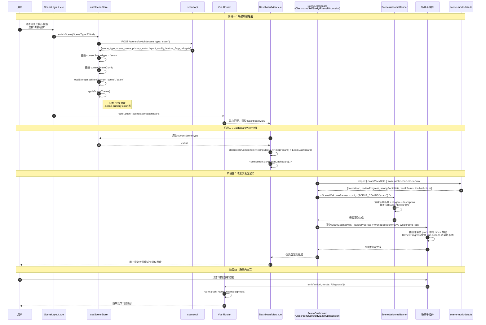
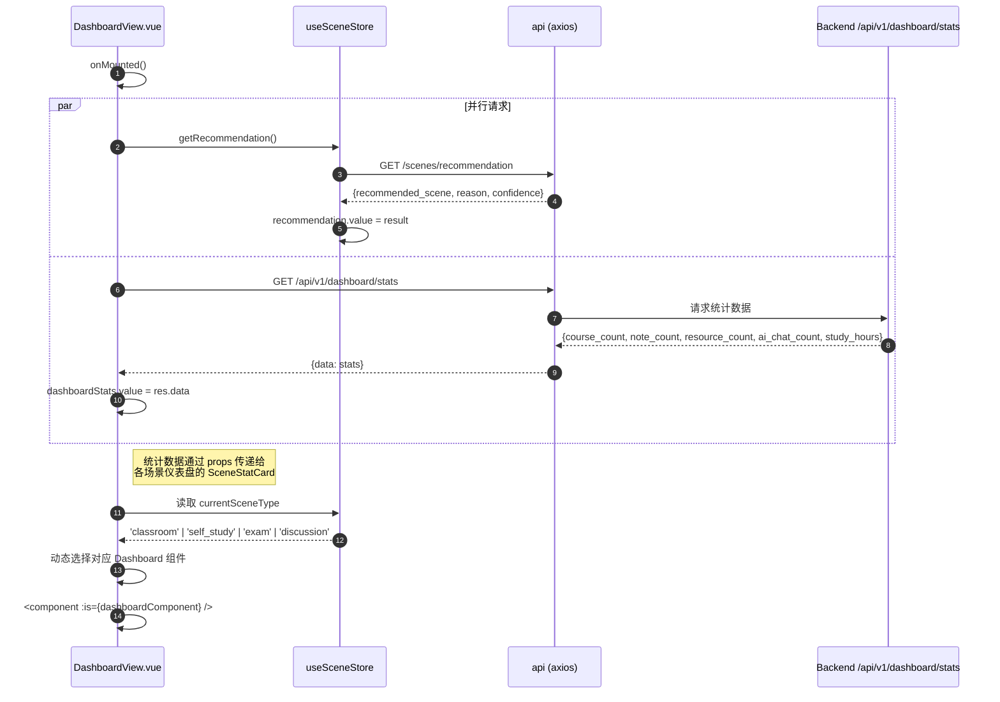
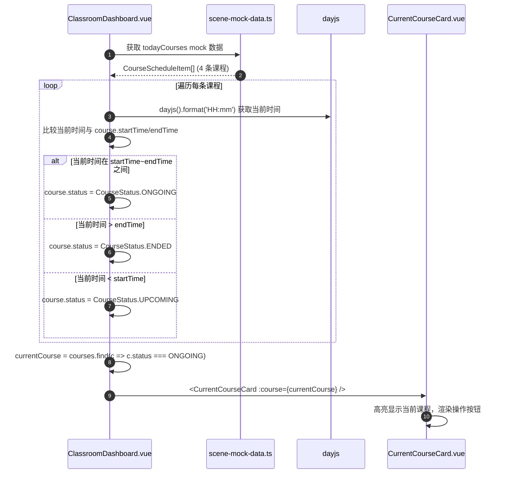
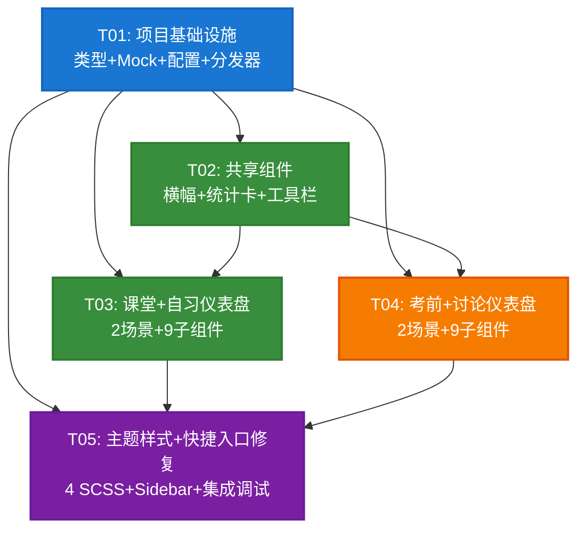

# 系统架构设计：学习场景化优化（Scene Optimization）

> **项目**: AI4EDU - AI 驱动的智慧教学平台
> **模块**: 3.11 学习场景化优化
> **架构师**: 高见远（Bob）
> **基于 PRD**: `docs/prd-scene-optimization.md` v1.0
> **文档版本**: v1.0
> **创建日期**: 2025-07-10

---

## 目录

- [Part A: 系统设计](#part-a-系统设计)
  - [1. 实现方案](#1-实现方案)
  - [2. 文件列表](#2-文件列表)
  - [3. 数据结构和接口](#3-数据结构和接口)
  - [4. 程序调用流程](#4-程序调用流程)
  - [5. 待明确事项](#5-待明确事项)
- [Part B: 任务分解](#part-b-任务分解)
  - [6. 依赖包列表](#6-依赖包列表)
  - [7. 任务列表](#7-任务列表)
  - [8. 共享知识](#8-共享知识)
  - [9. 任务依赖图](#9-任务依赖图)

---

## Part A: 系统设计

### 1. 实现方案

#### 1.1 核心技术挑战

| 挑战 | 说明 | 解决方案 |
|------|------|---------|
| **DashboardView 单文件膨胀** | 当前 435 行单文件包含四场景 if/else 分支，维护困难 | 重构为动态组件分发器，使用 Vue `<component :is>` 模式按 `currentSceneType` 分发到独立子仪表盘组件 |
| **四场景视觉同质化** | 当前仅靠主题色区分，布局/组件/信息密度完全一致 | 每场景独立仪表盘组件 + 独立子组件布局 + SCSS 主题扩展组件级样式差异（动画/圆角/间距） |
| **Mock 数据散落硬编码** | 当前 mock 数据直接写在模板和 ref 中，P2 替换困难 | 集中到 `mock/scene-mock-data.ts` 模块，按场景分组导出，P2 只需替换数据源 |
| **SCENE_CONFIG 配置不足** | 当前仅有 name/nameEn/icon/color 四个字段 | 扩展为含 slogan/description/illustration/accentColor 的完整配置，支持横幅组件渲染 |
| **失效快捷入口** | 课堂"举手提问"指向 `/ai-chat`，但侧边栏已删除 AI 对话入口 | 修复为指向 `/agent`（AI 智能体中心），路由已存在于 `scene-routes.ts` |
| **考前环形图渲染** | 复习进度环形图需要图表组件 | 复用项目已有的 `echarts` + `vue-echarts`（package.json 已声明），无需新增依赖 |

#### 1.2 框架与库选型

| 技术 | 选型 | 理由 |
|------|------|------|
| **前端框架** | Vue 3 + Composition API (`<script setup>`) | 项目已有技术栈，保持一致 |
| **UI 组件库** | Element Plus | 项目已有，使用 `el-row/el-col/el-card/el-tag/el-button/el-progress` 等 |
| **图表渲染** | ECharts + vue-echarts（已有依赖） | 考前模式环形进度图；项目 package.json 已含 `echarts@^5.5.0` 和 `vue-echarts@^6.7.0`，无需新增 |
| **状态管理** | Pinia（已有 `useSceneStore`） | 复用现有 scene store 的 `currentSceneType`/`sceneClass`/`primaryColor`/`featureFlags` |
| **样式方案** | SCSS + CSS 变量 | 扩展现有 `themes/*.scss`，通过 CSS 变量实现场景主题切换 |
| **路由** | Vue Router（已有 `scene-routes.ts`） | 路由结构 `/scene/:sceneType/dashboard` 无需调整，仅 DashboardView 内部分发变化 |
| **时间处理** | dayjs（已有依赖） | 课堂课表时间判断、考前倒计时计算 |
| **Mock 数据策略** | 集中 TypeScript 模块 | `mock/scene-mock-data.ts` 统一管理，P2 阶段替换为 API 调用时只需改数据源 |

#### 1.3 架构模式

采用 **组件分发器 + 场景策略** 模式：

```
DashboardView.vue（分发器）
  ├── 根据 sceneStore.currentSceneType 选择组件
  ├── <component :is="dashboardComponent" />
  │     ├── ClassroomDashboard.vue    ← 课堂策略
  │     ├── SelfStudyDashboard.vue    ← 自习策略
  │     ├── ExamDashboard.vue         ← 考前策略
  │     └── DiscussionDashboard.vue   ← 讨论策略
  │           └── 各自组合 SceneWelcomeBanner + 场景专属子组件
  └── 保留场景推荐 Alert（跨场景共享逻辑）
```

**设计原则**：
- **分发器精简**：DashboardView 仅负责场景判断和组件分发，不含业务逻辑
- **场景自治**：每个场景仪表盘独立管理自己的布局、子组件、mock 数据
- **共享组件下沉**：SceneWelcomeBanner、SceneStatCard、QuickActionBar 为跨场景共享组件
- **数据与视图分离**：所有 mock 数据集中在 types + mock 模块，组件只消费不生产

---

### 2. 文件列表

#### 2.1 新建文件（23 个）

| # | 文件路径 | 说明 | 所属任务 |
|---|---------|------|---------|
| 1 | `frontend/src/views/scene/types.ts` | 场景仪表盘 TypeScript 接口定义 | T01 |
| 2 | `frontend/src/views/scene/mock/scene-mock-data.ts` | 集中 mock 数据（按场景分组） | T01 |
| 3 | `frontend/src/views/scene/components/SceneWelcomeBanner.vue` | 场景欢迎横幅（共享） | T02 |
| 4 | `frontend/src/views/scene/components/SceneStatCard.vue` | 统计卡片（共享） | T02 |
| 5 | `frontend/src/views/scene/components/QuickActionBar.vue` | 快捷工具栏（共享） | T02 |
| 6 | `frontend/src/views/scene/classroom/ClassroomDashboard.vue` | 课堂模式仪表盘 | T03 |
| 7 | `frontend/src/views/scene/classroom/components/TodaySchedule.vue` | 今日课表时间轴 | T03 |
| 8 | `frontend/src/views/scene/classroom/components/CurrentCourseCard.vue` | 当前课程高亮卡 | T03 |
| 9 | `frontend/src/views/scene/classroom/components/ReviewReminder.vue` | 课后复习提醒 | T03 |
| 10 | `frontend/src/views/scene/self-study/SelfStudyDashboard.vue` | 自习模式仪表盘 | T03 |
| 11 | `frontend/src/views/scene/self-study/components/StudyPlanProgress.vue` | 学习计划进度 | T03 |
| 12 | `frontend/src/views/scene/self-study/components/KnowledgeGraphEntry.vue` | 知识图谱入口 | T03 |
| 13 | `frontend/src/views/scene/self-study/components/FlashcardReview.vue` | 闪卡复习提醒 | T03 |
| 14 | `frontend/src/views/scene/self-study/components/StudyTimeStats.vue` | 学习时长统计 | T03 |
| 15 | `frontend/src/views/scene/exam/ExamDashboard.vue` | 考前模式仪表盘 | T04 |
| 16 | `frontend/src/views/scene/exam/components/ExamCountdown.vue` | 考试倒计时大字报 | T04 |
| 17 | `frontend/src/views/scene/exam/components/ReviewProgress.vue` | 复习进度环形图 | T04 |
| 18 | `frontend/src/views/scene/exam/components/WrongBookSummary.vue` | 错题本概览 | T04 |
| 19 | `frontend/src/views/scene/exam/components/WeakPointsTags.vue` | 薄弱知识点标签 | T04 |
| 20 | `frontend/src/views/scene/discussion/DiscussionDashboard.vue` | 讨论模式仪表盘 | T04 |
| 21 | `frontend/src/views/scene/discussion/components/HotTopicsRank.vue` | 热门话题排行 | T04 |
| 22 | `frontend/src/views/scene/discussion/components/MyDiscussionFeed.vue` | 我的讨论动态 | T04 |
| 23 | `frontend/src/views/scene/discussion/components/QuickStartDiscussion.vue` | 快速发起讨论 | T04 |

#### 2.2 修改文件（7 个）

| # | 文件路径 | 修改内容 | 所属任务 |
|---|---------|---------|---------|
| 24 | `frontend/src/utils/constants.ts` | 扩展 `SCENE_CONFIG` 类型与数据（+slogan/description/illustration/accentColor） | T01 |
| 25 | `frontend/src/views/scene/DashboardView.vue` | 重构为动态组件分发器（删除 if/else 分支，改用 `<component :is>`） | T01 |
| 26 | `frontend/src/styles/themes/classroom.scss` | 新增组件级样式（时间轴、脉冲动画、卡片圆角） | T05 |
| 27 | `frontend/src/styles/themes/self-study.scss` | 新增组件级样式（进度条动效、图谱节点悬浮） | T05 |
| 28 | `frontend/src/styles/themes/exam.scss` | 新增组件级样式（倒计时闪烁、警示边框、标签悬停） | T05 |
| 29 | `frontend/src/styles/themes/discussion.scss` | 新增组件级样式（热度色条、未读弹跳、渐变背景） | T05 |
| 30 | `frontend/src/components/layout/Sidebar.vue` | 修复 P0-8 失效快捷入口（"举手提问"改指 `/agent`） | T05 |

#### 2.3 目录结构（重构后）

```
frontend/src/views/scene/
├── DashboardView.vue                    # [重构] 场景路由分发器（精简至 ~40 行）
├── types.ts                             # [新建] 仪表盘 TypeScript 接口
├── mock/
│   └── scene-mock-data.ts               # [新建] 集中 mock 数据
├── components/                           # [新建] 跨场景共享组件
│   ├── SceneWelcomeBanner.vue           #   场景横幅
│   ├── SceneStatCard.vue                #   统计卡片
│   └── QuickActionBar.vue               #   快捷工具栏
├── classroom/                            # [新建] 课堂模式
│   ├── ClassroomDashboard.vue           #   仪表盘入口
│   └── components/
│       ├── TodaySchedule.vue            #   今日课表时间轴
│       ├── CurrentCourseCard.vue        #   当前课程卡
│       └── ReviewReminder.vue           #   课后复习提醒
├── self-study/                           # [新建] 自习模式
│   ├── SelfStudyDashboard.vue           #   仪表盘入口
│   └── components/
│       ├── StudyPlanProgress.vue        #   学习计划进度
│       ├── KnowledgeGraphEntry.vue      #   知识图谱入口
│       ├── FlashcardReview.vue          #   闪卡复习
│       └── StudyTimeStats.vue           #   学习统计
├── exam/                                 # [新建] 考前模式
│   ├── ExamDashboard.vue                #   仪表盘入口
│   └── components/
│       ├── ExamCountdown.vue            #   倒计时大字报
│       ├── ReviewProgress.vue           #   复习进度环形图
│       ├── WrongBookSummary.vue         #   错题本概览
│       └── WeakPointsTags.vue           #   薄弱知识点
└── discussion/                           # [新建] 讨论模式
    ├── DiscussionDashboard.vue          #   仪表盘入口
    └── components/
        ├── HotTopicsRank.vue            #   热门话题排行
        ├── MyDiscussionFeed.vue          #   我的讨论动态
        └── QuickStartDiscussion.vue     #   快速发起讨论
```

---

### 3. 数据结构和接口

#### 3.1 类图（Mermaid）

```mermaid
classDiagram
    %% ===== 枚举与配置 =====
    class SceneType {
        <<enum>>
        CLASSROOM = 'classroom'
        SELF_STUDY = 'self_study'
        EXAM = 'exam'
        DISCUSSION = 'discussion'
    }

    class SceneConfigEntry {
        +String name
        +String nameEn
        +String icon
        +String color
        +String slogan
        +String description
        +String illustration
        +String accentColor
    }

    class SCENE_CONFIG {
        <<const Record~SceneType, SceneConfigEntry~>>
    }

    %% ===== Mock 数据接口 =====
    class CourseScheduleItem {
        +String id
        +String name
        +String startTime
        +String endTime
        +String location
        +CourseStatus status
        +String teacher
    }

    class CourseStatus {
        <<enum>>
        ONGOING = 'ongoing'
        ENDED = 'ended'
        UPCOMING = 'upcoming'
    }

    class StudyTask {
        +String id
        +String title
        +Boolean completed
        +String subject
        +String priority
    }

    class FlashcardStats {
        +Number pendingReview
        +Number masteryRate
        +String nextReviewTopic
    }

    class KnowledgeGraphMini {
        +Number totalNodes
        +Number weakNodes
        +GraphNode[] nodes
    }

    class GraphNode {
        +String id
        +String label
        +String color
        +Boolean isWeak
    }

    class StudyTimeData {
        +String weekHours
        +String todayHours
        +Number streakDays
    }

    class ExamCountdownData {
        +Number daysLeft
        +String examName
        +String examDate
    }

    class ReviewProgressData {
        +Number overallProgress
        +SubjectProgress[] subjects
    }

    class SubjectProgress {
        +String subject
        +Number progress
    }

    class WrongBookStats {
        +Number pendingReview
        +Number mastered
        +Number correctRate
    }

    class WeakPoint {
        +String id
        +String name
        +WeaknessLevel level
    }

    class WeaknessLevel {
        <<enum>>
        CRITICAL = 'critical'
        WARNING = 'warning'
        CAUTION = 'caution'
    }

    class DiscussionTopic {
        +String id
        +String title
        +Number participants
        +Number replies
        +Number heatScore
        +String[] tags
    }

    class MyDiscussionItem {
        +String id
        +String title
        +DiscussionType type
        +Number newReplies
        +Boolean resolved
    }

    class DiscussionType {
        <<enum>>
        MY_QUESTION = 'my_question'
        PARTICIPATED = 'participated'
    }

    class QuickAction {
        +String label
        +String icon
        +String route
        +String buttonType
    }

    class StatItem {
        +String label
        +String|Number value
        +String icon
        +String color
    }

    %% ===== 组件 Props =====
    class SceneWelcomeBanner {
        +SceneConfigEntry config
    }

    class SceneStatCard {
        +StatItem[] stats
    }

    class QuickActionBar {
        +QuickAction[] actions
        +String title
    }

    class ClassroomDashboard {
        +CourseScheduleItem[] todayCourses
        +CourseScheduleItem currentCourse
        +QuickAction[] toolbarActions
    }

    class SelfStudyDashboard {
        +StudyTask[] tasks
        +FlashcardStats flashcardStats
        +KnowledgeGraphMini graphMini
        +StudyTimeData studyTime
    }

    class ExamDashboard {
        +ExamCountdownData countdown
        +ReviewProgressData reviewProgress
        +WrongBookStats wrongBookStats
        +WeakPoint[] weakPoints
        +QuickAction[] toolbarActions
    }

    class DiscussionDashboard {
        +DiscussionTopic[] hotTopics
        +MyDiscussionItem[] myDiscussions
        +QuickAction[] collabActions
    }

    %% ===== 关系 =====
    SCENE_CONFIG --> SceneConfigEntry : Record~SceneType, ~
    SceneConfigEntry --> SceneType : keyed by

    CourseScheduleItem --> CourseStatus : status
    StudyTask --> CourseScheduleItem : shares id pattern
    KnowledgeGraphMini --> GraphNode : nodes[]
    ReviewProgressData --> SubjectProgress : subjects[]
    WeakPoint --> WeaknessLevel : level
    MyDiscussionItem --> DiscussionType : type

    SceneWelcomeBanner --> SceneConfigEntry : props.config
    SceneStatCard --> StatItem : props.stats[]
    QuickActionBar --> QuickAction : props.actions[]

    ClassroomDashboard --> CourseScheduleItem : todayCourses[]
    ClassroomDashboard --> QuickAction : toolbarActions[]
    SelfStudyDashboard --> StudyTask : tasks[]
    SelfStudyDashboard --> FlashcardStats : flashcardStats
    SelfStudyDashboard --> KnowledgeGraphMini : graphMini
    SelfStudyDashboard --> StudyTimeData : studyTime
    ExamDashboard --> ExamCountdownData : countdown
    ExamDashboard --> ReviewProgressData : reviewProgress
    ExamDashboard --> WrongBookStats : wrongBookStats
    ExamDashboard --> WeakPoint : weakPoints[]
    ExamDashboard --> QuickAction : toolbarActions[]
    DiscussionDashboard --> DiscussionTopic : hotTopics[]
    DiscussionDashboard --> MyDiscussionItem : myDiscussions[]
    DiscussionDashboard --> QuickAction : collabActions[]
```



#### 3.2 核心 TypeScript 接口定义

> 以下接口将定义在 `frontend/src/views/scene/types.ts` 中：

```typescript
/**
 * AI4Edu 场景仪表盘类型定义
 */

// ============ 通用类型 ============

/** 课程状态枚举 */
export enum CourseStatus {
  ONGOING = 'ongoing',
  ENDED = 'ended',
  UPCOMING = 'upcoming',
}

/** 薄弱知识点严重程度 */
export enum WeaknessLevel {
  CRITICAL = 'critical',   // 🔴 红色
  WARNING = 'warning',     // 🟠 橙色
  CAUTION = 'caution',     // 🟡 黄色
}

/** 讨论类型 */
export enum DiscussionType {
  MY_QUESTION = 'my_question',
  PARTICIPATED = 'participated',
}

/** 快捷操作项 */
export interface QuickAction {
  label: string
  icon: string
  route: string
  buttonType: 'primary' | 'success' | 'warning' | 'danger' | 'info'
}

/** 统计项 */
export interface StatItem {
  label: string
  value: string | number
  icon: string
  color: string
}

// ============ 课堂模式 Mock 数据 ============

/** 课程表条目 */
export interface CourseScheduleItem {
  id: string
  name: string
  startTime: string         // '08:00'
  endTime: string           // '09:40'
  location: string
  status: CourseStatus
  teacher: string
}

/** 课后复习提醒 */
export interface ReviewReminderItem {
  courseId: string
  courseName: string
  description: string
  actionLabel: string
  actionRoute: string
}

// ============ 自习模式 Mock 数据 ============

/** 学习任务 */
export interface StudyTask {
  id: string
  title: string
  completed: boolean
  subject: string
  priority: 'high' | 'medium' | 'low'
}

/** 闪卡统计 */
export interface FlashcardStats {
  pendingReview: number
  masteryRate: number       // 0-100
  nextReviewTopic: string
}

/** 知识图谱迷你节点 */
export interface GraphNode {
  id: string
  label: string
  color: string
  isWeak: boolean
}

/** 知识图谱迷你数据 */
export interface KnowledgeGraphMini {
  totalNodes: number
  weakNodes: number
  nodes: GraphNode[]
}

/** 学习时长统计 */
export interface StudyTimeData {
  weekHours: string         // '12.5h'
  todayHours: string        // '2.3h'
  streakDays: number
}

// ============ 考前模式 Mock 数据 ============

/** 考试倒计时 */
export interface ExamCountdownData {
  daysLeft: number
  examName: string
  examDate: string          // ISO date string
}

/** 科目复习进度 */
export interface SubjectProgress {
  subject: string
  progress: number          // 0-100
}

/** 复习进度总览 */
export interface ReviewProgressData {
  overallProgress: number   // 0-100
  subjects: SubjectProgress[]
}

/** 错题本统计 */
export interface WrongBookStats {
  pendingReview: number
  mastered: number
  correctRate: number       // 0-100
}

/** 薄弱知识点 */
export interface WeakPoint {
  id: string
  name: string
  level: WeaknessLevel
}

// ============ 讨论模式 Mock 数据 ============

/** 热门话题 */
export interface DiscussionTopic {
  id: string
  title: string
  participants: number
  replies: number
  heatScore: number
  tags: string[]
}

/** 我的讨论条目 */
export interface MyDiscussionItem {
  id: string
  title: string
  type: DiscussionType
  newReplies: number
  resolved: boolean
}
```

#### 3.3 SCENE_CONFIG 扩展类型

> 修改 `frontend/src/utils/constants.ts` 中的 `SCENE_CONFIG`：

```typescript
/**
 * 场景配置条目（扩展后）
 */
export interface SceneConfigEntry {
  name: string
  nameEn: string
  icon: string
  color: string
  slogan: string           // 场景标语
  description: string      // 场景描述
  illustration: string     // 场景插画/图标标识（P0 用 Element Plus 图标名）
  accentColor: string      // 辅助强调色
}

export const SCENE_CONFIG: Record<SceneType, SceneConfigEntry> = {
  [SceneType.CLASSROOM]: {
    name: '课堂模式',
    nameEn: 'Classroom',
    icon: 'School',
    color: '#1976D2',
    slogan: '专注课堂，同步记录',
    description: '实时课表、课堂互动、课后回顾一站式',
    illustration: 'School',      // P0 用图标，P2 替换为 SVG 路径
    accentColor: '#64B5F6',
  },
  [SceneType.SELF_STUDY]: {
    name: '自习模式',
    nameEn: 'Self Study',
    icon: 'Reading',
    color: '#388E3C',
    slogan: '自主规划，高效学习',
    description: '学习计划、知识图谱、闪卡记忆',
    illustration: 'Reading',
    accentColor: '#81C784',
  },
  [SceneType.EXAM]: {
    name: '考前模式',
    nameEn: 'Exam Prep',
    icon: 'EditPen',
    color: '#F57C00',
    slogan: '冲刺备考，查漏补缺',
    description: '倒计时、错题本、模拟考试、薄弱知识点',
    illustration: 'EditPen',
    accentColor: '#FFB74D',
  },
  [SceneType.DISCUSSION]: {
    name: '讨论模式',
    nameEn: 'Discussion',
    icon: 'ChatDotRound',
    color: '#7B1FA2',
    slogan: '思想碰撞，协作共进',
    description: '热门话题、互动讨论、协作白板',
    illustration: 'ChatDotRound',
    accentColor: '#BA68C8',
  },
}
```

#### 3.4 共享组件 Props 定义

**SceneWelcomeBanner.vue**：
```typescript
// Props
interface Props {
  config: SceneConfigEntry  // 从 SCENE_CONFIG[currentSceneType] 传入
}
// 无 emit，纯展示组件
```

**SceneStatCard.vue**：
```typescript
// Props
interface Props {
  stats: StatItem[]  // 统计项数组，最多 4 个
}
// 无 emit
```

**QuickActionBar.vue**：
```typescript
// Props
interface Props {
  actions: QuickAction[]  // 快捷操作列表
  title?: string          // 工具栏标题，默认"快捷工具"
}
// Emit
interface Emits {
  (e: 'action', action: QuickAction): void  // 点击操作时触发
}
```

---

### 4. 程序调用流程

#### 4.1 场景切换 → 仪表盘渲染 时序图



#### 4.2 DashboardView 初始化时序图



#### 4.3 课堂模式当前课程状态判断流程



---

### 5. 待明确事项

| 编号 | 问题 | 影响范围 | 架构建议 | 状态 |
|------|------|---------|---------|------|
| A-1 | PRD Q-1: 课堂"举手提问"指向 `/ai-chat`，当前路由 `scene-routes.ts` 中 `ai-chat/:sessionId?` 路由实际存在（加载 `AgentChatView.vue`），但侧边栏已移除 AI 对话入口导致不易发现。是否改为指向 `/agent`（AI 智能体中心）？ | 课堂工具栏 P0-8 | **建议改为 `/agent`**：路由 `/scene/:sceneType/agent` 已存在，指向 `AgentCenterView.vue`，用户可选择智能体提问，体验更优 | ⏳ 待确认 |
| A-2 | PRD Q-7: 四场景是否保留统一顶部统计卡区？当前 DashboardView 顶部有 4 个统计卡（课程数/笔记数/学习时长/AI对话），重构后统计卡由各场景仪表盘自行管理还是保留在分发器层？ | 所有场景布局 | **建议各场景自定义**：分发器不再渲染统计卡，各场景仪表盘内通过 `SceneStatCard` 组件渲染场景相关统计（如考前模式不显示"AI对话"次数，改显示"错题数/复习进度"）。统计数据来源：P0 复用 `GET /api/v1/dashboard/stats` + 场景 mock 补充 | ⏳ 待确认 |
| A-3 | PRD Q-6: 场景横幅插画资源 P0 是否需要 SVG 文件？还是用 Element Plus 图标 + 主题色渐变背景替代？ | SceneWelcomeBanner | **P0 用图标替代**：`illustration` 字段暂存 Element Plus 图标名（如 `School`），横幅左侧渲染大号图标 + 主题色圆形背景。P2 迭代替换为设计师提供的 SVG 插画 | ⏳ 待确认 |
| A-4 | PRD Q-3: 考前倒计时 P0 固定 14 天，是否需要支持 localStorage 持久化用户设置的考试日期？ | ExamCountdown | **P0 固定 14 天**：mock 数据写死 `daysLeft: 14`，不提供设置入口。P1 需求（P1-4）再增加日期设置功能 | ⏳ 已明确 |
| A-5 | PRD Q-8: 自习模式知识图谱迷你图是否可交互？ | KnowledgeGraphEntry | **P0 不可交互**：迷你图仅展示静态拓扑 SVG，点击整个卡片跳转 `/scene/self_study/graphs`（路由已存在） | ⏳ 已明确 |
| A-6 | 后端 `scene_config.py` 中 ScenePreset 场景类型（self_study/preview/review/exam_prep）与前端 SceneType（classroom/self_study/exam/discussion）不完全对应，P0 不动后端，但 P2 对接时需统一枚举 | 后端对接 | P0 不影响（前端 mock 为主），P2 阶段需做场景类型映射层 | 📋 P2 处理 |
| A-7 | DashboardView 当前 `goTo()` 方法将路径拼接为 `/scene/${currentSceneType}${path}`，重构后子组件如何跳转？ | 所有场景子组件 | **统一使用 `useRouter().push()` 直接跳转完整路径**：子组件通过 `inject` 或 props 接收 `currentSceneType`，拼接 `/scene/${sceneType}/${subPath}`。或在 QuickActionBar 的 `@action` emit 中统一处理路由跳转 | ⏳ 待确认 |

---

## Part B: 任务分解

### 6. 依赖包列表

| 包名 | 版本 | 用途 | 是否新增 |
|------|------|------|---------|
| `echarts` | ^5.5.0 | 考前模式复习进度环形图 | ❌ 已有 |
| `vue-echarts` | ^6.7.0 | ECharts 的 Vue 3 封装组件 | ❌ 已有 |
| `dayjs` | ^1.11.10 | 课堂课表时间判断、考前倒计时计算 | ❌ 已有 |
| `element-plus` | ^2.7.0 | UI 组件（el-card/el-tag/el-button/el-progress 等） | ❌ 已有 |
| `@element-plus/icons-vue` | ^2.3.0 | 场景图标、工具栏图标 | ❌ 已有 |
| `pinia` | ^2.1.0 | 状态管理（useSceneStore） | ❌ 已有 |

> **结论：P0 无需新增任何 npm 依赖包。** 所有所需库均已在 `package.json` 中声明。

---

### 7. 任务列表

#### T01: 项目基础设施（类型定义 + Mock 数据 + 配置扩展 + 分发器重构）

| 项 | 内容 |
|----|------|
| **任务编号** | T01 |
| **任务名称** | 项目基础设施：类型定义、Mock 数据、SCENE_CONFIG 扩展、DashboardView 分发器重构 |
| **优先级** | P0 |
| **涉及文件** | `frontend/src/views/scene/types.ts`（新建）<br>`frontend/src/views/scene/mock/scene-mock-data.ts`（新建）<br>`frontend/src/utils/constants.ts`（修改：扩展 SCENE_CONFIG）<br>`frontend/src/views/scene/DashboardView.vue`（重构：删除 if/else 分支，改为 `<component :is>` 分发器，保留场景推荐 Alert 和 onMounted 统计获取） |
| **依赖任务** | 无（基础任务，所有后续任务依赖此任务） |
| **详细说明** | 1. 创建 `types.ts`，定义所有场景仪表盘所需的 TypeScript 接口（见架构文档 3.2 节）<br>2. 创建 `mock/scene-mock-data.ts`，按场景分组导出 mock 数据（classroomMockData / selfStudyMockData / examMockData / discussionMockData），每个对象包含该场景所有子组件所需数据<br>3. 修改 `constants.ts`：新增 `SceneConfigEntry` 接口，扩展 `SCENE_CONFIG` 增加 slogan/description/illustration/accentColor 字段（见架构文档 3.3 节）<br>4. 重构 `DashboardView.vue`：删除四场景 if/else 模板分支，改为 `<component :is="dashboardComponent" />` 动态分发；保留场景推荐 Alert 和 `onMounted` 中的 `getRecommendation()` + `dashboard/stats` 获取逻辑；统计数据通过 props 传给子组件 |

#### T02: 共享组件（场景横幅 + 统计卡片 + 快捷工具栏）

| 项 | 内容 |
|----|------|
| **任务编号** | T02 |
| **任务名称** | 共享组件：SceneWelcomeBanner、SceneStatCard、QuickActionBar |
| **优先级** | P0 |
| **涉及文件** | `frontend/src/views/scene/components/SceneWelcomeBanner.vue`（新建）<br>`frontend/src/views/scene/components/SceneStatCard.vue`（新建）<br>`frontend/src/views/scene/components/QuickActionBar.vue`（新建） |
| **依赖任务** | T01（需要 SceneConfigEntry 类型和 StatItem/QuickAction 接口） |
| **详细说明** | 1. `SceneWelcomeBanner.vue`：接收 `config: SceneConfigEntry` props，渲染场景图标（Element Plus 图标 + 主题色圆形背景）+ 场景名称 + slogan + description；背景使用 `config.accentColor` 的浅色渐变；高度约 100px<br>2. `SceneStatCard.vue`：接收 `stats: StatItem[]` props，使用 `el-row/el-col` 响应式布局（xs=12, sm=6），每项渲染图标 + 数值 + 标签；图标颜色使用 `stat.color`<br>3. `QuickActionBar.vue`：接收 `actions: QuickAction[]` 和可选 `title` props，渲染工具栏标题 + 按钮组（`el-button` 按 `buttonType` 设置 type）；点击按钮 emit `action` 事件，由父组件处理路由跳转 |

#### T03: 课堂 + 自习仪表盘

| 项 | 内容 |
|----|------|
| **任务编号** | T03 |
| **任务名称** | 课堂模式仪表盘 + 自习模式仪表盘（含子组件） |
| **优先级** | P0 |
| **涉及文件** | `frontend/src/views/scene/classroom/ClassroomDashboard.vue`（新建）<br>`frontend/src/views/scene/classroom/components/TodaySchedule.vue`（新建）<br>`frontend/src/views/scene/classroom/components/CurrentCourseCard.vue`（新建）<br>`frontend/src/views/scene/classroom/components/ReviewReminder.vue`（新建）<br>`frontend/src/views/scene/self-study/SelfStudyDashboard.vue`（新建）<br>`frontend/src/views/scene/self-study/components/StudyPlanProgress.vue`（新建）<br>`frontend/src/views/scene/self-study/components/KnowledgeGraphEntry.vue`（新建）<br>`frontend/src/views/scene/self-study/components/FlashcardReview.vue`（新建）<br>`frontend/src/views/scene/self-study/components/StudyTimeStats.vue`（新建） |
| **依赖任务** | T01（类型 + mock 数据 + 分发器）、T02（共享组件） |
| **详细说明** | **课堂模式**：<br>1. `ClassroomDashboard.vue`：引入 `SceneWelcomeBanner` + `SceneStatCard`（课堂专属统计）+ `CurrentCourseCard` + `TodaySchedule` + `ReviewReminder` + `QuickActionBar`；从 `classroomMockData` 获取数据；使用 dayjs 判断课程状态<br>2. `TodaySchedule.vue`：时间轴样式（左侧时间线 + 状态圆点），状态用颜色标识（绿=进行中、灰=已结束、橙=未开始）<br>3. `CurrentCourseCard.vue`：高亮卡片，显示当前课程信息 + 3 个操作按钮（做笔记/课堂互动/资料）<br>4. `ReviewReminder.vue`：课后复习提醒列表，每项含课程名 + 描述 + 操作按钮<br><br>**自习模式**：<br>5. `SelfStudyDashboard.vue`：引入 `SceneWelcomeBanner` + `SceneStatCard` + `StudyPlanProgress` + `KnowledgeGraphEntry` + `FlashcardReview` + `StudyTimeStats`；从 `selfStudyMockData` 获取数据<br>6. `StudyPlanProgress.vue`：进度条（`el-progress`）+ 任务列表（勾选状态）<br>7. `KnowledgeGraphEntry.vue`：迷你拓扑 SVG（静态节点图）+ 薄弱节点数 + "进入图谱"按钮<br>8. `FlashcardReview.vue`：待复习卡片数 + 掌握度进度条 + 下次复习主题 + "开始复习"按钮<br>9. `StudyTimeStats.vue`：横条展示本周学习时长/今日时长/连续打卡天数 |

#### T04: 考前 + 讨论仪表盘

| 项 | 内容 |
|----|------|
| **任务编号** | T04 |
| **任务名称** | 考前模式仪表盘 + 讨论模式仪表盘（含子组件） |
| **优先级** | P0 |
| **涉及文件** | `frontend/src/views/scene/exam/ExamDashboard.vue`（新建）<br>`frontend/src/views/scene/exam/components/ExamCountdown.vue`（新建）<br>`frontend/src/views/scene/exam/components/ReviewProgress.vue`（新建）<br>`frontend/src/views/scene/exam/components/WrongBookSummary.vue`（新建）<br>`frontend/src/views/scene/exam/components/WeakPointsTags.vue`（新建）<br>`frontend/src/views/scene/discussion/DiscussionDashboard.vue`（新建）<br>`frontend/src/views/scene/discussion/components/HotTopicsRank.vue`（新建）<br>`frontend/src/views/scene/discussion/components/MyDiscussionFeed.vue`（新建）<br>`frontend/src/views/scene/discussion/components/QuickStartDiscussion.vue`（新建） |
| **依赖任务** | T01（类型 + mock 数据 + 分发器）、T02（共享组件） |
| **详细说明** | **考前模式**：<br>1. `ExamDashboard.vue`：引入 `SceneWelcomeBanner` + `SceneStatCard`（考前专属统计）+ `ExamCountdown` + `ReviewProgress` + `WrongBookSummary` + `WeakPointsTags` + `QuickActionBar`；从 `examMockData` 获取数据<br>2. `ExamCountdown.vue`：大字报样式居中显示倒计时天数，下方显示考试名称和日期，提供"设置考试日期"按钮（P0 点击提示"P1 版本支持"）<br>3. `ReviewProgress.vue`：使用 `vue-echarts` 渲染环形进度图（overallProgress）+ 下方各科目进度条<br>4. `WrongBookSummary.vue`：三列数字展示（待复习/已掌握/正确率）+ "错题重练"按钮<br>5. `WeakPointsTags.vue`：标签云布局，按 WeaknessLevel 着色（红/橙/黄），悬停展开详情<br><br>**讨论模式**：<br>6. `DiscussionDashboard.vue`：引入 `SceneWelcomeBanner` + `SceneStatCard`（讨论专属统计）+ `QuickStartDiscussion` + `HotTopicsRank` + `MyDiscussionFeed` + `QuickActionBar`；从 `discussionMockData` 获取数据<br>7. `HotTopicsRank.vue`：排行榜样式（序号 + 标题 + 参与人数 + 回复数 + 热度），左侧热度色条<br>8. `MyDiscussionFeed.vue`：分区显示"我的提问"和"我参与的"，新回复有未读标记（🔔）<br>9. `QuickStartDiscussion.vue`：顶部输入区，提供"发起话题/提问/创建投票"三个入口按钮 |

#### T05: 主题样式扩展 + 快捷入口修复 + 集成调试

| 项 | 内容 |
|----|------|
| **任务编号** | T05 |
| **任务名称** | SCSS 主题样式扩展、P0-8 失效快捷入口修复、四场景集成调试 |
| **优先级** | P0 |
| **涉及文件** | `frontend/src/styles/themes/classroom.scss`（修改）<br>`frontend/src/styles/themes/self-study.scss`（修改）<br>`frontend/src/styles/themes/exam.scss`（修改）<br>`frontend/src/styles/themes/discussion.scss`（修改）<br>`frontend/src/components/layout/Sidebar.vue`（修改：修复 P0-8） |
| **依赖任务** | T01（分发器）、T03（课堂+自习仪表盘）、T04（考前+讨论仪表盘） |
| **详细说明** | 1. **classroom.scss 扩展**：新增时间轴线样式（`.classroom-timeline`）、进行中课程脉冲动画（`@keyframes pulse`）、卡片圆角调整（8px→10px）<br>2. **self-study.scss 扩展**：新增进度条动效（`@keyframes progress-glow`）、知识图谱节点悬浮放大（`.graph-node:hover`）、绿色系渐变卡片背景<br>3. **exam.scss 扩展**：新增倒计时数字闪烁动画（`@keyframes countdown-blink`）、薄弱知识点标签悬停展开、橙色警示边框（`border: 2px solid rgba(245,124,0,0.3)`）<br>4. **discussion.scss 扩展**：新增话题卡片左侧热度色条、未读标记弹跳动画（`@keyframes bounce`）、紫色渐变话题背景<br>5. **Sidebar.vue P0-8 修复**：排查所有场景仪表盘中的快捷入口路由，将失效的 `/ai-chat` 链接修改为 `/agent`（AI 智能体中心）；确认其他快捷入口路由均有效<br>6. **集成调试**：启动 `npm run dev`，切换四个场景验证仪表盘渲染、主题样式、快捷入口跳转、mock 数据展示 |

---

### 8. 共享知识

#### 8.1 命名规范

| 类别 | 规范 | 示例 |
|------|------|------|
| **组件文件名** | PascalCase.vue | `ClassroomDashboard.vue`、`TodaySchedule.vue` |
| **组件目录名** | kebab-case（与 SceneType 枚举值一致） | `classroom/`、`self-study/`、`exam/`、`discussion/` |
| **子组件目录** | `components/`（各场景目录下） | `classroom/components/TodaySchedule.vue` |
| **TypeScript 接口** | PascalCase，无 `I` 前缀 | `CourseScheduleItem`、`FlashcardStats` |
| **枚举** | PascalCase，值为小写下划线 | `CourseStatus.ONGOING`、`WeaknessLevel.CRITICAL` |
| **Mock 数据导出** | camelCase + `MockData` 后缀 | `classroomMockData`、`examMockData` |
| **CSS 类名** | BEM 规范（block__element--modifier） | `.classroom-dashboard__schedule--active` |
| **CSS 变量** | `--scene-{场景}-{用途}` | `--scene-exam-primary`、`--scene-classroom-accent` |
| **事件名** | kebab-case | `@action`、`@scene-switch` |

#### 8.2 Mock 数据组织方式

```typescript
// mock/scene-mock-data.ts 组织结构
import type {
  CourseScheduleItem, ReviewReminderItem, QuickAction,
  StudyTask, FlashcardStats, KnowledgeGraphMini, StudyTimeData,
  ExamCountdownData, ReviewProgressData, WrongBookStats, WeakPoint,
  DiscussionTopic, MyDiscussionItem, StatItem,
} from '../types'

// 课堂模式 mock 数据
export const classroomMockData = {
  stats: StatItem[],
  todayCourses: CourseScheduleItem[],
  reviewReminders: ReviewReminderItem[],
  toolbarActions: QuickAction[],
}

// 自习模式 mock 数据
export const selfStudyMockData = {
  stats: StatItem[],
  tasks: StudyTask[],
  flashcardStats: FlashcardStats,
  graphMini: KnowledgeGraphMini,
  studyTime: StudyTimeData,
}

// 考前模式 mock 数据
export const examMockData = {
  stats: StatItem[],
  countdown: ExamCountdownData,
  reviewProgress: ReviewProgressData,
  wrongBookStats: WrongBookStats,
  weakPoints: WeakPoint[],
  toolbarActions: QuickAction[],
}

// 讨论模式 mock 数据
export const discussionMockData = {
  stats: StatItem[],
  hotTopics: DiscussionTopic[],
  myDiscussions: MyDiscussionItem[],
  collabActions: QuickAction[],
}
```

**Mock 数据约定**：
- 所有 mock 数据集中在一个文件中，按场景分组导出
- 每个场景导出一个对象，包含该场景所有子组件所需数据
- P2 阶段替换为 API 调用时，只需创建 `services/scene-dashboard.ts`，在各仪表盘组件中替换 import 来源
- Mock 数据应标注"示例数据"标签（PRD Q-2 建议），可在 `SceneStatCard` 或卡片右上角添加 `<el-tag type="info" size="small">示例</el-tag>`

#### 8.3 样式变量约定

| 变量名 | 用途 | 定义位置 |
|--------|------|---------|
| `--scene-primary-color` | 场景主色 | `variables.scss` :root + 各 `themes/*.scss` |
| `--scene-primary-light` | 主色浅色变体 | 各 `themes/*.scss` |
| `--scene-primary-dark` | 主色深色变体 | 各 `themes/*.scss` |
| `--scene-primary-bg` | 主色背景色（极浅） | 各 `themes/*.scss` |
| `--scene-accent-color` | 辅助强调色（新增） | 各 `themes/*.scss`（对应 SCENE_CONFIG.accentColor） |
| `--scene-sidebar-gradient` | 侧边栏渐变 | `scene.ts` store 中 `applySceneTheme()` 动态设置 |

**新增样式变量**（T05 中添加到各 themes/*.scss）：
```scss
// classroom.scss 新增
.scene-classroom {
  --scene-accent-color: #64B5F6;
  --scene-banner-gradient: linear-gradient(135deg, #E3F2FD 0%, #BBDEFB 100%);
  --scene-card-radius: 10px;
}

// exam.scss 新增
.scene-exam {
  --scene-accent-color: #FFB74D;
  --scene-banner-gradient: linear-gradient(135deg, #FFF3E0 0%, #FFE0B2 100%);
  --scene-card-radius: 8px;
  --scene-warning-border: 2px solid rgba(245, 124, 0, 0.3);
}
```

#### 8.4 路由跳转约定

所有场景内快捷入口的路由跳转遵循统一模式：

```typescript
// 在各场景仪表盘组件中
import { useRouter } from 'vue-router'
import { useSceneStore } from '@/stores/scene'

const router = useRouter()
const sceneStore = useSceneStore()

function navigateToSceneRoute(subPath: string): void {
  const sceneType = sceneStore.currentSceneType
  router.push(`/scene/${sceneType}/${subPath}`)
}

// QuickActionBar 的 action 事件处理
function handleAction(action: QuickAction): void {
  navigateToSceneRoute(action.route)
}
```

**快捷入口路由映射表**（P0-8 修复后）：

| 场景 | 操作 | 旧路由 | 新路由 | 目标组件 |
|------|------|--------|--------|---------|
| 课堂 | 举手提问 | `/ai-chat` ❌ | `/agent` ✅ | AgentCenterView.vue |
| 课堂 | 做笔记 | — | `/notes` | NoteListView.vue |
| 课堂 | 随堂测验 | `/diagnosis` | `/diagnosis` ✅ | DiagnosisView.vue |
| 自习 | 知识图谱 | `/graphs` | `/graphs` ✅ | GraphSquareView.vue |
| 自习 | 闪卡复习 | — | `/graphs` | GraphSquareView.vue |
| 考前 | 错题重练 | `/notes` | `/diagnosis` ✅ | DiagnosisView.vue |
| 考前 | 模拟考试 | `/diagnosis` | `/diagnosis` ✅ | DiagnosisView.vue |
| 考前 | 限时训练 | `/diagnosis` | `/diagnosis` ✅ | DiagnosisView.vue |
| 讨论 | 发起讨论 | `/ai-chat` | `/agent` ✅ | AgentCenterView.vue |
| 讨论 | 协作白板 | `/buddy` | `/buddy` ✅ | BuddyChatView.vue |

#### 8.5 组件通信约定

```
DashboardView.vue
  │
  ├── props: 无（直接从 sceneStore 读取）
  ├── provide: dashboardStats（从 API 获取的统计数据）
  │
  └── <component :is="dashboardComponent" />
        │
        ├── props: 无（各仪表盘自行从 mock 模块和 store 获取数据）
        ├── 内部组合: SceneWelcomeBanner + SceneStatCard + 场景子组件 + QuickActionBar
        │
        ├── SceneWelcomeBanner: props = { config: SceneConfigEntry }
        ├── SceneStatCard: props = { stats: StatItem[] }
        ├── QuickActionBar: props = { actions, title }, emit = { @action }
        └── 场景子组件: props = { 各自数据接口 }, 部分有 emit
```

**关键约定**：
- 各场景仪表盘组件**不接收 props**，自行从 `scene-mock-data.ts` 导入数据和从 `useSceneStore` 获取场景配置
- `SceneWelcomeBanner` 通过 `SCENE_CONFIG[sceneStore.currentSceneType]` 获取配置，或由父组件传入
- `QuickActionBar` 的路由跳转由父组件（各场景仪表盘）通过 `@action` 事件处理
- `provide/inject` 仅用于 DashboardView 向子组件传递 `dashboardStats`（API 获取的统计数据），避免 prop drilling

---

### 9. 任务依赖图



**依赖说明**：

| 任务 | 依赖 | 依赖原因 |
|------|------|---------|
| T01 | 无 | 基础设施任务，定义类型、数据、配置和分发器 |
| T02 | T01 | 需要 `SceneConfigEntry`、`StatItem`、`QuickAction` 类型定义 |
| T03 | T01, T02 | 需要类型定义 + mock 数据 + 共享组件（SceneWelcomeBanner/SceneStatCard/QuickActionBar） |
| T04 | T01, T02 | 同 T03，需要类型定义 + mock 数据 + 共享组件 |
| T05 | T01, T03, T04 | 需要所有仪表盘组件就绪后才能编写场景专属样式 + 修复 Sidebar 快捷入口 + 集成调试 |

**并行机会**：
- T02 与 T03/T04 的子组件开发可部分并行（T02 完成后 T03 和 T04 可同时启动）
- T03 和 T04 互不依赖，可完全并行开发

---

> **文档作者**: 高见远（Bob）· 架构师
> **基于 PRD**: 许清楚（Xu）· 产品经理
> **审核人**: 陈安国（项目负责人）
> **下次更新**: 评审后根据反馈修订
