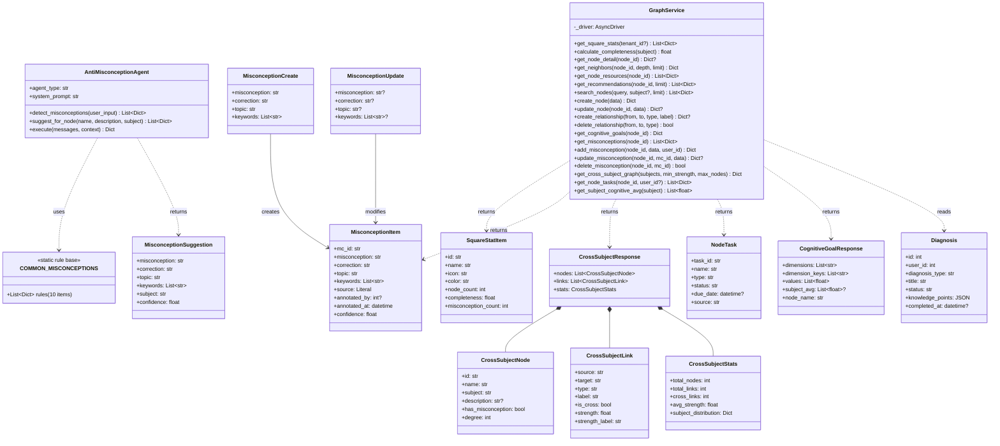
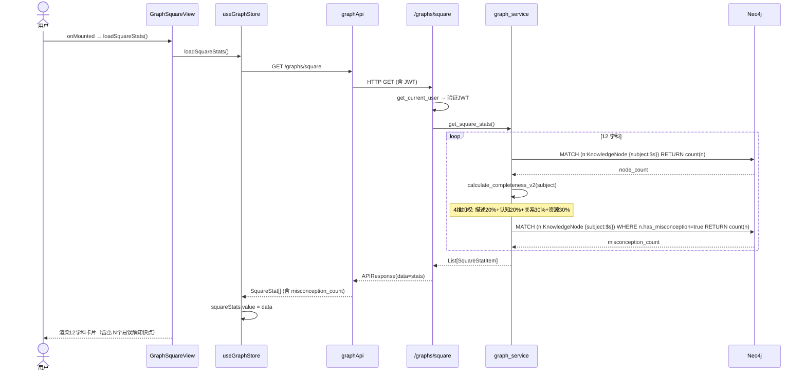
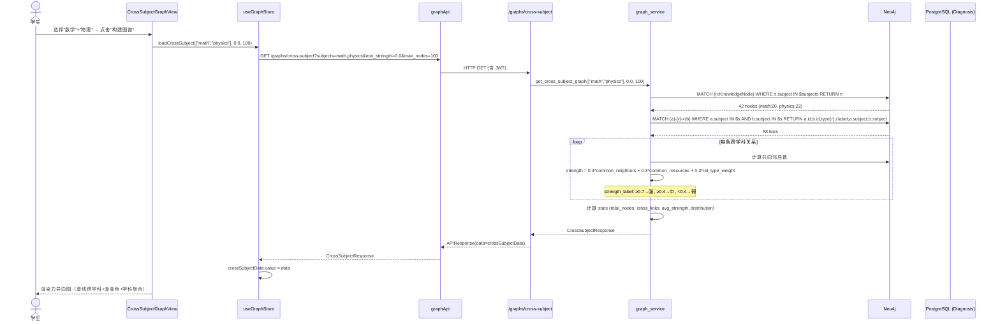
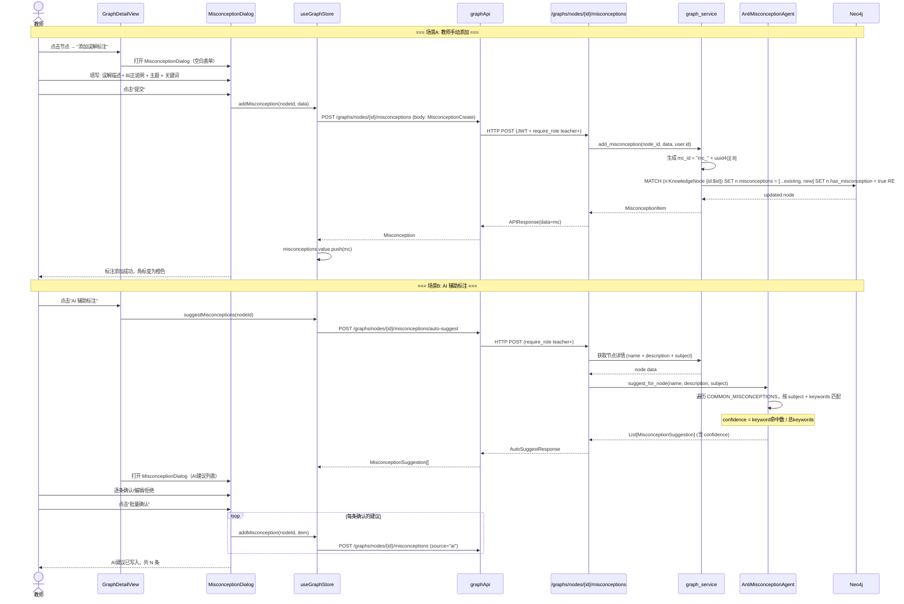
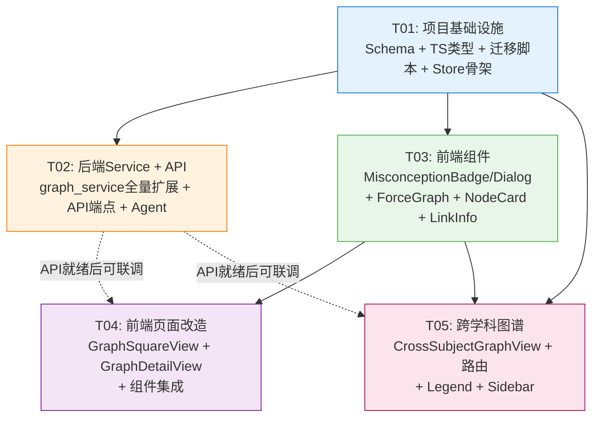

# AI4EDU 知识图谱模块 — 系统架构设计 & 任务分解

> **架构师**: 高见远（Gao）
> **日期**: 2025-07-13
> **分支**: YeGen_Module_3.4_图谱
> **基准文档**: `docs/prd-knowledge-graph.md`

---

## 目录

1. [Part A: 系统设计](#part-a-系统设计)
   - [1. 实现方案概述](#1-实现方案概述)
   - [2. 文件列表](#2-文件列表)
   - [3. 数据结构和接口设计](#3-数据结构和接口设计)
   - [4. 程序调用流程（时序图）](#4-程序调用流程时序图)
   - [5. 待明确事项](#5-待明确事项)
2. [Part B: 任务分解](#part-b-任务分解)
   - [6. 依赖包列表](#6-依赖包列表)
   - [7. 任务列表](#7-任务列表)
   - [8. 共享知识](#8-共享知识)
   - [9. 任务依赖图](#9-任务依赖图)

---

## Part A: 系统设计

### 1. 实现方案概述

#### 1.1 核心设计决策

| 决策项 | 决策 | 依据 |
|--------|------|------|
| **subject 字段统一** | 全链路使用英文 ID（`math`, `physics`…），中文名仅用于展示 `SUBJECT_CATEGORIES[].name` | PRD Q1 |
| **cognitive_level key 统一** | Neo4j 存储与 API 返回统一使用英文 key（`remember/understand/apply/analyze/evaluate/create`），前端展示维度名映射为中文 | PRD Q8 |
| **misconception 存储** | 在 `KnowledgeNode` 节点上扩展 `has_misconception: boolean` + `misconceptions: string (JSON)` 属性，不单独创建 Misconception 节点 | 简化查询，避免跨节点关联开销 |
| **完整度评分** | 4 维硬编码权重：描述填充率 20% + 认知水平填充率 20% + 关系密度 30% + 资源覆盖率 30% | PRD Q3，v1 硬编码 |
| **任务数据来源** | 优先关联 `Diagnosis` 模型（已有 `knowledge_points` JSON 字段），按知识点名称匹配诊断记录 | PRD Q2，短期不新建任务模型 |
| **跨学科查询** | 通过单次 Cypher 查询获取选定学科的所有节点和关系，在 Python 层计算关系强度 | 避免 Cypher 过于复杂，便于调试和测试 |
| **misconception 初始化** | 提供独立 Python 脚本 `/backend/scripts/init_misconceptions.py`，扫描 COMMON_MISCONCEPTIONS 规则库匹配节点 name | PRD Q6 |

#### 1.2 架构分层

```
┌─────────────────────────────────────────────────────┐
│                    前端 (Vue 3)                       │
│  ┌──────────┐ ┌──────────┐ ┌───────────────────┐    │
│  │  Views   │ │Components│ │  Stores (Pinia)   │    │
│  │ GraphSq  │ │NodeCard  │ │  graph.ts         │    │
│  │ GraphDet  │ │ForceGraph│ │  ┌─ squareStats   │    │
│  │ CrossSubj │ │Misconcept│ │  ├─ currentGraph  │    │
│  └──────────┘ │LinkInfo  │ │  ├─ crossSubject   │    │
│               │Legend    │ │  ├─ tasks          │    │
│               └──────────┘ │  └─ misconceptions │    │
│                            └───────────────────┘    │
│  ┌──────────────────────────────────────────────┐   │
│  │           Services (graph.ts)                 │   │
│  │  graphApi.{method}() → api.get/post() → HTTP  │   │
│  └──────────────────────────────────────────────┘   │
└───────────────────────┬─────────────────────────────┘
                        │ HTTP/REST
┌───────────────────────┴─────────────────────────────┐
│                   后端 (FastAPI)                      │
│  ┌──────────────────────────────────────────────┐   │
│  │       API Layer (api/v1/graphs.py)            │   │
│  │  /square  /nodes/{id}/misconceptions          │   │
│  │  /cross-subject  /nodes/{id}/tasks            │   │
│  └──────────────────┬───────────────────────────┘   │
│  ┌──────────────────┴───────────────────────────┐   │
│  │     Service Layer (graph_service.py)          │   │
│  │  ┌─ calculate_completeness_v2()               │   │
│  │  ├─ get_misconceptions() / add_misconception()│   │
│  │  ├─ get_cross_subject_graph()                 │   │
│  │  ├─ get_node_tasks()                          │   │
│  │  └─ suggest_misconceptions()                  │   │
│  └──────┬──────────────┬─────────────────────────┘   │
│         │ Neo4j        │ PostgreSQL                   │
│  ┌──────┴──────┐ ┌─────┴──────┐                      │
│  │   Neo4j     │ │ PostgreSQL │                      │
│  │KnowledgeNode│ │ diagnoses  │                      │
│  │+ misconceptions│           │                      │
│  └─────────────┘ └────────────┘                      │
└──────────────────────────────────────────────────────┘
```

#### 1.3 技术选型

**无需新增任何第三方依赖包**。所有功能基于现有技术栈实现：

- 后端：FastAPI + neo4j（AsyncGraphDatabase）+ SQLAlchemy 2.0 async + Pydantic v2
- 前端：Vue 3 + TypeScript + Element Plus + Pinia + ECharts
- 力导向图：复用现有自定义 SVG 力导向布局（`ForceGraph.vue`），不引入 D3 库

---

### 2. 文件列表

#### 2.1 新增文件

| # | 文件路径 | 说明 |
|---|----------|------|
| 1 | `backend/app/schemas/graph.py` | 图谱模块 Pydantic Schema 集中定义（Misconception, CrossSubject, Task 等） |
| 2 | `backend/scripts/migrate_seed_data.py` | 种子数据迁移脚本：subject 中文→英文、cognitive_level 中文key→英文key |
| 3 | `backend/scripts/init_misconceptions.py` | Misconception 一次性初始化脚本：COMMON_MISCONCEPTIONS 规则库 → Neo4j |
| 4 | `frontend/src/views/graph/CrossSubjectGraphView.vue` | 跨学科关联图谱视图（学科选择器 + 力导向图 + 统计面板 + 图例） |
| 5 | `frontend/src/components/graph/MisconceptionBadge.vue` | Misconception 标注角标（橙色 Warning 图标，hover tooltip，click 弹窗） |
| 6 | `frontend/src/components/graph/MisconceptionDialog.vue` | Misconception 详情弹窗（误解/纠正/来源/分页翻页） |
| 7 | `frontend/src/components/graph/CrossSubjectLegend.vue` | 跨学科图例组件（颜色=学科、线型=关系类型、粗细=强度） |

#### 2.2 修改文件

| # | 文件路径 | 修改内容概述 |
|---|----------|-------------|
| 8 | `backend/app/services/graph_service.py` | ① 扩展 `get_square_stats` 增加 misconception_count；② 重构 `calculate_completeness` 为 4 维加权；③ 新增 misconception CRUD 方法；④ 新增 `get_cross_subject_graph` 含强度算法；⑤ 新增 `get_node_tasks`；⑥ 增量改 `get_recommendations` 增加跨学科推荐 |
| 9 | `backend/app/api/v1/graphs.py` | ① 所有端点增加 `Depends(get_current_user)` 认证；② 写操作端点增加 `Depends(require_role(...))` 角色控制；③ 新增 7 个 API 端点（misconception CRUD × 4 + auto-suggest + tasks + cross-subject）；④ 修改 create_node/update_node 支持 has_misconception/misconceptions 参数 |
| 10 | `backend/app/agents/anti_misconception_agent.py` | 新增 `suggest_for_node(name, description, subject)` 方法：返回匹配的 misconception 建议列表（含置信度），供 auto-suggest API 调用 |
| 11 | `frontend/src/services/graph.ts` | ① 新增 TS 类型（Misconception, MisconceptionInput, CrossSubjectLink, CrossSubjectResponse, NodeTask）；② 扩展 `SquareStat` 增加 `misconception_count`；③ 新增 API 方法（misconception CRUD + suggest + tasks + cross-subject） |
| 12 | `frontend/src/stores/graph.ts` | ① 新增 state：misconceptions, tasks, crossSubjectData；② 新增 actions：loadMisconceptions, loadTasks, loadCrossSubject；③ 修改 loadSquareStats 处理新字段 |
| 13 | `frontend/src/views/graph/GraphSquareView.vue` | ① 学科卡片增加 misconception 标注行（⚠ N 个易误解知识点）；② 新增"仅有误解标注"筛选 toggle；③ 新增"跨学科关联图谱"入口按钮；④ subject 中文名展示映射 |
| 14 | `frontend/src/views/graph/GraphDetailView.vue` | ① 任务 Tab 从 mock 改为真实 API 数据；② 概览 Tab 增加 misconception 标注入口；③ 认知目标 Tab 增加学科均值对比线（P1）；④ 推荐 Tab 增加跨学科标签 |
| 15 | `frontend/src/components/graph/NodeCard.vue` | ① 增加 `has_misconception` 判断 → 右上角显示 MisconceptionBadge；② subject 展示改为中文映射 |
| 16 | `frontend/src/components/graph/ForceGraph.vue` | ① 新增 `crossSubjectMode` prop；② 跨学科模式：虚线 + 渐变色连线、学科聚合引力、misconception 节点橙色边框；③ 通用改进：misconception 节点边框加粗橙色 |
| 17 | `frontend/src/components/graph/LinkInfo.vue` | 增加关系强度展示（`strength` + `strength_label` + `is_cross` 标记） |
| 18 | `frontend/src/router/routes/scene-routes.ts` | 新增 `graph/cross-subject` 路由 |
| 19 | `frontend/src/components/layout/Sidebar.vue` | 侧边栏知识图谱菜单下增加"跨学科关联图谱"子菜单项 |

---

### 3. 数据结构和接口设计

#### 3.1 Neo4j 数据模型

```
(KnowledgeNode)
  ┌──────────────────────┐
  │ id: string           │  ← 已有
  │ name: string         │  ← 已有
  │ subject: string      │  ← 统一为英文ID: math/physics/...
  │ description: string  │  ← 已有
  │ cognitive_level: json│  ← 统一为英文key: remember/understand/...
  │ has_misconception:   │  ← 新增 boolean
  │   boolean            │
  │ misconceptions:      │  ← 新增 string(JSON)
  │   string             │
  └──────────────────────┘

关系类型:
  - RELATED        ← 已有
  - PREREQUISITE   ← 已有
  - APPLICATION    ← 已有
  - HAS_RESOURCE   ← 已有 (to Resource node)
```

**`misconceptions` JSON 存储结构**（`cognitive_level` 类似，存为 JSON 字符串或原生 JSON，取决于 Neo4j 版本）：

```json
[
  {
    "mc_id": "mc_001",
    "misconception": "重的物体比轻的物体下落快",
    "correction": "在真空中（忽略空气阻力），所有物体下落加速度相同，与质量无关。",
    "topic": "牛顿运动定律",
    "keywords": ["重的下落快", "质量大落得快"],
    "source": "teacher",
    "annotated_by": 123,
    "annotated_at": "2025-07-13T10:00:00Z",
    "confidence": 1.0
  }
]
```

#### 3.2 Pydantic Schema（`backend/app/schemas/graph.py` 新增）

```python
from datetime import datetime
from typing import Any, Dict, List, Optional, Literal
from pydantic import BaseModel, Field


# ========== Misconception ==========

class MisconceptionItem(BaseModel):
    """误解标注项（读取/响应）"""
    mc_id: str
    misconception: str
    correction: str
    topic: str
    keywords: List[str] = Field(default_factory=list)
    source: Literal["teacher", "ai", "system"]
    annotated_by: Optional[int] = None
    annotated_at: datetime
    confidence: float = Field(default=1.0, ge=0.0, le=1.0)


class MisconceptionCreate(BaseModel):
    """创建误解标注（请求体）"""
    misconception: str = Field(..., min_length=1, max_length=500)
    correction: str = Field(..., min_length=1, max_length=2000)
    topic: str = Field(..., min_length=1, max_length=200)
    keywords: List[str] = Field(default_factory=list, max_length=10)


class MisconceptionUpdate(BaseModel):
    """更新误解标注（请求体，所有字段可选）"""
    misconception: Optional[str] = Field(None, max_length=500)
    correction: Optional[str] = Field(None, max_length=2000)
    topic: Optional[str] = Field(None, max_length=200)
    keywords: Optional[List[str]] = None


class MisconceptionSuggestion(BaseModel):
    """AI 辅助标注建议"""
    misconception: str
    correction: str
    topic: str
    keywords: List[str]
    subject: str
    confidence: float = Field(ge=0.0, le=1.0)


class AutoSuggestResponse(BaseModel):
    suggestions: List[MisconceptionSuggestion]
    total: int


# ========== 广场统计（扩展） ==========

class SquareStatItem(BaseModel):
    id: str
    name: str
    icon: str
    color: str
    node_count: int
    completeness: float
    misconception_count: int  # 新增


# ========== 跨学科图谱 ==========

class CrossSubjectNode(BaseModel):
    id: str
    name: str
    subject: str
    description: Optional[str] = None
    has_misconception: bool = False
    degree: int = 0  # 关联度数，用于节点半径映射


class CrossSubjectLink(BaseModel):
    source: str
    target: str
    type: str
    label: str
    is_cross: bool
    strength: float = Field(ge=0.0, le=1.0)
    strength_label: Literal["强", "中", "弱"]


class CrossSubjectStats(BaseModel):
    total_nodes: int
    total_links: int
    cross_links: int
    avg_strength: float
    subject_distribution: Dict[str, int]
    top_cross_pairs: List[Dict[str, Any]] = Field(default_factory=list)  # Top 5 最强跨学科关系对


class CrossSubjectResponse(BaseModel):
    nodes: List[CrossSubjectNode]
    links: List[CrossSubjectLink]
    stats: CrossSubjectStats


# ========== 任务 ==========

class NodeTask(BaseModel):
    task_id: str
    name: str
    type: Literal["learning", "review", "diagnosis"]
    status: Literal["pending", "in_progress", "completed"]
    due_date: Optional[datetime] = None
    source: Literal["course", "diagnosis"]


# ========== 认知目标（扩展） ==========

class CognitiveGoalResponse(BaseModel):
    dimensions: List[str]       # 中文标签 ["记忆","理解","应用","分析","评价","创造"]
    dimension_keys: List[str]   # 英文key ["remember","understand","apply","analyze","evaluate","create"]
    values: List[float]
    subject_avg: Optional[List[float]] = None  # 同学科均值（P1）
    node_name: str
```

#### 3.3 后端 API 端点清单

##### 已有端点（修改认证）

| 方法 | 路径 | 认证变更 | 权限 |
|------|------|----------|------|
| GET | `/graphs/square` | 增加 `Depends(get_current_user)` | 全体用户 |
| GET | `/graphs/nodes/{node_id}` | 已有（无认证 → 增加） | 全体用户 |
| GET | `/graphs/nodes/{node_id}/neighbors` | 增加 | 全体用户 |
| GET | `/graphs/nodes/{node_id}/resources` | 增加 | 全体用户 |
| GET | `/graphs/nodes/{node_id}/recommendations` | 增加 | 全体用户 |
| GET | `/graphs/nodes/{node_id}/cognitive` | 增加 | 全体用户 |
| POST | `/graphs/nodes` | 增加 `require_role(["teacher","admin","super_admin"])` | 教师+ |
| PUT | `/graphs/nodes/{node_id}` | 增加 `require_role(...)` | 教师+ |
| POST | `/graphs/nodes/{from_id}/link/{to_id}` | 增加 `require_role(...)` | 教师+ |
| DELETE | `/graphs/nodes/{from_id}/link/{to_id}` | 增加 `require_role(...)` | 教师+ |
| GET | `/graphs/search` | 增加 `get_current_user` | 全体用户 |

##### 新增端点

| 方法 | 路径 | 请求参数 | 响应 | 权限 |
|------|------|----------|------|------|
| **GET** | `/graphs/nodes/{node_id}/misconceptions` | — | `APIResponse[List[MisconceptionItem]]` | 全体用户 |
| **POST** | `/graphs/nodes/{node_id}/misconceptions` | Body: `MisconceptionCreate` | `APIResponse[MisconceptionItem]` | 教师+ |
| **PUT** | `/graphs/nodes/{node_id}/misconceptions/{mc_id}` | Body: `MisconceptionUpdate` | `APIResponse[MisconceptionItem]` | 教师+ |
| **DELETE** | `/graphs/nodes/{node_id}/misconceptions/{mc_id}` | — | `APIResponse(message="删除成功")` | 教师+ |
| **POST** | `/graphs/nodes/{node_id}/misconceptions/auto-suggest` | — | `APIResponse[AutoSuggestResponse]` | 教师+ |
| **GET** | `/graphs/nodes/{node_id}/tasks` | — | `APIResponse[List[NodeTask]]` | 全体用户 |
| **GET** | `/graphs/cross-subject` | Query: `subjects` (str, 逗号分隔), `min_strength` (float, 默认 0.0), `max_nodes` (int, 默认 100) | `APIResponse[CrossSubjectResponse]` | 全体用户 |

#### 3.4 前端 TypeScript 类型定义（`services/graph.ts` 扩展）

```typescript
// ========== 新增类型 ==========

export interface Misconception {
  mc_id: string
  misconception: string
  correction: string
  topic: string
  keywords: string[]
  source: 'teacher' | 'ai' | 'system'
  annotated_by: number | null
  annotated_at: string
  confidence: number
}

export interface MisconceptionInput {
  misconception: string
  correction: string
  topic: string
  keywords: string[]
}

export interface MisconceptionSuggestion {
  misconception: string
  correction: string
  topic: string
  keywords: string[]
  subject: string
  confidence: number
}

export interface CrossSubjectLink {
  source: string
  target: string
  type: string
  label: string
  is_cross: boolean
  strength: number
  strength_label: '强' | '中' | '弱'
}

export interface CrossSubjectStats {
  total_nodes: number
  total_links: number
  cross_links: number
  avg_strength: number
  subject_distribution: Record<string, number>
}

export interface CrossSubjectResponse {
  nodes: KnowledgeNode[]
  links: CrossSubjectLink[]
  stats: CrossSubjectStats
}

export interface NodeTask {
  task_id: string
  name: string
  type: 'learning' | 'review' | 'diagnosis'
  status: 'pending' | 'in_progress' | 'completed'
  due_date: string | null
  source: 'course' | 'diagnosis'
}

// ========== SquareStat 扩展 ==========
export interface SquareStat {
  id: string
  name: string
  icon: string
  color: string
  node_count: number
  completeness: number
  misconception_count: number  // NEW
}
```

#### 3.5 前端 API Service 方法清单（新增）

```typescript
export const graphApi = {
  // ... 已有方法 ...

  // Misconception
  async getMisconceptions(nodeId: string): Promise<Misconception[]>
  async addMisconception(nodeId: string, data: MisconceptionInput): Promise<Misconception>
  async updateMisconception(nodeId: string, mcId: string, data: Partial<MisconceptionInput>): Promise<Misconception>
  async deleteMisconception(nodeId: string, mcId: string): Promise<void>
  async suggestMisconceptions(nodeId: string): Promise<MisconceptionSuggestion[]>

  // 任务
  async getNodeTasks(nodeId: string): Promise<NodeTask[]>

  // 跨学科
  async getCrossSubjectGraph(subjects: string[], minStrength?: number, maxNodes?: number): Promise<CrossSubjectResponse>
}
```

#### 3.6 前端 Store 扩展（`stores/graph.ts`）

```typescript
// 新增 State
const misconceptions = ref<Misconception[]>([])
const nodeTasks = ref<NodeTask[]>([])
const crossSubjectData = ref<CrossSubjectResponse | null>(null)
const misconceptionFilter = ref<boolean>(false)  // "仅有误解标注"筛选

// 新增 Actions
async function loadMisconceptions(nodeId: string): Promise<void>
async function addMisconception(nodeId: string, data: MisconceptionInput): Promise<void>
async function updateMisconception(nodeId: string, mcId: string, data: Partial<MisconceptionInput>): Promise<void>
async function deleteMisconception(nodeId: string, mcId: string): Promise<void>
async function suggestMisconceptions(nodeId: string): Promise<MisconceptionSuggestion[]>
async function loadNodeTasks(nodeId: string): Promise<void>
async function loadCrossSubject(subjects: string[], minStrength?: number, maxNodes?: number): Promise<void>
```

#### 3.7 类图



---

### 4. 程序调用流程（时序图）

#### 4.1 图谱广场加载（含 misconception 统计）



#### 4.2 跨学科图谱构建



#### 4.3 Misconception 标注管理流程（教师 + AI 辅助）



---

### 5. 待明确事项

| # | 问题 | 影响范围 | 建议 |
|---|------|----------|------|
| **U1** | 教师手动标注时 `annotated_by` 需要 `user.id`，但现有 `graph_service` 方法不接收 `user` 参数。需在 API 层传递 `user.id` 作为 `annotated_by` 参数 | Misconception CRUD | API 层从 `Depends(get_current_user)` 获取 user，传给 service |
| **U2** | 任务 Tab 数据来源：既关联 Diagnosis（按 knowledge_points JSON 中的知识点名称匹配）又需考虑课程作业，但当前系统可能没有独立的课程作业模型 | KG-P0-05 | 先只关联 Diagnosis，课程作业后续迭代补充。`get_node_tasks` 按 `node.name` 模糊匹配 `diagnoses.knowledge_points` 内容 |
| **U3** | `get_cross_subject_graph` 返回大量关系时，前端 ForceGraph 性能可能不足（当前 SVG 模式在 > 100 节点时性能下降） | KG-P0-07, KG-P2-04 | 默认 `max_nodes=100`，超限提示缩小范围；P2 阶段增加 Canvas 渲染模式 |
| **U4** | 认知目标学科均值需额外查询，增加 API 响应时间 | KG-P1-04 | 在 `get_cognitive_goals` 中增加可选参数 `include_avg: bool`，默认 False |
| **U5** | 种子数据迁移脚本需在 Neo4j 中逐节点更新，如果节点量大可能耗时 | Q1, Q8 | 使用批量 Cypher（`UNWIND` + batch update），建议先在 staging 环境验证 |
| **U6** | MisconceptionDialog 中多条 misconception 的翻页交互（分页 vs 滚动） | KG-P0-03 | 设计为分页模式（上一条/下一条），与 PRD 线框图一致 |

---

## Part B: 任务分解

### 6. 依赖包列表

**无需新增任何第三方依赖包**。所有功能基于现有技术栈实现：

**后端**（无新增 pip 包）：
- `fastapi` — 已有
- `neo4j` — 已有（AsyncGraphDatabase）
- `sqlalchemy[asyncio]` — 已有
- `pydantic` — 已有 (v2)

**前端**（无新增 npm 包）：
- `vue` — 已有 (3.x)
- `element-plus` — 已有
- `pinia` — 已有
- `echarts` — 已有
- `@element-plus/icons-vue` — 已有

---

### 7. 任务列表

#### T01: 项目基础设施 + 数据 Schema + 迁移脚本

- **Task ID**: T01
- **Task Name**: 数据层基础设施搭建
- **Priority**: P0
- **Dependencies**: 无
- **Source Files**:

| 文件 | 操作 | 说明 |
|------|------|------|
| `backend/app/schemas/graph.py` | **NEW** | 集中定义所有图谱 Pydantic Schema：`MisconceptionItem`, `MisconceptionCreate`, `MisconceptionUpdate`, `MisconceptionSuggestion`, `AutoSuggestResponse`, `SquareStatItem`(扩展), `CrossSubjectNode`, `CrossSubjectLink`, `CrossSubjectStats`, `CrossSubjectResponse`, `NodeTask`, `CognitiveGoalResponse`(扩展) |
| `backend/scripts/migrate_seed_data.py` | **NEW** | 种子数据迁移：① 遍历所有 `KnowledgeNode`，将 `subject` 中文值映射为英文 ID；② 将 `cognitive_level` JSON 中的中文 key 映射为英文 key |
| `backend/scripts/init_misconceptions.py` | **NEW** | Misconception 初始化：遍历 `COMMON_MISCONCEPTIONS` 规则库，按 `subject` + `topic`/`keywords` 匹配节点 `name`，以 `source: "system"` 写入 `misconceptions` 字段，设置 `has_misconception=true` |
| `frontend/src/services/graph.ts` | **MODIFY** | ① 新增 TS 类型定义（`Misconception`, `MisconceptionInput`, `MisconceptionSuggestion`, `CrossSubjectLink`, `CrossSubjectStats`, `CrossSubjectResponse`, `NodeTask`）；② 扩展 `SquareStat` 增加 `misconception_count`；③ 新增 API 方法签名（`getMisconceptions`, `addMisconception`, `updateMisconception`, `deleteMisconception`, `suggestMisconceptions`, `getNodeTasks`, `getCrossSubjectGraph`） |
| `frontend/src/stores/graph.ts` | **MODIFY** | ① 新增 state：`misconceptions`, `nodeTasks`, `crossSubjectData`, `misconceptionFilter`；② 新增 actions：`loadMisconceptions`, `addMisconception`, `updateMisconception`, `deleteMisconception`, `suggestMisconceptions`, `loadNodeTasks`, `loadCrossSubject` |

#### T02: 后端 Service + API 全量实现

- **Task ID**: T02
- **Task Name**: 后端图谱服务与接口扩展
- **Priority**: P0
- **Dependencies**: T01（依赖 Schema 定义）
- **Source Files**:

| 文件 | 操作 | 说明 |
|------|------|------|
| `backend/app/services/graph_service.py` | **MODIFY** | ① 重构 `calculate_completeness` 为 4 维加权（描述 20% + 认知 20% + 关系 30% + 资源 30%）；② 扩展 `get_square_stats` 增加 `misconception_count` 查询；③ 新增 `get_misconceptions(node_id)` — 从节点属性读取并解析 JSON；④ 新增 `add_misconception(node_id, data, user_id)` — 追加到 misconceptions 数组，更新 has_misconception；⑤ 新增 `update_misconception(node_id, mc_id, data)` — 按 mc_id 定位更新；⑥ 新增 `delete_misconception(node_id, mc_id)` — 按 mc_id 删除，若数组为空则 has_misconception=false；⑦ 新增 `get_cross_subject_graph(subjects, min_strength, max_nodes)` — 含关系强度算法；⑧ 新增 `get_node_tasks(node_id, user_id)` — 查询 Diagnosis 表按知识点名称匹配；⑨ 扩展 `get_recommendations` 增加跨学科推荐来源；⑩ 新增 `get_subject_cognitive_avg(subject)` — 聚合同学科节点认知水平均值 |
| `backend/app/api/v1/graphs.py` | **MODIFY** | ① 所有端点增加 `Depends(get_current_user)`；② 写操作端点增加 `Depends(require_role(["teacher","admin","super_admin"]))`；③ 新增 `GET /nodes/{id}/misconceptions` 端点；④ 新增 `POST /nodes/{id}/misconceptions` 端点；⑤ 新增 `PUT /nodes/{id}/misconceptions/{mc_id}` 端点；⑥ 新增 `DELETE /nodes/{id}/misconceptions/{mc_id}` 端点；⑦ 新增 `POST /nodes/{id}/misconceptions/auto-suggest` 端点；⑧ 新增 `GET /nodes/{id}/tasks` 端点；⑨ 新增 `GET /cross-subject` 端点；⑩ 修改 `/square` 使用新的 SquareStatItem schema |
| `backend/app/agents/anti_misconception_agent.py` | **MODIFY** | 新增 `suggest_for_node(name: str, description: str, subject: str) -> List[Dict]` 方法：遍历 `COMMON_MISCONCEPTIONS`，先按 `subject` 过滤，再对 name + description 做关键词匹配，返回匹配到的 misconception 建议列表（含 `confidence` 字段 = 匹配关键词数 / 总关键词数） |

> **注意**: `get_node_tasks` 需要查询 PostgreSQL 的 `diagnoses` 表。需在 `graph_service.py` 中注入数据库会话或直接在 API 层处理 Diagnosis 查询。建议：在 `graph_service` 中新增方法，接受 `async_session` 参数或通过依赖注入获取。

#### T03: 前端公共组件 — Misconception 标注

- **Task ID**: T03
- **Task Name**: Anti-Misconception 前端组件开发
- **Priority**: P0
- **Dependencies**: T01（依赖 TS 类型和 API 方法签名）
- **Source Files**:

| 文件 | 操作 | 说明 |
|------|------|------|
| `frontend/src/components/graph/MisconceptionBadge.vue` | **NEW** | 橙色圆形 Warning 角标组件：① Props: `node: KnowledgeNode`（或 `misconceptionCount: number`）；② 右上角绝对定位显示；③ hover 时 tooltip 显示前 3 条误解摘要；④ click 时 emit `open-dialog` 事件 |
| `frontend/src/components/graph/MisconceptionDialog.vue` | **NEW** | 误解详情弹窗（基于 `el-dialog`）：① Props: `misconceptions: Misconception[]`, `editable: boolean`；② 显示误解（❌ 红色）、纠正（✅ 绿色）、主题、来源标记；③ 分页翻页（上一条/下一条）；④ 教师模式：编辑按钮、删除按钮；⑤ 教师模式：底部"AI 辅助标注"按钮 → emit `suggest` 事件；⑥ Emits: `add`, `update`, `delete`, `suggest`, `close` |
| `frontend/src/components/graph/NodeCard.vue` | **MODIFY** | ① 引入 `MisconceptionBadge`；② 读取 `node.has_misconception`，为 true 时渲染角标；③ subject 展示映射中文名（如 `math` → `数学`）；④ hover 角标时 tooltip 显示误解摘要 |
| `frontend/src/components/graph/ForceGraph.vue` | **MODIFY** | ① 新增 prop `crossSubjectMode: boolean`（默认 false）；② 新增 prop `subjectColors: Record<string, string>`；③ 跨学科模式：虚线 stroke-dasharray + 渐变色（通过 SVG `<linearGradient>` 动态生成）；④ 跨学科模式：增加学科聚合力（同学科节点间额外引力 30%）；⑤ 通用：misconception 节点边框 `stroke: #E6A23C; stroke-width: 3`；⑥ 节点旁显示小 warning 图标（仅 crossSubjectMode）；⑦ 新增 `@link-click` emit |
| `frontend/src/components/graph/LinkInfo.vue` | **MODIFY** | ① `GraphLink` 接口扩展：增加 `strength?: number`, `strength_label?: string`, `is_cross?: boolean`；② 展示关系强度（进度条或 Tag）；③ 跨学科关系标记"跨学科" Tag |

#### T04: 前端页面改造 — 图谱广场 + 详情页

- **Task ID**: T04
- **Task Name**: 图谱广场与详情页功能升级
- **Priority**: P0
- **Dependencies**: T01, T03（依赖 Store actions 和组件）
- **Source Files**:

| 文件 | 操作 | 说明 |
|------|------|------|
| `frontend/src/views/graph/GraphSquareView.vue` | **MODIFY** | ① 学科卡片增加 misconception 标注行（`⚠ N 个易误解知识点`，橙色，`misconception_count > 0` 时显示）；② 搜索/排序栏增加"仅有误解标注"筛选 toggle（`el-switch`）；③ 页头增加"跨学科关联图谱"入口按钮（`el-button type="primary"`，跳转 `CrossSubjectGraph` 路由）；④ 卡片 hover 显示前 5 个知识点 tooltip（调用 searchNodes API）；⑤ subject 中文名展示映射 |
| `frontend/src/views/graph/GraphDetailView.vue` | **MODIFY** | ① **任务 Tab**：替换 mock 数据，调用 `graphStore.loadNodeTasks(selectedNodeId)` 获取真实数据；② **任务 Tab**：无任务时显示 `el-empty` "暂无关联任务"；③ **概览 Tab**：如果节点 `has_misconception`，搜索结果中 NodeCard 自动展示角标；④ **概览 Tab**：选中节点后显示 misconception 标注入口 → 打开 MisconceptionDialog；⑤ **认知目标 Tab**（P1）：增加学科均值对比线（调用 `loadCognitiveGoal` 时携带 `include_avg`，ECharts 渲染两条雷达线）；⑥ **推荐 Tab**（P1）：跨学科推荐标注"跨学科"标签 |
| `frontend/src/components/graph/NodeCard.vue` | **MODIFY** | （在 T03 中已修改，T04 只需确保集成正确） |

#### T05: 跨学科图谱 + 路由集成

- **Task ID**: T05
- **Task Name**: 跨学科关联图谱视图与路由集成
- **Priority**: P0
- **Dependencies**: T01, T03（依赖 ForceGraph 跨学科模式和 Store）
- **Source Files**:

| 文件 | 操作 | 说明 |
|------|------|------|
| `frontend/src/views/graph/CrossSubjectGraphView.vue` | **NEW** | 跨学科图谱完整视图：① 学科多选选择器（`el-select multiple`，至少 2 个）；② 强度阈值滑块（`el-slider` 0-1）；③ "构建图谱"按钮（disabled 当选择 <2 学科）；④ 使用 `ForceGraph` 组件（`crossSubjectMode=true`）渲染图谱；⑤ 统计面板（`el-row` + `el-statistic`：总节点数、跨学科关系数、平均强度）；⑥ 图例面板（`CrossSubjectLegend`）；⑦ 点击节点 → 跳转到 GraphDetailView；⑧ 点击关系 → 显示 LinkInfo 弹窗；⑨ 响应式布局 |
| `frontend/src/components/graph/CrossSubjectLegend.vue` | **NEW** | 图例说明面板：① 颜色=学科（展示选中的学科色块+名称）；② 线型：实线=同学科、虚线=跨学科；③ 粗细=关系强度（强/中/弱三条线示例）；④ 使用 `el-card` 作为容器 |
| `frontend/src/router/routes/scene-routes.ts` | **MODIFY** | 新增路由：`{ path: 'graph/cross-subject', name: 'CrossSubjectGraph', component: () => import('@/views/graph/CrossSubjectGraphView.vue'), meta: { title: '跨学科关联图谱', requiresAuth: true } }` |
| `frontend/src/components/layout/Sidebar.vue` | **MODIFY** | 在"知识图谱"菜单项下增加子菜单"跨学科关联图谱"（或与 GraphSquare 并列），路由指向 `CrossSubjectGraph` |

---

### 8. 共享知识（跨文件约定）

#### 8.1 subject 字段约定

```
存储值：英文ID（小写）
  math, physics, chemistry, biology, cs, chinese, english, 
  history, geography, politics, pe, art

展示映射：中文名（仅在前端/API响应中添加）
  const SUBJECT_NAME_MAP: Record<string, string> = {
    math: '数学', physics: '物理学', chemistry: '化学',
    biology: '生物学', cs: '计算机科学', chinese: '语文',
    english: '英语', history: '历史', geography: '地理',
    politics: '政治', pe: '体育', art: '艺术',
  }

迁移脚本: backend/scripts/migrate_seed_data.py
  将 Neo4j 中现有中文 subject 值统一替换为英文 ID
```

#### 8.2 cognitive_level key 约定

```
存储 key（英文，Neo4j JSON）:
  remember, understand, apply, analyze, evaluate, create

展示维度名（中文，API 返回 + 前端渲染）:
  记忆, 理解, 应用, 分析, 评价, 创造

迁移脚本: backend/scripts/migrate_seed_data.py
  将 Neo4j 中现有中文 key 映射为英文 key

后端 get_cognitive_goals 返回格式:
  {
    "dimensions": ["记忆","理解","应用","分析","评价","创造"],
    "dimension_keys": ["remember","understand","apply","analyze","evaluate","create"],
    "values": [80, 60, 40, 30, 20, 10],
    "subject_avg": [70, 50, 35, 25, 15, 8],  // P1 可选
    "node_name": "牛顿第二定律"
  }
```

#### 8.3 misconception JSON 结构约定

```json
// Neo4j KnowledgeNode.misconceptions 字段（存储为 JSON 字符串或 Neo4j JSON）
[
  {
    "mc_id": "mc_a1b2c3d4",
    "misconception": "错误概念描述",
    "correction": "正确的解释",
    "topic": "所属知识点主题",
    "keywords": ["关键词1", "关键词2"],
    "source": "teacher|ai|system",
    "annotated_by": 123,         // 教师ID，ai/system 为 null
    "annotated_at": "2025-07-13T10:00:00Z",
    "confidence": 1.0             // 0.0-1.0
  }
]

// mc_id 生成: "mc_" + uuid4()[:8]
// has_misconception: 当 misconceptions 数组非空时为 true
```

#### 8.4 关系强度算法约定

```python
# 权重（v1 硬编码）
W_COMMON_NEIGHBORS = 0.4
W_COMMON_RESOURCES = 0.3
W_REL_TYPE = 0.3

# 关系类型基础分
REL_TYPE_WEIGHTS = {
    "PREREQUISITE": 1.0,
    "APPLICATION": 0.8,
    "RELATED": 0.5,
    "HAS_RESOURCE": 0.3,
}

# 共同邻居归一化: common_count / max_common_count_in_batch
# 共同资源归一化: common_resource_count / max_resource_count_in_batch
# 最终: strength = W1*CN_norm + W2*CR_norm + W3*RT_weight

# 强度标签
def strength_label(s: float) -> str:
    if s >= 0.7: return "强"
    if s >= 0.4: return "中"
    return "弱"
```

#### 8.5 完整度评分公式（v1 硬编码）

```
completeness = 
    description_fill_rate * 20 +   # 有描述节点 / 总节点 * 20
    cognitive_fill_rate  * 20 +   # 有认知水平节点 / 总节点 * 20
    relation_density     * 30 +   # min(关系数/(总节点*2), 1) * 30
    resource_coverage    * 30     # 有HAS_RESOURCE关系的节点 / 总节点 * 30

范围: 0-100, 无节点时返回 0
```

#### 8.6 学科颜色映射（前端共享）

```typescript
// ForceGraph.vue、NodeCard.vue、CrossSubjectGraphView.vue 共用
export const SUBJECT_COLORS: Record<string, string> = {
  math: '#1976D2', physics: '#F57C00', chemistry: '#4CAF50',
  biology: '#388E3C', cs: '#7B1FA2', chinese: '#D32F2F',
  english: '#00796B', history: '#5D4037', geography: '#0288D1',
  politics: '#C62828', pe: '#FF6F00', art: '#AD1457',
}
```

#### 8.7 API 响应格式约定

```
所有后端 API 统一返回 APIResponse:
  { code: 200, data: <T>, message: "success" }

前端 api.get/post 已封装解包，直接返回 response.data

认证: 所有图谱 API 需携带 JWT Authorization: Bearer <token>
角色控制: 写操作需 require_role(["teacher","admin","super_admin"])
```

---

### 9. 任务依赖图



**依赖关系说明**：

| 任务 | 直接依赖 | 说明 |
|------|----------|------|
| T01 | — | 无依赖，所有任务的基础 |
| T02 | T01 | 需要 Schema 定义才能写 Service 和 API |
| T03 | T01 | 需要 TS 类型和 API 方法签名 |
| T04 | T01, T03 | 需要 Store actions（T01）+ UI 组件（T03） |
| T05 | T01, T03 | 需要 Store actions（T01）+ ForceGraph 跨学科模式（T03） |

**建议实现顺序**：T01 → (T02 ∥ T03) → (T04 ∥ T05)

T02 和 T03 可以并行开发（后端与前端的 API 契约在 T01 中已通过 TS 类型和 Pydantic Schema 约定好）。
T04 和 T05 可以在 T03 完成后并行开发。

---
