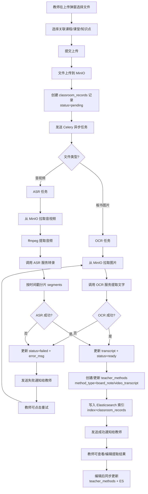
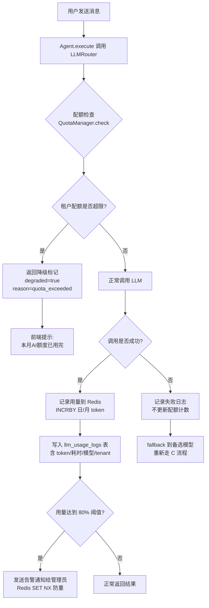
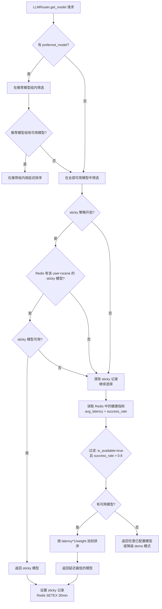
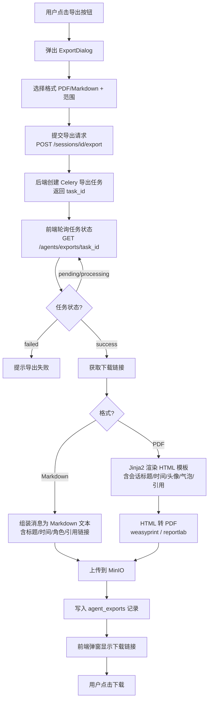

# PRD：AI 智能体中心（AI Agent Center）— 增量 v2

> **项目**: AI4EDU - AI 驱动的智慧教学平台
> **模块**: 产品规划文档 3.6 - AI 智能体中心（增量）
> **文档版本**: v2.0
> **基线版本**: v1.0（P0 MVP 已完成）
> **创建日期**: 2025-07-04
> **分支**: `陈安国的代码——AI智能体中心`
> **状态**: 待评审

---

## 1. 版本说明

### 1.1 与 v1 的关系

本文档是 v1 PRD（`prd-ai-agent-center.md`）的**增量补充**，不重复已定义的内容，仅针对本次新增的 4 项能力做详细规划。

### 1.2 P0 MVP 已完成清单（v1 PRD）

以下 P0 需求已实现，本版不再重复：

| ID | 已完成需求 | 关键文件 |
|----|-----------|---------|
| P0-1 ~ P0-4 | 多模型路由引擎（DeepSeek/混元/千问）+ 自动 fallback | `agents/llm_router.py`, `agents/base.py` |
| P0-5 ~ P0-6 | ResourceContextBuilder 资源感知（笔记/资源/图谱/老师方法） | `agents/resource_context.py` |
| P0-7 ~ P0-8 | teacher_methods 表 + 老师方法检索注入 | `models/teacher_method.py` |
| P0-9 ~ P0-10 | 4 类场景预设 + AgentCenterView 场景入口页 | `agents/scene_config.py`, `views/agent/AgentCenterView.vue` |
| P0-11 | 对话引用来源展示（CitationList 组件） | `views/agent/components/CitationList.vue` |
| P0-12 | 模型配置 API `GET /agents/models` | `api/v1/agents.py` |

### 1.3 本次新增范围

| # | 能力 | 优先级 | v1 中的 ID | 说明 |
|---|------|--------|-----------|------|
| 1 | 板书/录播自动 OCR/ASR 提取 | P1 | P1-1, P1-2 | v1 PRD 中作为 P1 规划但未实现，本版细化设计 |
| 2 | 多租户模型配额计量 | P2 | 新增 | v1 PRD Q7 遗留问题，本版正式立项 |
| 3 | 对话导出 PDF/Markdown | P2 | P2-5 | v1 PRD 中作为 P2 一行描述，本版细化 |
| 4 | 模型负载均衡 | P2 | P2-1 | v1 PRD 中作为 P2 一行描述，本版细化 |

---

## 2. 产品目标

### 2.1 板书/录播 OCR/ASR 提取（P1）

| # | 目标 | 衡量指标 |
|---|------|---------|
| G2-1 | **教学资源自动化入库**：教师上传板书图片或录播音视频后，系统自动提取文字内容并关联课程/知识点，无需人工录入 | 板书图片 OCR 成功率 ≥ 90%；音视频转录字准确率 ≥ 85% |
| G2-2 | **AI 可检索性**：提取的文本进入 Elasticsearch 索引，ResourceContextBuilder 能检索到板书/转录内容作为回答上下文 | 新增板书/转录资源在 AI 对话引用来源中出现率 ≥ 80% |
| G2-3 | **任务可追踪**：教师可查看处理状态，失败可重试 | 任务状态更新延迟 ≤ 5s；失败重试成功率 ≥ 95% |

### 2.2 多租户模型配额计量（P2）

| # | 目标 | 衡量指标 |
|---|------|---------|
| G3-1 | **用量可观测**：每次 LLM 调用的 token 数、耗时、模型、租户信息均有记录 | 调用日志记录覆盖率 100% |
| G3-2 | **配额可控制**：按租户维度配置 token/费用上限，超出时拦截并降级 | 超额拦截响应时间 ≤ 100ms；超额时降级为 demo 模式 |
| G3-3 | **管理可视化**：管理后台可查看配额使用趋势和告警 | 管理后台配额看板支持日/月维度查看 |

### 2.3 对话导出 PDF/Markdown（P2）

| # | 目标 | 衡量指标 |
|---|------|---------|
| G4-1 | **一键导出**：用户在对话页一键导出当前会话为 PDF 或 Markdown | 导出按钮点击后 ≤ 10s 返回下载链接 |
| G4-2 | **格式规范**：PDF 带样式排版（标题/时间/头像/气泡/引用），Markdown 包含引用来源链接 | PDF 渲染保真度 ≥ 95%（与页面视觉一致） |
| G4-3 | **导出可追溯**：导出记录持久化，用户可查看历史导出并重新下载 | 导出记录保留 ≥ 30 天 |

### 2.4 模型负载均衡（P2）

| # | 目标 | 衡量指标 |
|---|------|---------|
| G5-1 | **动态选择**：基于实时延迟和成功率选择模型，替代固定优先级 | 平均响应延迟降低 ≥ 20% |
| G5-2 | **故障自愈**：模型故障自动剔除，恢复后自动加回 | 故障检测延迟 ≤ 30s；恢复检测延迟 ≤ 60s |
| G5-3 | **老师方法优先**：当老师方法标注推荐模型时，优先使用推荐模型组内做负载均衡 | 老师方法推荐模型命中率 100% |

---

## 3. 用户故事

### US-V2-1：教师上传板书（OCR）

> **As** 数学教师陈老师，
> **I want** 课后把今天上课的板书拍成照片上传，系统自动识别出文字并关联到我教的课程和知识点，
> **so that** 学生用 AI 提问时，AI 能引用我今天课堂上讲的方法。

**验收标准**：
- 教师在「教师方法管理」页上传板书图片（JPG/PNG，≤ 10MB）
- 选择关联课程和知识点标签后提交
- 上传后显示「处理中」状态，后端异步 OCR
- 处理完成后显示提取的文字，教师可编辑修正
- 确认后存入 `teacher_methods` 表（method_type = `board_note`），同时索引到 Elasticsearch

### US-V2-2：教师上传录播（ASR）

> **As** 物理教师王老师，
> **I want** 上传课堂录播音频，系统自动转成文字并按时间段分片，
> **so that** 学生问某个知识点时，AI 能找到我课上对应的讲解片段。

**验收标准**：
- 教师上传音视频文件（MP4/MP3/WAV/M4A，≤ 500MB）
- 后端提取音频 → ASR 转录 → 按时间戳分片存储
- 转录结果存入 `classroom_records.transcript` 和 `segments`（JSON 分片）
- 学生提问时，ResourceContextBuilder 可检索到转录文本

### US-V2-3：租户管理员查看配额

> **As** 学校 IT 管理员（租户管理员），
> **I want** 查看本学校（租户）的 AI 模型使用量和费用趋势，设置月度 token 上限，
> **so that** 防止个别班级或学生耗尽全学校的 API 额度。

**验收标准**：
- 管理后台显示当前租户的日/月 token 使用量和估算费用
- 管理员可设置月度 token 上限（如 500 万 token/月）
- 即将达上限（80%）时系统发送告警通知
- 超出上限时 AI 对话降级为 demo 模式并提示「本月 AI 额度已用完」

### US-V2-4：学生导出对话复习

> **As** 高二学生小李，
> **I want** 把和 AI 的复习对话导出成 PDF 打印出来，
> **so that** 考前没有电子设备时也能翻看复习。

**验收标准**：
- 对话页右上角有「导出」按钮
- 点击后弹窗选择格式（PDF / Markdown）和范围（全部消息 / 选中消息）
- 选择后后台异步生成文件
- 生成完成后弹出下载链接，同时保存到「导出记录」列表

### US-V2-5：模型自动负载均衡

> **As** 任何学生，
> **I want** 晚自习高峰期 AI 回答速度不会变慢，
> **so that** 我不用等太久。

**验收标准**：
- 系统自动选择当前延迟最低的模型响应
- 某模型连续失败时自动剔除并切到其他模型
- 用户无感知，仅对话页显示当前使用的模型名

---

## 4. 需求池

### 4.1 P0 — MVP 已完成（汇总）

详见 v1 PRD 第 6 节 P0-1 ~ P0-12，此处不重复。

### 4.2 P1 — Should Have

#### 板书/录播 OCR/ASR 提取

| ID | 需求 | 模块 | 验收标准 |
|----|------|------|---------|
| P1-V2-1 | 教师端板书图片上传：支持 JPG/PNG（≤ 10MB），上传到 MinIO，创建 `classroom_records` 记录（record_type=`board_photo`，status=`pending`） | M3/M6 | 文件存储到 MinIO；DB 记录创建成功 |
| P1-V2-2 | Celery 异步 OCR 任务：从 MinIO 拉取图片 → 调用 OCR 服务提取文字 → 更新 `classroom_records.transcript` 和 `status=ready` | M3 | OCR 结果存入 DB；失败时 status=`failed` 并记录 error_msg |
| P1-V2-3 | 教师端音视频上传：支持 MP4/MP3/WAV/M4A（≤ 500MB），上传到 MinIO，创建 `classroom_records`（record_type=`video`，status=`pending`） | M3/M6 | 大文件分片上传；DB 记录创建成功 |
| P1-V2-4 | Celery 异步 ASR 任务：从 MinIO 拉取音视频 → 提取音频（ffmpeg）→ 调用 ASR 服务转录 → 按时间戳分片 → 更新 `transcript` + `segments`(JSON) + `status=ready` | M3 | 转录文本按时间段分片存储；失败时 status=`failed` |
| P1-V2-5 | OCR/ASR 结果 → teacher_methods 联动：处理成功后，自动创建/更新 `teacher_methods` 记录（method_type=`board_note`/`video_transcript`），关联 course_id / knowledge_points | M3 | teacher_methods 表新增记录；source_resource_id 指向 resources |
| P1-V2-6 | OCR/ASR 结果 → Elasticsearch 索引：提取的文本写入 ES 索引（index=`classroom_records`），ResourceContextBuilder 增加从 ES 检索板书/转录内容的能力 | M2/M3 | ES 索引创建成功；ResourceContextBuilder 检索到板书内容 |
| P1-V2-7 | 任务状态追踪 API：`GET /agents/classroom-records?classroom_id=&status=` 返回任务列表及状态；`POST /agents/classroom-records/{id}/retry` 失败重试 | M6 | API 返回 pending/processing/ready/failed 状态；重试后重新进入队列 |
| P1-V2-8 | 失败通知：OCR/ASR 失败时通过 notification_service 发送通知给上传教师；成功时也可通知 | M6 | 教师收到站内通知；通知内容含记录标题和错误原因 |
| P1-V2-9 | 前端板书/录播上传页：教师方法管理页新增「上传板书/录播」入口，支持文件选择、课程/知识点关联、状态展示、结果编辑 | M6 | 新增 `TeacherUploadDialog.vue` 组件；上传后列表实时更新状态 |
| P1-V2-10 | OCR 结果可编辑修正：教师在结果 ready 后可编辑 OCR/ASR 文本，修正后同步更新 teacher_methods 和 ES 索引 | M6 | 编辑保存后 DB 和 ES 同步更新 |

### 4.3 P2 — Nice to Have

#### 多租户模型配额计量

| ID | 需求 | 模块 | 验收标准 |
|----|------|------|---------|
| P2-V2-1 | LLM 调用日志记录：在 `LLMRouter.call_llm()` 成功/失败后，记录 token 数、耗时(ms)、模型、tenant_id、user_id、session_id 到 `llm_usage_logs` 表 | M1 | 每次调用有日志记录；含 prompt_tokens/completion_tokens/total_tokens |
| P2-V2-2 | 配额配置表 `tenant_quotas`：按租户配置 daily_token_limit / monthly_token_limit / monthly_cost_limit（可选），存储于 PostgreSQL | M1 | 管理员可 CRUD 配置；默认值从 tenant.plan 推导 |
| P2-V2-3 | 配额实时检查中间件：在 `BaseAgent._call_llm()` 前检查 Redis 中的租户当前日/月累计 token，超出则拒绝调用并返回降级标记 | M1 | 超额时返回 `{degraded: true, reason: "quota_exceeded"}`；检查延迟 ≤ 5ms |
| P2-V2-4 | 配额计数更新：LLM 调用成功后，Redis INCRBY 更新日/月累计 token；使用 Redis Pipeline 保证原子性 | M1 | Redis 计数准确；日计数 key 设 TTL 25h 自动过期 |
| P2-V2-5 | 配额告警：当使用量达到上限 80% 时，通过 notification_service 发送告警通知给租户管理员 | M1 | 告警每个阈值只发一次（Redis SET NX 防重） |
| P2-V2-6 | 管理后台配额看板 API：`GET /admin/quotas/{tenant_id}` 返回当前用量、配额上限、使用率；`GET /admin/quotas/{tenant_id}/trend` 返回日/月趋势 | M1 | 返回 {used_tokens, limit_tokens, usage_rate, trend[]} |
| P2-V2-7 | 前端配额管理页：管理后台新增「AI 配额」页，展示用量仪表盘 + 趋势图 + 配额配置表单 | M1 | 使用 ECharts 渲染仪表盘和趋势图 |

#### 对话导出 PDF/Markdown

| ID | 需求 | 模块 | 验收标准 |
|----|------|------|---------|
| P2-V2-8 | 导出 API `POST /agents/sessions/{id}/export`：接收 format（pdf/markdown）和 message_ids（可选，空则全部），创建 Celery 异步导出任务 | M5 | 返回 {task_id, status: "pending"} |
| P2-V2-9 | Markdown 导出：将消息列表组装为 Markdown 文本（含标题、时间、角色、内容、引用来源链接），上传到 MinIO，返回下载链接 | M5 | .md 文件可正常渲染；引用来源以链接形式呈现 |
| P2-V2-10 | PDF 导出：基于 HTML 模板渲染（Jinja2），转 PDF（复用 reportlab 或 weasyprint），含会话标题、时间、角色头像、消息气泡、引用来源 | M5 | PDF 排版与对话页视觉一致；中文字体正常显示 |
| P2-V2-11 | 导出记录持久化：新增 `agent_exports` 表记录 session_id / user_id / format / file_key / created_at，便于查看历史导出 | M5 | 导出记录可查询；下载链接 30 天有效 |
| P2-V2-12 | 历史导出 API `GET /agents/exports`：返回当前用户的导出记录列表，支持重新下载 | M5 | 返回 [{id, session_title, format, file_url, created_at}] |
| P2-V2-13 | 前端导出按钮与弹窗：AgentChatView 顶栏右侧新增「导出」按钮，点击弹窗选择格式和范围，提交后轮询任务状态，完成后提供下载 | M5 | 弹窗样式与项目风格一致；导出进度有 loading 状态 |

#### 模型负载均衡

| ID | 需求 | 模块 | 验收标准 |
|----|------|------|---------|
| P2-V2-14 | 模型健康指标采集：在 `ModelProvider` 新增 avg_latency_ms / success_rate / last_check_time 字段；Celery beat 定时任务（每 60s）对每个模型发轻量请求，记录延迟和成功率 | M1 | 指标存储在 Redis（Hash 结构）；beat 定时触发 |
| P2-V2-15 | 负载均衡选择策略：`LLMRouter.get_model()` 改造，默认按延迟最低 + 成功率最高加权选择；支持配置权重（weight）和 sticky 策略 | M1 | 选择延迟最低的可用模型；sticky 模式下同一 user+scene 返回同一模型 |
| P2-V2-16 | 故障自动剔除与恢复：连续失败 ≥ 阈值时标记 `is_available=False` 并记录 `retry_after` 时间；beat 定时任务尝试恢复探测，成功则标记恢复 | M1 | 故障模型自动剔除；恢复探测成功后自动加回候选池 |
| P2-V2-17 | 老师方法推荐模型优先：当 teacher_methods 标注了 `recommended_model` 字段时，优先在推荐模型组内做负载均衡 | M1/M3 | teacher_methods 新增 recommended_model 字段；匹配到推荐模型时优先使用 |
| P2-V2-18 | 负载均衡配置 API：`GET /agents/models/balancer` 返回各模型实时指标和选择策略；`PUT /agents/models/balancer` 可配置权重和策略模式 | M1 | 返回 [{provider, avg_latency, success_rate, weight, is_available}] |

---

## 5. 功能模块划分

### 5.1 模块全景（v2 增量标注）

```
AI 智能体中心
├── M1: 多模型路由引擎
│   ├── [已有] 模型提供商抽象层 + 自动 fallback
│   ├── [已有] 速率限制
│   ├── [v2新增] 模型健康指标采集（延迟/成功率）        ← P2-V2-14
│   ├── [v2新增] 动态负载均衡选择策略                   ← P2-V2-15
│   ├── [v2新增] 故障自动剔除与恢复探测                 ← P2-V2-16
│   ├── [v2新增] 老师方法推荐模型优先                   ← P2-V2-17
│   ├── [v2新增] 多租户配额计量与检查                   ← P2-V2-1~5
│   └── [v2新增] 配额管理后台 API + 看板               ← P2-V2-6~7
│
├── M2: 学习资源感知引擎
│   ├── [已有] 笔记/资源/图谱/老师方法检索
│   └── [v2新增] ES 索引板书/转录文本检索               ← P1-V2-6
│
├── M3: 老师方法一致性引擎
│   ├── [已有] teacher_methods 存储 + 检索注入
│   ├── [v2新增] 板书 OCR 自动提取                     ← P1-V2-2,5
│   ├── [v2新增] 录播 ASR 自动转录                     ← P1-V2-4,5
│   └── [v2新增] classroom_records 状态管理             ← P1-V2-7
│
├── M5: 对话核心
│   ├── [已有] 会话管理 + WebSocket 流式
│   ├── [已有] 引用来源展示
│   └── [v2新增] 对话导出 PDF/Markdown                 ← P2-V2-8~13
│
└── M6: 教师方法管理
    ├── [v1规划P1] 教师方法管理页（列表/编辑/删除）
    ├── [v2新增] 板书/录播上传组件                      ← P1-V2-9
    └── [v2新增] OCR/ASR 结果编辑修正                   ← P1-V2-10
```

### 5.2 新增/修改文件清单

| 文件 | 类型 | 说明 |
|------|------|------|
| `backend/app/models/llm_usage.py` | **新增** | LLMUsageLog + TenantQuota 模型 |
| `backend/app/models/agent_export.py` | **新增** | AgentExport 模型 |
| `backend/app/models/teacher_method.py` | 修改 | TeacherMethod 新增 `recommended_model` 字段 |
| `backend/app/models/__init__.py` | 修改 | 注册新模型 |
| `backend/app/agents/llm_router.py` | 修改 | 新增负载均衡选择 + 配额检查 + 健康指标采集 |
| `backend/app/agents/quota_manager.py` | **新增** | 租户配额管理器（Redis 计数 + 检查 + 告警） |
| `backend/app/agents/resource_context.py` | 修改 | _search_resources 增加 ES 检索板书/转录文本 |
| `backend/app/services/ocr_service.py` | **新增** | OCR 服务封装（支持多服务商） |
| `backend/app/services/asr_service.py` | **新增** | ASR 服务封装（支持多服务商） |
| `backend/app/services/export_service.py` | 修改 | 新增 export_session_pdf / export_session_markdown 方法 |
| `backend/app/tasks/celery_app.py` | **新增** | Celery 应用初始化 + beat 定时任务配置 |
| `backend/app/tasks/ocr_tasks.py` | **新增** | OCR/ASR 异步任务定义 |
| `backend/app/tasks/export_tasks.py` | **新增** | 导出异步任务定义 |
| `backend/app/tasks/health_check.py` | **新增** | 模型健康检查 beat 定时任务 |
| `backend/app/api/v1/agents.py` | 修改 | 新增导出/配额/负载均衡相关端点 |
| `backend/app/api/v1/admin_quota.py` | **新增** | 管理后台配额 API |
| `backend/app/config.py` | 修改 | 新增 OCR/ASR/Celery beat 配置项 |
| `frontend/src/views/agent/AgentChatView.vue` | 修改 | 新增导出按钮 + 导出弹窗 |
| `frontend/src/views/agent/components/ExportDialog.vue` | **新增** | 导出弹窗组件 |
| `frontend/src/views/agent/components/TeacherUploadDialog.vue` | **新增** | 板书/录播上传弹窗 |
| `frontend/src/views/admin/QuotaDashboard.vue` | **新增** | 配额管理看板页 |
| `frontend/src/stores/agent.ts` | 修改 | 新增导出相关 action |
| `frontend/src/services/agent.ts` | 修改 | 新增导出/配额/上传 API 方法 |

---

## 6. UI 设计稿 / 页面结构

### 6.1 页面路由规划（增量）

```
/agent                           → AgentCenterView.vue       （已有，不变）
/agent/chat/:sceneType?          → AgentChatView.vue         （改造：新增导出按钮）
/agent/methods                   → TeacherMethodsView.vue    （P1，新增上传入口）
/admin/quota                      → QuotaDashboard.vue        （P2，新增配额看板）
```

### 6.2 对话页改造（AgentChatView.vue）— 导出按钮

```
┌──────────────┬──────────────────────────────────────────────┐
│ 会话列表      │  📝 课后复习 · 高二数学    [导出 ▾] [DeepSeek] │
│              ├──────────────────────────────────────────────┤
│              │                                              │
│              │  👤 老师，导数那道题怎么做？                     │
│              │                                              │
│              │  🤖 这道题用我们上课讲的**定义法**来解...        │
│              │  📎 引用来源：...                              │
│              │                                              │
│              ├──────────────────────────────────────────────┤
│              │  [输入消息...]                        [发送]  │
└──────────────┴──────────────────────────────────────────────┘
```

**改造要点**：
1. 顶栏右侧模型指示灯左侧新增「导出」下拉按钮（el-dropdown）
2. 下拉菜单选项：「导出为 PDF」「导出为 Markdown」「导出选中消息」
3. 点击后弹出 ExportDialog 弹窗

### 6.3 导出弹窗（ExportDialog.vue）

```
┌─────────────────────────────────────────┐
│  导出对话                            ✕   │
├─────────────────────────────────────────┤
│                                         │
│  导出格式：                              │
│   ○ PDF（带样式排版，适合打印）           │
│   ○ Markdown（纯文本，适合二次编辑）     │
│                                         │
│  导出范围：                              │
│   ○ 全部消息（共 12 条）                 │
│   ○ 选中消息（已选 3 条）                 │
│                                         │
│  ─────────────────────────────────────  │
│                                         │
│  历史导出：                              │
│   📄 导数复习.pdf          2小时前  下载  │
│   📄 导数复习.md           昨天     下载  │
│                                         │
├─────────────────────────────────────────┤
│              [取消]    [开始导出]        │
└─────────────────────────────────────────┘
```

- 格式选择为 Radio 单选
- 范围选择为 Radio 单选（选中消息仅在用户已勾选消息时可选）
- 底部展示历史导出记录，每条含文件名、时间、下载链接
- 点击「开始导出」后按钮变为 loading 状态，完成后弹出下载提示

### 6.4 教师上传弹窗（TeacherUploadDialog.vue）

```
┌─────────────────────────────────────────────┐
│  上传板书 / 录播                         ✕   │
├─────────────────────────────────────────────┤
│                                             │
│  关联课程：  [高二数学 ▾]                     │
│  关联课堂：  [10月15日 导数复习课 ▾]           │
│  知识点标签：[导数] [定义法] [+ 添加]         │
│                                             │
│  文件类型：  ○ 板书图片  ○ 录播音视频          │
│                                             │
│  ┌─────────────────────────────────────┐   │
│  │                                     │   │
│  │       📎 拖拽文件到此处或点击上传      │   │
│  │       支持 JPG/PNG（≤10MB）          │   │
│  │                                     │   │
│  └─────────────────────────────────────┘   │
│                                             │
│  上传列表：                                  │
│   📷 board_01.jpg     ✅ 处理中 (OCR)       │
│   🎵 class_record.mp3 ⏳ 排队中              │
│                                             │
├─────────────────────────────────────────────┤
│                       [取消]    [提交上传]   │
└─────────────────────────────────────────────┘
```

- 文件类型切换后，上传区域支持的格式和大小限制自动调整
- 上传列表实时显示处理状态（排队中/处理中/完成/失败）
- 完成的项目可点击「查看结果」编辑 OCR/ASR 文本
- 失败的项目可点击「重试」

### 6.5 配额管理看板（QuotaDashboard.vue）

```
┌─────────────────────────────────────────────────────────────┐
│  AI 配额管理                              [刷新] [导出报表]   │
├─────────────────────────────────────────────────────────────┤
│                                                             │
│  ┌──────────────┐  ┌──────────────┐  ┌──────────────┐      │
│  │ 本月已用      │  │ 月度上限      │  │ 使用率       │      │
│  │  3,250,000    │  │  5,000,000   │  │   65% ▓▓▓░░  │      │
│  │  tokens       │  │  tokens       │  │   正常        │      │
│  └──────────────┘  └──────────────┘  └──────────────┘      │
│                                                             │
│  ── 日用量趋势（近 30 天）────────────────────────────────── │
│  │     ▁▂▃▅▇▆▄▃▂▁▂▃▅▇█▇▅▃▂▁▂▃▅▆▄▃▂▁▂▃▅▇▆             │
│  │                                                      │   │
│  └────────────────────────────────────────────────────────┘ │
│                                                             │
│  ── 配额配置 ─────────────────────────────────────────────── │
│  日 Token 上限：    [100,000  ] tokens                      │
│  月 Token 上限：    [5,000,000] tokens                      │
│  月费用上限：       [ ¥ 200  ]   （可选）                    │
│  告警阈值：         [ 80 ] %                                 │
│                                                             │
│                                          [保存配置]          │
│                                                             │
│  ── 各模型用量明细 ──────────────────────────────────────── │
│  │ 模型       │ 调用次数 │ Token 用量 │ 平均延迟 │ 费用   │  │
│  │ DeepSeek   │ 1,250    │ 2,100,000  │ 1.2s    │ ¥85   │  │
│  │ Qwen       │ 520      │ 850,000    │ 0.9s    │ ¥34   │  │
│  │ 混元        │ 180      │ 300,000    │ 1.5s    │ ¥12   │  │
│  └────────────────────────────────────────────────────────┘ │
└─────────────────────────────────────────────────────────────┘
```

---

## 7. 核心流程图

### 7.1 板书/录播 OCR/ASR 处理全流程



### 7.2 配额检查与计量流程



### 7.3 模型负载均衡选择流程



### 7.4 对话导出流程



---

## 8. 数据模型设计

### 8.1 新增表：`llm_usage_logs`

```python
class LLMUsageLog(Base):
    """LLM 调用使用日志"""
    __tablename__ = "llm_usage_logs"

    id: Mapped[int] = mapped_column(Integer, primary_key=True, autoincrement=True)
    tenant_id: Mapped[int] = mapped_column(Integer, ForeignKey("tenants.id"), nullable=False, index=True)
    user_id: Mapped[int] = mapped_column(Integer, ForeignKey("users.id"), nullable=False, index=True)
    session_id: Mapped[Optional[int]] = mapped_column(Integer, nullable=True, index=True)
    provider: Mapped[str] = mapped_column(String(30), nullable=False, comment="模型提供商")
    model_name: Mapped[str] = mapped_column(String(50), nullable=False)
    prompt_tokens: Mapped[int] = mapped_column(Integer, default=0)
    completion_tokens: Mapped[int] = mapped_column(Integer, default=0)
    total_tokens: Mapped[int] = mapped_column(Integer, default=0)
    latency_ms: Mapped[int] = mapped_column(Integer, default=0, comment="响应耗时(毫秒)")
    is_success: Mapped[bool] = mapped_column(Boolean, default=True)
    is_fallback: Mapped[bool] = mapped_column(Boolean, default=False)
    estimated_cost: Mapped[Optional[float]] = mapped_column(Float, nullable=True, comment="估算费用(元)")
    created_at: Mapped[datetime] = mapped_column(DateTime, default=datetime.utcnow, index=True)
```

### 8.2 新增表：`tenant_quotas`

```python
class TenantQuota(Base):
    """租户配额配置"""
    __tablename__ = "tenant_quotas"

    id: Mapped[int] = mapped_column(Integer, primary_key=True, autoincrement=True)
    tenant_id: Mapped[int] = mapped_column(Integer, ForeignKey("tenants.id"), nullable=False, unique=True, index=True)
    daily_token_limit: Mapped[int] = mapped_column(Integer, default=100000, comment="单日 token 上限")
    monthly_token_limit: Mapped[int] = mapped_column(Integer, default=5000000, comment="月度 token 上限")
    monthly_cost_limit: Mapped[Optional[float]] = mapped_column(Float, nullable=True, comment="月度费用上限(元)")
    alert_threshold: Mapped[float] = mapped_column(Float, default=0.8, comment="告警阈值百分比")
    is_active: Mapped[bool] = mapped_column(Boolean, default=True)
    created_at: Mapped[datetime] = mapped_column(DateTime, default=datetime.utcnow)
    updated_at: Mapped[datetime] = mapped_column(DateTime, default=datetime.utcnow, onupdate=datetime.utcnow)
```

### 8.3 新增表：`agent_exports`

```python
class AgentExport(Base):
    """对话导出记录"""
    __tablename__ = "agent_exports"

    id: Mapped[int] = mapped_column(Integer, primary_key=True, autoincrement=True)
    tenant_id: Mapped[int] = mapped_column(Integer, ForeignKey("tenants.id"), nullable=False, index=True)
    user_id: Mapped[int] = mapped_column(Integer, ForeignKey("users.id"), nullable=False, index=True)
    session_id: Mapped[int] = mapped_column(Integer, ForeignKey("agent_sessions.id"), nullable=False, index=True)
    session_title: Mapped[str] = mapped_column(String(200), nullable=False)
    export_format: Mapped[str] = mapped_column(String(10), nullable=False, comment="pdf/markdown")
    message_count: Mapped[int] = mapped_column(Integer, default=0)
    file_key: Mapped[str] = mapped_column(String(500), nullable=False, comment="MinIO 存储 Key")
    file_url: Mapped[Optional[str]] = mapped_column(String(1000), nullable=True, comment="预签名下载 URL")
    file_size: Mapped[Optional[int]] = mapped_column(Integer, nullable=True, comment="文件大小(字节)")
    status: Mapped[str] = mapped_column(String(20), default="pending", comment="pending/processing/success/failed")
    created_at: Mapped[datetime] = mapped_column(DateTime, default=datetime.utcnow, index=True)
```

### 8.4 修改表：`teacher_methods` 新增字段

```python
# 在 TeacherMethod 类中新增字段
recommended_model: Mapped[Optional[str]] = mapped_column(
    String(30), nullable=True, comment="推荐模型(用于负载均衡优先匹配)"
)
```

### 8.5 修改 `ModelProvider`（内存对象，非 DB 表）

```python
# 在 ModelProvider dataclass 中新增字段
avg_latency_ms: float = 0.0        # 平均延迟(毫秒)
success_rate: float = 1.0          # 成功率(0~1)
weight: int = 1                    # 负载均衡权重
last_check_time: Optional[datetime] = None  # 最近健康检查时间
retry_after: Optional[datetime] = None     # 故障恢复探测时间
```

---

## 9. API 设计（增量）

### 9.1 板书/录播上传与管理

| 端点 | 方法 | 说明 | 优先级 |
|------|------|------|--------|
| `/agents/classroom-records` | GET | 获取课堂记录列表（支持 classroom_id/status 筛选） | P1 |
| `/agents/classroom-records/upload` | POST | 上传板书/录播文件（multipart/form-data） | P1 |
| `/agents/classroom-records/{id}` | GET | 获取记录详情（含 transcript/segments） | P1 |
| `/agents/classroom-records/{id}` | PUT | 编辑修正 OCR/ASR 结果 | P1 |
| `/agents/classroom-records/{id}/retry` | POST | 失败重试 | P1 |
| `/agents/classroom-records/{id}` | DELETE | 删除记录 | P1 |

### 9.2 对话导出

| 端点 | 方法 | 说明 | 优先级 |
|------|------|------|--------|
| `/agents/sessions/{id}/export` | POST | 创建导出任务（format + message_ids） | P2 |
| `/agents/exports` | GET | 获取当前用户导出记录列表 | P2 |
| `/agents/exports/{id}` | GET | 获取导出详情（含下载链接） | P2 |
| `/agents/exports/{id}/download` | GET | 下载导出文件（MinIO 预签名 URL 重定向） | P2 |

### 9.3 配额管理

| 端点 | 方法 | 说明 | 优先级 |
|------|------|------|--------|
| `/admin/quotas/{tenant_id}` | GET | 获取租户配额使用情况 | P2 |
| `/admin/quotas/{tenant_id}` | PUT | 配置租户配额上限 | P2 |
| `/admin/quotas/{tenant_id}/trend` | GET | 获取用量趋势（日/月维度） | P2 |
| `/admin/quotas/{tenant_id}/models` | GET | 获取各模型用量明细 | P2 |

### 9.4 负载均衡

| 端点 | 方法 | 说明 | 优先级 |
|------|------|------|--------|
| `/agents/models/balancer` | GET | 获取各模型实时健康指标和策略 | P2 |
| `/agents/models/balancer` | PUT | 配置权重和策略模式 | P2 |

### 9.5 请求/响应示例

**上传板书**：
```json
// POST /agents/classroom-records/upload
// Request (multipart/form-data)
//   file: board_01.jpg
//   classroom_id: 15
//   course_id: 42
//   record_type: "board_photo"
//   knowledge_points: '["导数", "定义法"]'

// Response
{
  "code": 0,
  "data": {
    "id": 101,
    "record_type": "board_photo",
    "status": "pending",
    "resource_id": 55,
    "message": "已提交处理，请稍后查看状态"
  }
}
```

**创建导出任务**：
```json
// POST /agents/sessions/101/export
// Request
{
  "format": "pdf",
  "message_ids": [201, 202, 203]
}

// Response
{
  "code": 0,
  "data": {
    "task_id": "export-uuid-xxx",
    "status": "pending",
    "message": "导出任务已提交，请稍后查看"
  }
}
```

**获取配额**：
```json
// GET /admin/quotas/1
// Response
{
  "code": 0,
  "data": {
    "tenant_id": 1,
    "tenant_name": "示范学校",
    "daily_used_tokens": 85000,
    "daily_limit_tokens": 100000,
    "monthly_used_tokens": 3250000,
    "monthly_limit_tokens": 5000000,
    "monthly_estimated_cost": 131.0,
    "monthly_cost_limit": 200.0,
    "usage_rate": 0.65,
    "alert_threshold": 0.8,
    "is_alert": false
  }
}
```

---

## 10. 技术决策建议

### 10.1 OCR/ASR 服务商选择

| 方案 | 优点 | 缺点 | 费用 | 建议 |
|------|------|------|------|------|
| **阿里云 OCR + 语音识别** | 中文识别精度高；与千问同生态；有免费额度 | 需开通阿里云服务；API 调用有延迟 | 通用文字识别：200次/月免费；语音识别：3小时/月免费 | ⭐ 推荐 |
| **腾讯云 OCR + ASR** | 中文识别精度高；与混元同生态；有免费额度 | 需开通腾讯云服务 | 通用印刷体：1000次/月免费；一句话识别：5000次/月免费 | ⭐ 推荐 |
| **本地开源（PaddleOCR + Whisper）** | 完全免费；无 API 依赖；数据不出服务器 | 部署复杂（需 GPU）；中文手写体识别一般；Whisper 占用资源大 | 免费 | 适合预算有限场景 |
| **混合方案** | 灵活降级；优先免费额度 | 实现复杂度高 | 取决于使用量 | 复杂度高，暂不推荐 |

**决策建议**：
- **一期推荐**：阿里云 OCR + 语音识别（与现有 QWEN_API_KEY 同生态，开箱即用，免费额度够教学场景）
- **降级备选**：如阿里云额度用完，降级到腾讯云（与现有 HUNYUAN_API_KEY 同生态）
- **配置方式**：在 `.env` 中配置 `ALIYUN_OCR_KEY` / `TENCENT_OCR_KEY`，后端 `ocr_service.py` 按优先级尝试

### 10.2 任务队列：Celery

**结论**：**使用 Celery**，项目已配置 Celery broker/backend（`config.py` 中 `CELERY_BROKER_URL` / `CELERY_RESULT_BACKEND`），但尚未创建 celery_app.py。

需要新建：
```
backend/app/tasks/
├── celery_app.py      # Celery 实例 + 配置（broker=Redis, backend=Redis）
├── ocr_tasks.py       # OCR/ASR 异步任务
├── export_tasks.py    # 导出异步任务
└── health_check.py    # 模型健康检查 beat 定时任务
```

部署需启动：
```bash
# Worker
celery -A app.tasks.celery_app worker --loglevel=info
# Beat（定时任务：健康检查 + 配额日切重置）
celery -A app.tasks.celery_app beat --loglevel=info
```

### 10.3 PDF 生成库

| 库 | 优点 | 缺点 | 建议 |
|------|------|------|------|
| **weasyprint** | HTML/CSS → PDF，排版灵活，样式保真度高 | 安装依赖较多（cairo, pango）；首次加载慢 | ⭐ 推荐（样式要求高） |
| **reportlab** | 纯 Python，无系统依赖；项目已有使用经验 | API 底层，手写排版代码量大 | 备选（快速实现） |
| **pdfkit (wkhtmltopdf)** | HTML → PDF，简单 | 需安装 wkhtmltopdf 系统二进制 | 备选 |
| **playwright** | 浏览器渲染，保真度最高 | 依赖重，启动慢 | 不推荐 |

**决策建议**：优先使用 **weasyprint**（Jinja2 HTML 模板 → weasyprint → PDF），保证排版与对话页一致。如部署环境依赖安装困难，降级到 **reportlab**。

### 10.4 配额计量维度

**结论**：**按 token 数为主，费用估算为辅**。

- **主指标**：`total_tokens`（prompt_tokens + completion_tokens），直接来自 LLM API 返回的 `usage` 字段
- **辅助指标**：估算费用 = `prompt_tokens × 输入单价 + completion_tokens × 输出单价`（按各模型定价表估算）
- **限制维度**：日 token 上限 + 月 token 上限 + 月费用上限（可选）
- **计数方式**：Redis 实时计数（`quota:{tenant_id}:daily:{date}` / `quota:{tenant_id}:monthly:{year_month}`），日 key TTL 25h

### 10.5 负载均衡策略

**决策建议**：
- **默认策略**：加权最小延迟（Weighted Least Latency），`score = avg_latency_ms / weight`，选 score 最小
- **可选策略**：sticky 模式（同一 user + scene 保持同一模型，Redis SETEX 30min）
- **过滤条件**：`is_available == True` 且 `success_rate > 0.8`
- **健康检查**：Celery beat 每 60s 发轻量请求（`/models` 端点或简单 chat completion），更新 Redis 中的健康指标

---

## 11. 配置项扩展（`.env`）

```bash
# ============ OCR/ASR 配置 ============
# OCR 服务商优先级（逗号分隔）：aliyun / tencent / local_paddle
OCR_PROVIDER_PRIORITY=aliyun,tencent

# 阿里云 OCR
ALIYUN_OCR_KEY=
ALIYUN_OCR_ENDPOINT=https://ocr-api.cn-hangzhou.aliyuncs.com

# 腾讯云 OCR
TENCENT_OCR_SECRET_ID=
TENCENT_OCR_SECRET_KEY=

# 本地 PaddleOCR（可选）
PADDLEOCR_ENABLED=false

# ASR 服务商优先级：aliyun / tencent / whisper
ASR_PROVIDER_PRIORITY=aliyun,tencent

# 本地 Whisper（可选）
WHISPER_MODEL_PATH=
WHISPER_ENABLED=false

# ============ Celery Beat 配置 ============
# 模型健康检查间隔（秒）
LLM_HEALTH_CHECK_INTERVAL=60

# 故障模型恢复探测间隔（秒）
LLM_RECOVERY_CHECK_INTERVAL=120

# 配额日切重置时间（cron: 每日 00:00）
QUOTA_DAILY_RESET_CRON="0 0 * * *"

# ============ 负载均衡配置 ============
# 负载均衡策略：latency / weighted / sticky
LLM_BALANCER_STRATEGY=latency

# sticky 模式 TTL（秒）
LLM_STICKY_TTL=1800

# 模型成功率阈值
LLM_MIN_SUCCESS_RATE=0.8

# ============ 导出配置 ============
# 导出文件保留天数
EXPORT_FILE_RETENTION_DAYS=30

# PDF 生成引擎：weasyprint / reportlab
PDF_ENGINE=weasyprint
```

---

## 12. 待确认问题清单

| # | 问题 | 影响范围 | 建议方案 | 状态 |
|---|------|---------|---------|------|
| Q-V2-1 | OCR/ASR 选用哪家服务商？阿里云还是腾讯云？是否需要同时配置两家做降级？ | M3 OCR/ASR | 建议**阿里云优先**（与千问同生态，免费额度充足），腾讯云降级备选。需确认是否已有阿里云/腾讯云账号 | ❓ 待确认 |
| Q-V2-2 | 是否使用 Celery 作为任务队列？项目 `config.py` 已有 Celery 配置但未创建 celery_app.py，需确认部署环境能否启动 celery worker/beat 进程 | M3/M5 异步任务 | **建议使用 Celery**（已有配置基础）。需确认部署环境（阿里云 ECS）能否额外运行 celery worker 和 beat 进程 | ❓ 待确认 |
| Q-V2-3 | 导出 PDF 用什么库？weasyprint 需要安装 cairo/pango 系统依赖，reportlab 纯 Python 但排版代码量大 | M5 对话导出 | 建议 **weasyprint**（Jinja2 模板渲染保真度高）。若 ECS 环境安装 cairo 困难，降级 reportlab | ❓ 待确认 |
| Q-V2-4 | 配额按 token 数还是按费用限制？还是两者都支持？ | M1 配额计量 | 建议** token 数为主，费用估算为辅**。token 直接来自 API 返回，费用按模型定价表估算 | ❓ 待确认 |
| Q-V2-5 | 教师方法表新增 `recommended_model` 字段，这个推荐模型由谁配置？教师手动选择还是系统自动推荐？ | M3/M1 负载均衡 | 建议**教师上传时可选择推荐模型**（下拉选 DeepSeek/Qwen/混元），也可留空表示不指定 | ❓ 待确认 |
| Q-V2-6 | 配额管理后台是放在现有管理后台中，还是独立页面？当前项目是否有管理后台路由？ | M1 配额管理 | 需确认现有 `admin-routes.ts` 的管理后台结构。建议复用现有管理后台框架，新增 `/admin/quota` 路由 | ❓ 待确认 |
| Q-V2-7 | classroom_records 表在 v1 PRD 中已定义但未创建迁移脚本，是否需要补充 Alembic 迁移？ | M3 数据模型 | 建议**本次一并创建迁移脚本**，包含 classroom_records + teacher_methods.recommended_model 新字段 + llm_usage_logs + tenant_quotas + agent_exports | ❓ 待确认 |
| Q-V2-8 | 音视频文件较大（可能 500MB），MinIO 上传方式是前端直传还是后端中转？ | M3 文件上传 | 建议大文件使用 **MinIO 预签名 URL 直传**（前端直接上传到 MinIO，后端只生成签名），避免后端内存压力 | ❓ 待确认 |
| Q-V2-9 | 导出的 PDF/Markdown 文件是否需要权限控制？其他用户能否下载？ | M5 对话导出 | 建议导出文件**仅创建者可下载**，MinIO 预签名 URL 有效期 30 分钟 | ❓ 待确认 |
| Q-V2-10 | 负载均衡的 sticky 策略是否需要？还是所有请求都用 latency 策略？ | M1 负载均衡 | 建议 sticky 作为**可选策略**（默认关闭），仅在需要对话一致性时开启 | ❓ 待确认 |

---

## 13. 里程碑建议

| 阶段 | 内容 | 预估工期 | 依赖 |
|------|------|---------|------|
| Sprint V2-1 | P1-V2-1~4：板书/录播上传 + Celery 任务队列搭建 + OCR/ASR 服务集成 | 4 天 | Q-V2-1, Q-V2-2, Q-V2-8 确认 |
| Sprint V2-2 | P1-V2-5~10：OCR/ASR → teacher_methods 联动 + ES 索引 + 前端上传/编辑页 | 3 天 | Sprint V2-1 完成 |
| Sprint V2-3 | P2-V2-1~7：配额计量 + Redis 计数 + 检查中间件 + 管理后台看板 | 4 天 | Q-V2-4, Q-V2-6 确认 |
| Sprint V2-4 | P2-V2-8~13：对话导出 Celery 任务 + PDF/Markdown 生成 + 前端导出弹窗 | 3 天 | Q-V2-3 确认 |
| Sprint V2-5 | P2-V2-14~18：负载均衡健康检查 + 动态选择策略 + 老师方法推荐模型优先 | 3 天 | Q-V2-5, Q-V2-10 确认 |
| **V2 交付** | **P1 + P2 全部完成** | **~3 周** | |

---

## 附录 A：技术架构依赖关系

```
                    ┌──────────────┐
                    │  Celery Beat │
                    │ (定时任务)    │
                    └──────┬───────┘
                           │
              ┌────────────┼────────────┐
              ▼            ▼            ▼
     ┌────────────┐ ┌──────────┐ ┌──────────────┐
     │ OCR/ASR    │ │ 导出任务  │ │ 模型健康检查  │
     │ 异步任务    │ │ 异步任务  │ │ 定时探测      │
     └─────┬──────┘ └────┬─────┘ └──────┬───────┘
           │              │              │
           ▼              ▼              ▼
     ┌───────────┐ ┌───────────┐ ┌───────────┐
     │ MinIO     │ │ MinIO     │ │ Redis     │
     │ (文件存储) │ │ (导出文件) │ │ (健康指标) │
     └─────┬─────┘ └───────────┘ └─────┬─────┘
           │                            │
           ▼                            ▼
     ┌───────────┐              ┌───────────────┐
     │ OCR/ASR   │              │ LLMRouter     │
     │ 外部服务   │              │ (负载均衡选择) │
     └─────┬─────┘              └───────┬───────┘
           │                            │
           ▼                            ▼
     ┌───────────┐              ┌───────────────┐
     │PostgreSQL  │              │ Redis         │
     │classroom_  │              │ (配额计数)     │
     │records     │              └───────────────┘
     │teacher_    │
     │methods     │
     └─────┬─────┘
           │
           ▼
     ┌───────────┐
     │Elastic-   │
     │search     │
     │(全文索引)  │
     └───────────┘
```

## 附录 B：现有基础设施复用情况

| 基础设施 | 现有状态 | v2 复用方式 |
|---------|---------|------------|
| PostgreSQL | ✅ 已使用 | 新增 3 张表（llm_usage_logs / tenant_quotas / agent_exports） |
| Redis | ✅ 已使用（core/redis.py） | 配额计数 + 健康指标缓存 + sticky 记录 |
| MinIO | ✅ 已使用（resource_service.py） | 板书/录播文件存储 + 导出文件存储 |
| Elasticsearch | ✅ 已使用（search_service.py） | 板书/转录文本索引 |
| Celery | ⚠️ 配置已存在但未创建 celery_app.py | **本次新建** celery_app.py + 任务模块 |
| reportlab | ✅ 已使用（export_service.py） | PDF 导出备选方案 |

---

*文档结束 — 待确认问题清单 Q-V2-1 ~ Q-V2-10 需要项目组明确答复后方可进入开发。*
