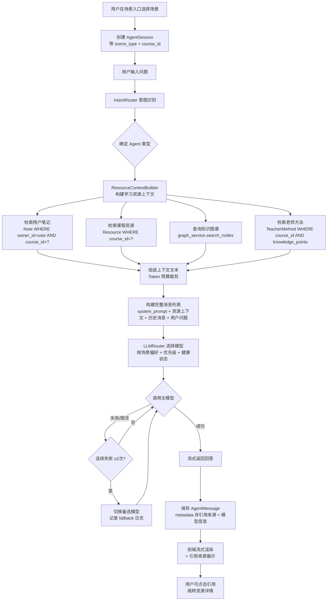
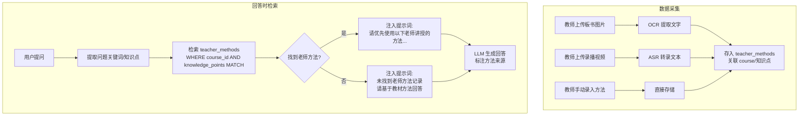

# PRD：AI 智能体中心（AI Agent Center）

> **项目**: AI4EDU - AI 驱动的智慧教学平台
> **模块**: 产品规划文档 3.6 - AI 智能体中心
> **文档版本**: v1.0
> **创建日期**: 2025-07-04
> **分支**: `陈安国的代码——AI智能体中心`
> **状态**: 待评审

---

## 1. 项目信息

| 字段 | 说明 |
|------|------|
| 项目名称 | ai4edu |
| 编程语言/框架 | 后端 FastAPI + SQLAlchemy(async) + PostgreSQL/Neo4j/Redis/MinIO/Elasticsearch/ClickHouse；前端 Vue3 + Vite + Element Plus + Pinia |
| 本地路径 | `D:\AI Agent\ai4edu` |
| 部署地址 | http://121.43.129.181 (阿里云 ECS) |
| 代码仓库 | https://github.com/CAG1218/ai4edu |

### 原始需求复述

开发「AI 智能体中心」模块，核心能力：

1. **多模型接入**：接入多个免费大模型 API（至少 DeepSeek、腾讯混元、阿里通义千问），实现多模型路由与容灾切换。
2. **学习资源感知**：自动读取用户的学习资源与学习过程数据（笔记 notes 表、教材/课件 resources 表、课堂录播与板书、课程 courses 表、知识图谱节点），作为 AI 回答的上下文依据。
3. **老师方法一致性**：回答学生问题时，优先基于老师上课所讲的方法、教材中的解法来回答，而非给出五花八门的通用解法。
4. **场景化入口**：作为学生自习、课前预习、课后复习、考前冲刺等场景的 AI 学伴入口。

---

## 2. 现有代码基线分析

> 以下基于对仓库现有代码的实际探索，确保 PRD 与现有架构对齐。

### 2.1 已有数据模型（`backend/app/models/`）

| 模型 | 表名 | 关键字段 | 复用情况 |
|------|------|---------|---------|
| `AgentSession` | `agent_sessions` | tenant_id, user_id, agent_type, scene_type, course_id, model_name, system_prompt, context(JSON), message_count, total_tokens | ✅ 直接复用，扩展 model_name 支持多模型 |
| `AgentMessage` | `agent_messages` | session_id, role, content, content_type, tokens, model_name, metadata_json, parent_id | ✅ 直接复用，metadata_json 存引用来源 |
| `Note` | `notes` | title, content, content_plain, note_type, course_id, resource_id, owner_id, tags | ✅ 直接复用 |
| `Resource` | `resources` | title, resource_type(pdf/video/...), file_key, url, course_id, metadata_json | ✅ 直接复用，需扩展 metadata 存板书/转录 |
| `Course` | `courses` | name, subject, grade, teacher_id, graph_id, settings(JSON) | ✅ 直接复用 |
| `Classroom` | `classrooms` | course_id, teacher_id, title, status, settings(JSON) | ⚠️ 缺少录播/板书字段，需新增关联表 |
| `Scene` | `scenes` | scene_type, name, ai_prompt_template, feature_flags | ✅ 直接复用 |
| `Buddy` | `buddies` | user_id, personality, tone, custom_prompt | ✅ 直接复用 |

### 2.2 已有 Agent 架构（`backend/app/agents/`）

- **BaseAgent**（`base.py`）：抽象基类，定义 `system_prompt` 属性、`execute()` / `stream_execute()` 方法，内部通过 `_call_llm()` 调用 OpenAI 兼容 API。当前**仅支持单一模型**（`settings.OPENAI_API_KEY` / `OPENAI_API_BASE` / `OPENAI_MODEL`），无 API Key 时降级为 `_demo_reply()` 规则引擎。
- **11 个 Agent 实现**：RAGAgent、SubjectAgent、QuizAgent、FileRAGAgent、LessonPlanAgent、BuddyAgent、DiagnosisAgent、ClassroomAgent、PsychologyAgent、AntiMisconceptionAgent、GeneralAgent。
- **IntentRouter**（`intent_router.py`）：基于关键词 + 正则的规则路由器，将用户输入分类到具体 Agent 类型。
- **RAGAgent** 已实现「检索 → 图谱查询 → 注入上下文 → LLM 生成」流程，但检索范围为全局搜索，未做用户/课程级别的隔离，也未引入老师方法优先策略。

### 2.3 已有 API（`backend/app/api/v1/agents.py`）

| 端点 | 方法 | 说明 | 复用 |
|------|------|------|------|
| `/agents/types` | GET | 获取智能体类型列表 | ✅ 扩展 |
| `/agents/sessions` | GET/POST | 会话列表/创建 | ✅ 复用 |
| `/agents/sessions/{id}` | GET | 会话详情+消息历史 | ✅ 复用 |
| `/agents/sessions/{id}/messages` | POST | 发送消息（非流式） | ⚠️ 需改造接入多模型+资源感知 |
| `/agents/sessions/{id}` | DELETE | 归档会话 | ✅ 复用 |
| `/agents/ws/{session_id}` | WS | WebSocket 流式对话 | ⚠️ 需改造 |
| `/agents/intent` | POST | 意图识别 | ✅ 复用 |

### 2.4 已有前端（`frontend/src/`）

- **AgentChatView.vue**：左栏会话列表 + Agent 类型选择器，右栏对话区（消息列表 + 流式渲染 + 输入框），WebSocket 流式接收。BEM 命名 SCSS。
- **stores/agent.ts**：Pinia store，管理 sessions / currentSession / messages / agentTypes / isStreaming / streamingContent，封装 HTTP + WebSocket 通信。
- **router/routes/**：scene-routes.ts（场景路由）、admin-routes.ts、teacher-routes.ts。

### 2.5 关键差距（Gap Analysis）

| 差距 | 影响 | PRD 对策 |
|------|------|---------|
| 仅支持单一 OpenAI 模型，无多模型路由 | 无法接入 DeepSeek/混元/千问；无容灾 | 新增 `LLMRouter` + `ModelProvider` 抽象层 |
| 无 API Key 配置时降级为规则引擎 | Demo 可用但生产不可用 | 多模型配置 + 自动 fallback |
| RAGAgent 检索为全局搜索，无用户/课程隔离 | 回答不精准，可能引用无关内容 | 新增 `ResourceContextBuilder`，按用户+课程过滤 |
| 无「老师方法」数据采集与检索 | 无法实现方法一致性 | 新增 `teacher_methods` 表 + 板书/转录采集 |
| 课堂录播/板书内容未结构化存储 | 无法被 AI 感知 | 新增 `ClassroomRecord` 关联表 |
| 场景入口与 Agent 未打通 | 学生无法按场景进入 | 场景化预设 Agent 配置 |

---

## 3. 产品目标与价值主张

### 3.1 产品目标

| # | 目标 | 衡量指标 |
|---|------|---------|
| G1 | **多模型可用性**：接入 3+ 免费大模型，实现自动路由与容灾，确保 AI 对话服务持续可用 | 模型可用率 ≥ 99%；单模型故障时 < 3s 自动切换 |
| G2 | **回答可信度**：AI 回答基于学生真实学习资源（笔记/教材/板书/课程），并优先采用老师讲授的方法 | 回答引用来源标注率 100%；老师方法优先命中率 ≥ 80% |
| G3 | **场景化学习陪伴**：提供自习/预习/复习/冲刺 4 类场景入口，降低学生使用门槛 | 场景入口使用率 ≥ 60%；学生周活跃提升 ≥ 20% |

### 3.2 价值主张

> **"跟着老师的方法学，带着自己的资源问"** —— AI 智能体中心不是通用 ChatBot，而是深度绑定学生课程学习数据的专属 AI 学伴。它读得懂你的笔记，看得见老师的板书，用老师教的方法帮你解题。

---

## 4. 用户故事

### US-1：课后复习 —— 跟着老师的方法解题

> **As** 高二学生小李，
> **I want** 课后做作业遇到不会的题时，AI 能用**我们数学老师上课讲的方法**来引导我解题，而不是给我一个老师没教过的另类解法，
> **so that** 我能巩固课堂所学，不会因为方法混乱而越学越晕。

**验收标准**：
- AI 回答中明确标注"参考方法来源：[课程名] [教师名] [课堂主题/教材章节]"
- 如果老师方法不可用，AI 应回退到教材解法并标注"未找到老师讲解记录，以下基于教材方法"
- 回答末尾提供"查看老师板书/录播片段"的引用链接

### US-2：课前预习 —— AI 帮我读懂教材

> **As** 高一学生小王，
> **I want** 课前预习时，AI 能读取我要学的教材章节和知识图谱节点，帮我梳理这节课的核心概念和前置知识，
> **so that** 我上课时能跟上老师的节奏。

**验收标准**：
- 选择"课前预习"场景后，AI 自动加载对应课程的下一章节资源
- 回答包含：核心概念清单、前置知识检查、3 个引导性问题
- 可一键跳转到知识图谱查看节点关系

### US-3：考前冲刺 —— 基于我的笔记和错题查漏补缺

> **As** 高三学生小张，
> **I want** 考前复习时，AI 能读取我整个学期的笔记和学习诊断数据，帮我找出薄弱知识点并生成针对性练习，
> **so that** 我能高效利用有限的复习时间。

**验收标准**：
- AI 自动汇总用户的笔记标签 + 诊断报告中的薄弱知识点
- 生成"薄弱知识点 TOP5 + 针对练习题"清单
- 练习题基于老师方法风格生成，而非通用题库

### US-4：自习答疑 —— 多模型保障随时可用

> **As** 任何学生，
> **I want** 晚自习问 AI 问题时，即使某个模型 API 暂时不可用或额度用完，AI 也能自动切换到另一个模型继续回答，
> **so that** 我的学习不会因为技术问题而中断。

**验收标准**：
- 用户无感知的模型切换，UI 仅显示当前使用的模型名称（可选）
- 单模型连续失败 2 次后自动切换备选模型
- 所有模型不可用时，降级为规则引擎并明确提示"AI 服务暂忙，以下为基础回复"

### US-5：教师视角 —— 上传板书让 AI 更懂我的教法

> **As** 数学教师陈老师，
> **I want** 上传课堂板书照片或录播视频后，AI 能自动提取我的解题方法并用于回答学生问题，
> **so that** 学生用 AI 辅导时学到的和我课堂上教的是一致的。

**验收标准**：
- 教师可上传板书图片/PDF/录播视频，关联到具体课堂和知识点
- 系统自动提取板书文字/视频转录文本，结构化存储为"老师方法"
- 学生提问时，AI 优先匹配相关老师方法

---

## 5. 功能模块划分

```
AI 智能体中心
├── M1: 多模型路由引擎（LLM Router）
│   ├── 模型提供商抽象层（Provider Adapter）
│   ├── 模型健康检查与自动 fallback
│   ├── 速率限制与额度管理
│   └── 模型选择策略（按场景/按负载/按质量）
│
├── M2: 学习资源感知引擎（Resource Context Builder）
│   ├── 用户学习画像构建（笔记 + 选课 + 诊断数据）
│   ├── 课程资源检索（教材/课件/视频/板书）
│   ├── 知识图谱关联查询（Neo4j）
│   └── 上下文组装与 Token 预算控制
│
├── M3: 老师方法一致性引擎（Teacher Method Engine）
│   ├── 老师方法数据采集（板书 OCR / 录播转录）
│   ├── 方法结构化存储与索引
│   ├── 方法匹配检索（按知识点 + 课程 + 教师）
│   └── 方法优先提示词构建
│
├── M4: 场景化入口（Scene Gateway）
│   ├── 4 类预设场景（自习/预习/复习/冲刺）
│   ├── 场景化 Agent 配置（系统提示词 + 资源范围 + 模型偏好）
│   └── 场景路由与 UI 主题
│
├── M5: 对话核心（Chat Core）—— 基于已有架构改造
│   ├── 会话管理（复用 AgentSession/AgentMessage）
│   ├── 消息流式传输（复用 WebSocket）
│   ├── 引用来源展示
│   └── 意图路由（复用 IntentRouter，扩展场景感知）
│
└── M6: 教师方法管理（Teacher Method Management）
    ├── 板书/录播上传与解析
    ├── 方法标注与知识点关联
    └── 方法库浏览与编辑
```

---

## 6. 需求池

### P0 — MVP 必须完成

| ID | 需求 | 模块 | 验收标准 |
|----|------|------|---------|
| P0-1 | 新增 `LLMRouter` 多模型路由层，支持 DeepSeek、腾讯混元、阿里通义千问 3 个模型提供商 | M1 | 3 个模型均能成功调用；无 API Key 时降级为 demo 模式 |
| P0-2 | 模型提供商抽象层：统一 OpenAI 兼容接口，每个 Provider 封装 api_key / base_url / model_name / 速率限制 | M1 | 新增 Provider 仅需实现统一接口；配置通过 `.env` 环境变量 |
| P0-3 | 自动 fallback：主模型调用失败（超时/限流/额度耗尽）时，自动切换备选模型 | M1 | 连续失败 2 次后切换；切换日志记录到 AgentMessage.metadata_json |
| P0-4 | 改造 `BaseAgent._call_llm()`，通过 `LLMRouter` 获取可用模型实例而非直接读 `settings.OPENAI_*` | M1/M5 | 所有 11 个 Agent 自动获得多模型能力 |
| P0-5 | 新增 `ResourceContextBuilder`：按 user_id + course_id 检索用户笔记、课程资源、知识图谱节点，组装为上下文 | M2 | 上下文包含 ≤ 5 条笔记摘要 + ≤ 5 条资源摘要 + ≤ 3 个图谱节点 |
| P0-6 | 改造 `RAGAgent` / `SubjectAgent`：在 LLM 调用前注入 `ResourceContextBuilder` 产出的学习资源上下文 | M2/M5 | AI 回答能引用用户笔记和课程资源内容 |
| P0-7 | 新增 `teacher_methods` 表：存储老师解题方法（关联 course_id / teacher_id / 知识点 / 来源类型） | M3 | DDL 迁移脚本可执行；支持 CRUD |
| P0-8 | 老师方法检索：按知识点 + 课程匹配老师方法，注入到提示词中，指示 LLM 优先使用 | M3 | 提示词包含【老师方法】段落；回答末尾标注方法来源 |
| P0-9 | 改造 `AgentSession` 创建逻辑：支持传入 `scene_type`，根据场景预设 system_prompt 和资源范围 | M4/M5 | 4 类场景各有独立的预设提示词模板 |
| P0-10 | 前端场景化入口页：展示 4 个场景卡片（自习/预习/复习/冲刺），点击进入对应场景的对话 | M4 | 新增 `AgentCenterView.vue`，卡片式入口 |
| P0-11 | 前端对话页改造：消息气泡下方展示引用来源（笔记/资源/老师方法/图谱节点） | M5 | 引用来源可点击跳转到对应资源详情页 |
| P0-12 | 模型配置 API：`GET /agents/models` 返回可用模型列表及状态 | M1 | 返回 [{provider, model, status, is_default}] |

### P1 — Should Have

| ID | 需求 | 模块 | 验收标准 |
|----|------|------|---------|
| P1-1 | 教师板书上传：支持图片/PDF 上传，调用 OCR 提取文字，存入 `teacher_methods` | M3/M6 | 支持 JPG/PNG/PDF；OCR 结果可编辑修正 |
| P1-2 | 课堂录播转录：视频资源自动转录为文本（调用 ASR 或第三方服务），结构化存储 | M3 | 转录文本按时间戳分片；可关联到知识点 |
| P1-3 | 模型选择策略：按场景偏好选择模型（如解题用 DeepSeek，对话用混元） | M1 | 场景配置中可指定 preferred_model |
| P1-4 | Token 预算控制：上下文注入时按 Token 上限裁剪，防止超出模型上下文窗口 | M2 | 上下文总 Token ≤ 模型上限的 60% |
| P1-5 | 对话历史摘要：长对话超过 N 轮时，自动摘要早期消息 | M5 | 超过 20 轮触发摘要；摘要存入 AgentSession.context |
| P1-6 | 前端模型切换器：用户可在对话中手动切换模型 | M1/M5 | 下拉选择模型；切换后下次消息生效 |
| P1-7 | 教师方法管理页：教师可浏览/编辑/删除自己上传的方法 | M6 | 列表 + 编辑表单 + 知识点标签关联 |
| P1-8 | 回答质量反馈：用户可对 AI 回答点赞/点踩，记录到 AgentMessage.metadata_json | M5 | 反馈数据可用于后续优化 |

### P2 — Nice to Have

| ID | 需求 | 模块 | 验收标准 |
|----|------|------|---------|
| P2-1 | 模型负载均衡：多模型按响应延迟动态分配请求 | M1 | 延迟监控 + 权重调整 |
| P2-2 | 老师方法相似度去重：多个课堂讲了同一方法时，自动去重保留最新 | M3 | 相似度 > 0.85 视为重复 |
| P2-3 | 学习路径推荐：基于对话内容和诊断数据，推荐下一步学习资源 | M2 | 推荐卡片展示在对话结束后 |
| P2-4 | 多模态输入：支持上传图片提问（如拍题） | M5 | 图片通过 vision 模型识别 |
| P2-5 | 对话导出：导出为 Markdown / PDF | M5 | 一键导出当前会话 |
| P2-6 | 老师方法覆盖率看板：教师可查看自己的方法被 AI 引用的次数 | M6 | 统计图表 |

---

## 7. 技术规范

### 7.1 多模型配置（`.env` 扩展）

```bash
# === 多模型配置 ===
# 模型路由开关
LLM_MULTI_MODEL_ENABLED=true

# DeepSeek
DEEPSEEK_API_KEY=sk-xxx
DEEPSEEK_API_BASE=https://api.deepseek.com/v1
DEEPSEEK_MODEL=deepseek-chat

# 腾讯混元（OpenAI 兼容模式）
HUNYUAN_API_KEY=xxx
HUNYUAN_API_BASE=https://api.hunyuan.cloud.tencent.com/v1
HUNYUAN_MODEL=hunyuan-pro

# 阿里通义千问（DashScope OpenAI 兼容模式）
QWEN_API_KEY=sk-xxx
QWEN_API_BASE=https://dashscope.aliyuncs.com/compatible-mode/v1
QWEN_MODEL=qwen-plus

# 模型优先级（逗号分隔，从高到低）
LLM_MODEL_PRIORITY=deepseek,qwen,hunyuan

# 速率限制（每分钟请求数）
LLM_RATE_LIMIT_PER_MINUTE=60
```

> **说明**：三个模型提供商均提供 OpenAI 兼容的 `/chat/completions` 接口，因此 `BaseAgent` 现有的 httpx 调用逻辑可基本复用，仅需将固定的 `settings.OPENAI_*` 替换为 `LLMRouter` 动态返回的 Provider 配置。

### 7.2 新增数据模型

#### `teacher_methods` 表

```python
class TeacherMethod(Base):
    """老师方法表 - 存储老师讲授的解题方法/知识点讲解"""
    __tablename__ = "teacher_methods"

    id: Mapped[int] = mapped_column(Integer, primary_key=True, autoincrement=True)
    tenant_id: Mapped[int] = mapped_column(Integer, ForeignKey("tenants.id"), nullable=False, index=True)
    teacher_id: Mapped[int] = mapped_column(Integer, ForeignKey("users.id"), nullable=False, index=True)
    course_id: Mapped[Optional[int]] = mapped_column(Integer, ForeignKey("courses.id"), nullable=True, index=True)
    classroom_id: Mapped[Optional[int]] = mapped_column(Integer, ForeignKey("classrooms.id"), nullable=True)
    title: Mapped[str] = mapped_column(String(300), nullable=False, comment="方法标题")
    content: Mapped[str] = mapped_column(Text, nullable=False, comment="方法内容(结构化文本)")
    method_type: Mapped[str] = mapped_column(String(30), nullable=False, comment="类型: board_note/video_transcript/textbook_solution/manual")
    knowledge_points: Mapped[Optional[str]] = mapped_column(Text, nullable=True, comment="关联知识点(JSON数组)")
    source_resource_id: Mapped[Optional[int]] = mapped_column(Integer, ForeignKey("resources.id"), nullable=True, comment="来源资源ID")
    source_url: Mapped[Optional[str]] = mapped_column(String(1000), nullable=True, comment="来源链接(板书图/录播片段)")
    subject: Mapped[str] = mapped_column(String(50), nullable=False, index=True, comment="学科")
    is_active: Mapped[bool] = mapped_column(Boolean, default=True, nullable=False)
    created_at: Mapped[datetime] = mapped_column(DateTime, default=datetime.utcnow)
    updated_at: Mapped[datetime] = mapped_column(DateTime, default=datetime.utcnow, onupdate=datetime.utcnow)
```

#### `classroom_records` 表（课堂录播/板书关联）

```python
class ClassroomRecord(Base):
    """课堂记录表 - 录播视频与板书的结构化记录"""
    __tablename__ = "classroom_records"

    id: Mapped[int] = mapped_column(Integer, primary_key=True, autoincrement=True)
    tenant_id: Mapped[int] = mapped_column(Integer, ForeignKey("tenants.id"), nullable=False, index=True)
    classroom_id: Mapped[int] = mapped_column(Integer, ForeignKey("classrooms.id"), nullable=False, index=True)
    course_id: Mapped[int] = mapped_column(Integer, ForeignKey("courses.id"), nullable=False, index=True)
    record_type: Mapped[str] = mapped_column(String(20), nullable=False, comment="类型: video/board_photo/transcript")
    resource_id: Mapped[Optional[int]] = mapped_column(Integer, ForeignKey("resources.id"), nullable=True)
    transcript: Mapped[Optional[str]] = mapped_column(Text, nullable=True, comment="转录/OCR文本")
    segments: Mapped[Optional[str]] = mapped_column(Text, nullable=True, comment="分段时间戳文本(JSON)")
    knowledge_points: Mapped[Optional[str]] = mapped_column(Text, nullable=True, comment="覆盖知识点(JSON)")
    status: Mapped[str] = mapped_column(String(20), default="pending", comment="状态: pending/processing/ready/failed")
    created_at: Mapped[datetime] = mapped_column(DateTime, default=datetime.utcnow)
```

### 7.3 LLMRouter 设计

```python
# backend/app/agents/llm_router.py
class ModelProvider:
    """单个模型提供商配置"""
    provider: str        # "deepseek" / "qwen" / "hunyuan"
    api_key: str
    api_base: str
    model_name: str
    is_available: bool
    last_error_time: Optional[datetime]
    request_count: int   # 当前窗口请求计数

class LLMRouter:
    """多模型路由器"""
    
    async def get_model(self, scene_type: str = None, preferred: str = None) -> ModelProvider:
        """获取可用模型，按优先级 + 场景偏好 + 健康状态选择"""
        ...
    
    async def call_llm(self, messages, model: ModelProvider, stream=False) -> ...:
        """调用指定模型，失败时自动 fallback"""
        ...
    
    async def health_check(self) -> list[dict]:
        """检查所有模型可用性"""
        ...
```

### 7.4 ResourceContextBuilder 设计

```python
# backend/app/agents/resource_context.py
class ResourceContextBuilder:
    """学习资源上下文构建器"""
    
    async def build(self, user_id: int, course_id: int = None, 
                    query: str = None, scene_type: str = None) -> str:
        """
        构建学习资源上下文文本，注入到提示词中
        
        Returns:
            结构化的上下文文本，包含：
            - 【我的笔记】用户最近笔记摘要
            - 【课程资源】教材/课件相关段落
            - 【知识图谱】相关知识点节点
            - 【老师方法】老师讲授的解题方法（最高优先级）
        """
        ...
```

### 7.5 场景预设配置

| 场景 | scene_type | 系统提示词核心指令 | 资源范围 | 模型偏好 |
|------|-----------|------------------|---------|---------|
| 自习答疑 | `self_study` | "你是学生的自习助手，基于学生的学习资料解答疑问，优先使用老师讲授的方法" | 用户全部笔记 + 选课资源 | deepseek |
| 课前预习 | `preview` | "你是预习向导，帮学生梳理即将学习的内容，提供核心概念和前置知识检查" | 课程下一章节资源 + 图谱前置节点 | qwen |
| 课后复习 | `review` | "你是复习教练，基于学生笔记和课堂板书，帮助巩固当天所学" | 当天课堂板书/录播 + 用户笔记 | deepseek |
| 考前冲刺 | `exam_prep` | "你是冲刺导师，基于学生薄弱知识点生成针对性练习和快速复习要点" | 诊断报告 + 错题笔记 + 全课程图谱 | deepseek |

---

## 8. UI 设计稿 / 页面结构

### 8.1 页面路由规划

```
/agent                    → AgentCenterView.vue    （场景入口页，P0）
/agent/chat/:sceneType?   → AgentChatView.vue      （对话页，改造现有）
/agent/methods            → TeacherMethodsView.vue （教师方法管理，P1）
```

### 8.2 场景入口页（AgentCenterView.vue）

```
┌─────────────────────────────────────────────────────────────┐
│  AI 智能体中心                              [模型状态: ●正常] │
├─────────────────────────────────────────────────────────────┤
│                                                             │
│   ┌─────────────┐  ┌─────────────┐  ┌─────────────┐  ┌─────────────┐
│   │  📖 自习答疑  │  │  🔍 课前预习  │  │  📝 课后复习  │  │  🏆 考前冲刺  │
│   │             │  │             │  │             │  │             │
│   │ 随时提问     │  │ 预习新内容   │  │ 巩固今日所学  │  │ 查漏补缺     │
│   │ 基于你的笔记  │  │ 梳理核心概念  │  │ 回顾课堂板书  │  │ 针对性练习    │
│   │             │  │             │  │             │  │             │
│   │  [开始对话]  │  │  [开始对话]  │  │  [开始对话]  │  │  [开始对话]  │
│   └─────────────┘  └─────────────┘  └─────────────┘  └─────────────┘
│                                                             │
│   ── 最近会话 ──────────────────────────────────────────────  │
│   📌 高二数学 - 导数复习          2小时前    12条消息          │
│   📌 高一物理 - 力学预习          昨天        8条消息          │
│   📌 英语语法答疑                 3天前       5条消息          │
│                                                             │
└─────────────────────────────────────────────────────────────┘
```

- 4 个场景卡片，每张卡片有图标、标题、描述、CTA 按钮
- 卡片下方显示最近 5 条会话记录
- 右上角显示模型状态指示灯（绿/黄/红）

### 8.3 对话页改造（AgentChatView.vue）

基于现有 `AgentChatView.vue` 改造，主要变化：

```
┌──────────────┬──────────────────────────────────────────────┐
│ 会话列表      │  📝 课后复习 · 高二数学              [DeepSeek ▾] │
│              ├──────────────────────────────────────────────┤
│ [+ 新会话]    │                                              │
│              │  👤 老师，导数那道题怎么做？                     │
│ 场景: 课后复习 │                                              │
│ ─ 数学复习    │  🤖 这道题用我们上课讲的**定义法**来解：        │
│ ─ 物理预习    │     步骤1...                                  │
│ ─ 英语答疑    │     步骤2...                                  │
│              │                                              │
│              │  📎 引用来源：                                 │
│              │     • [老师板书] 导数定义法解题步骤  →          │
│              │     • [我的笔记] 导数基础概念     →             │
│              │     • [知识图谱] 导数的几何意义   →             │
│              │                                              │
│              ├──────────────────────────────────────────────┤
│              │  [输入消息...                        ] [发送]  │
│              │  📎 附加上下文: 笔记(3) 资源(2) 图谱(1) 方法(1) │
└──────────────┴──────────────────────────────────────────────┘
```

**改造要点**：
1. 顶栏右侧新增模型切换下拉（P1）
2. 消息气泡下方新增「引用来源」区域，可点击跳转
3. 底部输入区上方显示「附加上下文」标签，展示注入了哪些资源
4. 左栏会话列表按场景分组

### 8.4 组件结构

```
views/agent/
├── AgentCenterView.vue          # 场景入口页（新增，P0）
├── AgentChatView.vue            # 对话页（改造，P0）
└── components/
    ├── SceneCard.vue            # 场景卡片组件（新增）
    ├── CitationList.vue         # 引用来源列表组件（新增）
    ├── ContextBadges.vue        # 上下文标签组件（新增）
    └── ModelSelector.vue        # 模型选择器组件（新增，P1）

views/agent/  (P1)
└── TeacherMethodsView.vue       # 教师方法管理页
```

---

## 9. 核心流程图

### 9.1 用户提问 → 回答生成 全流程



### 9.2 多模型路由与 fallback 流程

```mermaid
flowchart LR
    Q[LLMRouter.get_model] --> R{preferred_model\n指定?}
    R -->|是| S[尝试 preferred]
    R -->|否| T[按 LLM_MODEL_PRIORITY\n依次尝试]
    
    S --> U{模型可用?\n健康检查 + 速率限制}
    T --> U
    
    U -->|是| V[返回 ModelProvider]
    U -->|否| W[尝试下一个模型]
    W --> U
    
    V --> X[call_llm]
    X -->|成功| Y[返回结果]
    X -->|失败| Z{还有备选模型?}
    Z -->|是| W
    Z -->|否| AA[降级: demo 规则引擎\n返回提示"AI服务暂忙"]
```

### 9.3 老师方法一致性流程



---

## 10. API 设计（新增/改造）

### 10.1 新增端点

| 端点 | 方法 | 说明 | 优先级 |
|------|------|------|--------|
| `/agents/models` | GET | 获取可用模型列表及健康状态 | P0 |
| `/agents/scenes` | GET | 获取场景预设配置列表 | P0 |
| `/agents/sessions/{id}/context` | GET | 获取当前会话注入的上下文资源列表 | P0 |
| `/agents/methods` | GET/POST | 老师方法列表/创建 | P1 |
| `/agents/methods/{id}` | GET/PUT/DELETE | 老师方法详情/编辑/删除 | P1 |
| `/agents/methods/upload` | POST | 上传板书/录播（触发 OCR/ASR） | P1 |

### 10.2 改造端点

| 端点 | 改造内容 |
|------|---------|
| `POST /agents/sessions` | 新增 `scene_type` 参数，自动设置对应 system_prompt 和默认 model |
| `POST /agents/sessions/{id}/messages` | 接入 ResourceContextBuilder + TeacherMethod 检索 + LLMRouter |
| `WS /agents/ws/{session_id}` | 同上改造，流式输出时携带引用来源元数据 |
| `GET /agents/types` | 返回值增加 `scene_types` 字段，关联场景信息 |

### 10.3 请求/响应示例

**创建场景会话**：
```json
// POST /agents/sessions
// Request
{
  "agent_type": "rag",
  "scene_type": "review",
  "course_id": 42,
  "title": "高二数学 - 导数复习"
}

// Response
{
  "code": 0,
  "data": {
    "id": 101,
    "agent_type": "rag",
    "scene_type": "review",
    "title": "高二数学 - 导数复习",
    "model_name": "deepseek-chat",
    "system_prompt": "你是复习教练，基于学生笔记和课堂板书...",
    "created_at": "2025-07-04T10:00:00"
  }
}
```

**发送消息（含引用来源）**：
```json
// POST /agents/sessions/101/messages
// Request
{
  "content": "老师，导数那道题怎么做？",
  "content_type": "text"
}

// Response
{
  "code": 0,
  "data": {
    "user_message": { "id": 201, "role": "user", "content": "老师，导数那道题怎么做？" },
    "assistant_message": {
      "id": 202,
      "role": "assistant",
      "content": "这道题用我们上课讲的**定义法**来解...",
      "model_name": "deepseek-chat"
    },
    "citations": [
      {
        "type": "teacher_method",
        "title": "导数定义法解题步骤",
        "source_url": "/resources/55",
        "teacher_name": "陈老师"
      },
      {
        "type": "note",
        "title": "导数基础概念",
        "source_url": "/notes/88"
      },
      {
        "type": "graph_node",
        "title": "导数的几何意义",
        "source_url": "/graph/nodes/derivative_geometry"
      }
    ],
    "context_summary": {
      "notes_count": 3,
      "resources_count": 2,
      "graph_nodes_count": 1,
      "teacher_methods_count": 1
    },
    "model_used": "deepseek-chat",
    "model_fallback": false
  }
}
```

---

## 11. 待确认问题清单

| # | 问题 | 影响范围 | 建议方案 | 状态 |
|---|------|---------|---------|------|
| Q1 | DeepSeek / 混元 / 千问 的免费额度具体是多少？是否够教学场景使用？ | M1 模型路由 | 需确认各平台免费额度；建议预留额度监控告警 | ❓ 待确认 |
| Q2 | 腾讯混元是否已开通 OpenAI 兼容模式？需确认 API 域名和认证方式 | M1 模型路由 | 混元提供 OpenAI 兼容接口，需确认具体 endpoint | ❓ 待确认 |
| Q3 | 课堂录播视频目前是否有实际数据？存储在 MinIO 还是外部？ | M3 老师方法 | 需确认录播来源；若有则接 ASR 转录 | ❓ 待确认 |
| Q4 | 老师板书内容目前是否有现成数据？还是完全需要重新采集？ | M3 老师方法 | 建议先支持手动录入 + 图片上传 OCR | ❓ 待确认 |
| Q5 | OCR / ASR 服务使用哪个？阿里云 OCR？腾讯云 ASR？还是开源方案？ | M3/M6 | 影响成本和实现复杂度 | ❓ 待确认 |
| Q6 | 知识图谱节点的 `knowledge_points` 与 `teacher_methods` 的知识点如何对齐？是否使用统一的知识点编码？ | M3 方法匹配 | 建议使用图谱节点 ID 作为知识点标识 | ❓ 待确认 |
| Q7 | 多模型场景下，Token 计费/额度如何分摊？是否需要按租户限额？ | M1 模型路由 | 建议在 Redis 中做 per-tenant 计数 | ❓ 待确认 |
| Q8 | "老师方法一致性"是否需要 100% 遵守？如果老师方法本身有误，AI 是否可以修正？ | M3 方法引擎 | 建议默认遵守，但允许教师标注"已更新方法" | ❓ 待确认 |
| Q9 | 场景入口是否需要支持教师角色？教师是否也有自己的 AI 助手入口？ | M4 场景入口 | 当前 PRD 聚焦学生场景；教师入口可在后续迭代 | ❓ 待确认 |
| Q10 | 现有 `AgentSession.model_name` 默认为 "gpt-4o"，是否需要迁移历史数据？ | M5 数据兼容 | 建议新增字段 `model_provider`，历史数据保持不变 | ❓ 待确认 |

---

## 12. 里程碑建议

| 阶段 | 内容 | 预估工期 |
|------|------|---------|
| Sprint 1 | P0-1 ~ P0-4：多模型路由引擎 + BaseAgent 改造 | 3 天 |
| Sprint 2 | P0-5 ~ P0-8：资源感知引擎 + 老师方法引擎 + 数据模型 | 4 天 |
| Sprint 3 | P0-9 ~ P0-12：场景入口 + 前端改造 + 引用展示 | 3 天 |
| **MVP 交付** | **P0 全部完成，可端到端使用** | **~2 周** |
| Sprint 4 | P1-1 ~ P1-4：板书上传 + 录播转录 + 模型策略 + Token 控制 | 5 天 |
| Sprint 5 | P1-5 ~ P1-8：历史摘要 + 模型切换 + 教师方法管理 + 反馈 | 4 天 |
| **V1.1 交付** | **P1 全部完成** | **~2 周** |

---

## 附录 A：现有文件改造清单

| 文件 | 改造类型 | 说明 |
|------|---------|------|
| `backend/app/config.py` | 修改 | 新增多模型配置项（DEEPSEEK_*, HUNYUAN_*, QWEN_*） |
| `backend/app/agents/base.py` | 修改 | `_call_llm()` 改为通过 LLMRouter 获取模型 |
| `backend/app/agents/llm_router.py` | **新增** | 多模型路由器 |
| `backend/app/agents/resource_context.py` | **新增** | 学习资源上下文构建器 |
| `backend/app/agents/rag_agent.py` | 修改 | 接入 ResourceContextBuilder + TeacherMethod |
| `backend/app/agents/subject_agent.py` | 修改 | 同上 |
| `backend/app/models/teacher_method.py` | **新增** | TeacherMethod + ClassroomRecord 模型 |
| `backend/app/models/__init__.py` | 修改 | 注册新模型 |
| `backend/app/api/v1/agents.py` | 修改 | 改造消息发送逻辑 + 新增端点 |
| `backend/app/schemas/agent.py` | 修改 | 新增场景/模型/引用相关 Schema |
| `frontend/src/views/agent/AgentCenterView.vue` | **新增** | 场景入口页 |
| `frontend/src/views/agent/AgentChatView.vue` | 修改 | 引用展示 + 模型切换 + 上下文标签 |
| `frontend/src/views/agent/components/*.vue` | **新增** | SceneCard / CitationList / ContextBadges / ModelSelector |
| `frontend/src/stores/agent.ts` | 修改 | 新增场景/模型/引用相关状态 |
| `frontend/src/router/routes/scene-routes.ts` | 修改 | 新增 /agent 路由 |
| `frontend/src/services/agent.ts` | 修改 | 新增 API 调用方法 |

---

*文档结束 — 请评审后反馈，待确认问题清单中的 Q1-Q10 需要项目组明确答复后方可进入开发。*
