# PRD：学习场景化优化（Scene Optimization）

> **项目**: AI4EDU - AI 驱动的智慧教学平台
> **模块**: 3.11 学习场景化优化
> **文档版本**: v1.0
> **创建日期**: 2025-07-10
> **产品经理**: 许清楚（Xu）
> **状态**: 待评审

---

## 1. 项目信息

| 项 | 内容 |
|----|------|
| **Language** | 中文 |
| **Programming Language** | Vue3 + ElementPlus + TypeScript（前端）/ FastAPI + Python（后端） |
| **Project Name** | `scene-optimization` |
| **原始需求复述** | 课堂/自习/考前/讨论四模式，专属 UI 和交互。四个模式现在就一个壳，需要再细化优化更多细节。 |

---

## 2. 产品定义

### 2.1 核心问题

当前场景系统已有四种模式（课堂、自习、考前、讨论）的骨架——场景枚举、Store、布局、主题样式、路由均已就位，但 `DashboardView.vue` 仅用一组 `if/else` 分支为每个场景渲染 2 个简陋卡片，且数据基本为硬编码 mock。**四个场景在视觉上只有颜色差异，在功能上缺乏专属交互与信息组织，用户切换场景后体验几乎不变。**

### 2.2 产品目标

| 编号 | 目标 | 衡量标准 |
|------|------|---------|
| **G1** | 为四种学习场景设计差异化的专属仪表盘，让用户在切换场景时获得与场景目标匹配的信息展示与快捷入口 | 每个场景仪表盘包含 ≥4 个专属功能区；场景切换后页面结构、卡片内容、快捷入口均有明显变化 |
| **G2** | 强化场景视觉识别度，超越颜色层面的差异化 | 四个场景在布局结构、图标体系、信息密度、动效上均有可感知差异 |
| **G3** | P0 阶段以前端展示优化为主，不引入后端复杂逻辑变更，确保快速交付可用 | P0 全部需求仅使用前端 mock 数据 + 已有后端接口实现，无新增后端表结构 |

### 2.3 用户故事

| 编号 | 角色 | 用户故事 |
|------|------|---------|
| US-01 | 学生 | 作为一名学生，我想在课堂模式看到今日完整课表和当前课程状态，以便快速了解今天要上什么课、哪节课正在进行 |
| US-02 | 学生 | 作为一名学生，我想在课堂模式一键进入当前课程的笔记记录，以便课上同步做笔记 |
| US-03 | 学生 | 作为一名学生，我想在自习模式看到我的学习计划进度和今日待办，以便明确自习目标不浪费时间 |
| US-04 | 学生 | 作为一名学生，我想在自习模式看到知识图谱学习入口和闪卡复习提醒，以便高效开展自主复习 |
| US-05 | 学生 | 作为一名学生，我想在考前模式看到考试倒计时和复习进度条，以便感受紧迫感并合理分配时间 |
| US-06 | 学生 | 作为一名学生，我想在考前模式看到错题本概览和薄弱知识点，以便针对性查漏补缺 |
| US-07 | 学生 | 作为一名学生，我想在讨论模式看到热门讨论话题和我的提问，以便快速参与有价值的讨论 |
| US-08 | 学生 | 作为一名学生，我想在讨论模式看到我发起的讨论的回复动态，以便及时跟进讨论进展 |
| US-09 | 学生 | 作为一名学生，我想在切换场景时看到平滑的视觉过渡和场景化的欢迎语，以便获得沉浸式学习体验 |

---

## 3. 现状分析

### 3.1 现有架构盘点

| 组件 | 文件路径 | 现状 | 问题 |
|------|---------|------|------|
| 场景枚举 | `frontend/src/utils/constants.ts` | `SceneType` 4 值 + `SCENE_CONFIG`（name/icon/color） | 配置过简，缺少场景描述、slogan、功能开关 |
| 场景 Store | `frontend/src/stores/scene.ts` | 管理当前场景、配置、主题、推荐 | 基础设施完备，但 DashboardView 未充分利用 `widgets`/`featureFlags`/`layoutConfig` |
| 场景布局 | `frontend/src/components/layout/SceneLayout.vue` | 场景切换下拉框 + 主题应用 | 仅切换颜色，无场景化布局变化 |
| 仪表盘 | `frontend/src/views/scene/DashboardView.vue` | 单文件 if/else 分支，每场景 2 个卡片 | ❌ 核心问题：功能单薄、数据硬编码、无场景差异化 |
| 主题样式 | `frontend/src/styles/themes/*.scss` | 4 个 scss 仅改变 CSS 变量和侧边栏渐变 | 仅颜色层面差异，无布局/组件层面差异化 |
| 场景路由 | `frontend/src/router/routes/scene-routes.ts` | `/scene/:sceneType/*` 统一路由 | 路由结构合理，无需调整 |
| 侧边栏 | `frontend/src/components/layout/Sidebar.vue` | 固定功能菜单，不随场景变化 | ❌ 四场景侧边栏功能菜单完全相同，无场景化快捷入口 |
| 后端配置 | `backend/app/agents/scene_config.py` | 4 个 ScenePreset（system_prompt 等） | 后端有 AI prompt 层面的场景配置，前端未对接 |

### 3.2 当前 DashboardView 问题清单

```
DashboardView.vue（当前）
├── sceneStats  → 课堂/自习用通用统计，仅考前/讨论有定制统计
├── classroom   → 今日课程列表（3条硬编码）+ 课堂互动按钮 ×3
├── self_study  → 知识图谱占位符 + 学习工具按钮 ×3
├── exam        → 错题本统计（硬编码数字）+ 考前工具按钮 ×3
└── discussion  → 讨论话题列表（2条硬编码）+ 协作工具按钮 ×3
```

**问题汇总**：
1. 单文件维护四个场景，代码耦合，扩展困难
2. 每场景仅 2 个卡片，信息密度不足
3. 快捷入口按钮指向通用路径，无场景语义
4. 课堂模式"举手提问"跳转 `/ai-chat`，但侧边栏已删除 AI 对话入口，链接可能失效
5. 自习模式知识图谱仅为占位图标，无实际内容
6. 考前模式统计数字全部硬编码，无数据来源
7. 四场景视觉布局完全一致，仅靠主题色区分

---

## 4. 需求池（P0 / P1 / P2）

### P0 — 必须实现（前端展示优化，不动后端复杂逻辑）

| 编号 | 需求 | 说明 |
|------|------|------|
| P0-1 | 拆分场景仪表盘为独立组件 | 将 `DashboardView.vue` 重构为场景路由分发器，每个场景拆分为独立组件（`ClassroomDashboard.vue` 等） |
| P0-2 | 课堂模式专属仪表盘 | 今日课表时间轴 + 当前课程高亮卡 + 课堂快捷工具栏 + 课后复习提醒 |
| P0-3 | 自习模式专属仪表盘 | 今日学习计划进度 + 知识图谱学习入口 + 闪卡复习提醒 + 学习时长统计 |
| P0-4 | 考前模式专属仪表盘 | 考试倒计时大字报 + 复习进度环形图 + 错题本概览 + 薄弱知识点标签 + 限时训练入口 |
| P0-5 | 讨论模式专属仪表盘 | 热门话题排行 + 我的讨论动态 + 快速发起讨论 + 协作工具入口 |
| P0-6 | 场景化欢迎横幅 | 每场景顶部展示场景名称、slogan、场景化背景图/插画，替代当前通用标题 |
| P0-7 | 扩展 SCENE_CONFIG 常量 | 为每场景补充 description、slogan、illustration、accentColor 等配置字段 |
| P0-8 | 修复失效快捷入口 | 排查并修复课堂模式"举手提问"等指向已删除模块的失效链接 |

### P1 — 应该实现

| 编号 | 需求 | 说明 |
|------|------|------|
| P1-1 | 场景化侧边栏快捷区 | 侧边栏底部根据当前场景显示 2-3 个场景专属快捷入口（如考前模式显示"错题本""模拟考"） |
| P1-2 | 场景切换动效 | 切换场景时添加淡入淡出/滑动过渡动画，增强沉浸感 |
| P1-3 | 课堂模式课后复习卡 | 课堂结束后自动推荐"回顾本课笔记 + AI 生成复习要点"卡片 |
| P1-4 | 考前模式倒计时配置 | 允许用户设置考试日期，倒计时基于真实日期计算（localStorage 存储） |
| P1-5 | 自习模式番茄钟 | 自习模式内置番茄钟计时器，完成后记录学习时长 |
| P1-6 | 讨论模式未读回复标记 | 讨论模式显示我的提问是否有新回复的未读标记 |

### P2 — 可以后续实现

| 编号 | 需求 | 说明 |
|------|------|------|
| P2-1 | 场景数据后端化 | 将 P0 中的 mock 数据替换为后端接口返回的真实数据 |
| P2-2 | 场景智能推荐增强 | 基于学习行为数据自动推荐切换场景（增强已有 recommendation 接口） |
| P2-3 | 自定义场景布局 | 允许用户拖拽调整仪表盘卡片顺序与显隐 |
| P2-4 | 场景使用统计 | 记录用户在各场景的停留时长与功能使用频率，用于场景优化迭代 |

---

## 5. UI 设计稿

### 5.1 整体架构重构

```mermaid
flowchart TD
    A[DashboardView.vue<br/>场景路由分发器] --> B{currentSceneType?}
    B -->|classroom| C[ClassroomDashboard.vue]
    B -->|self_study| D[SelfStudyDashboard.vue]
    B -->|exam| E[ExamDashboard.vue]
    B -->|discussion| F[DiscussionDashboard.vue]

    C --> C1[SceneWelcomeBanner 场景横幅]
    C --> C2[TodaySchedule 今日课表]
    C --> C3[CurrentCourseCard 当前课程卡]
    C --> C4[ClassroomToolbar 课堂工具栏]
    C --> C5[ReviewReminder 复习提醒]

    D --> D1[SceneWelcomeBanner]
    D --> D2[StudyPlanProgress 学习计划]
    D --> D3[KnowledgeGraphEntry 图谱入口]
    D --> D4[FlashcardReview 闪卡复习]
    D --> D5[StudyTimeStats 学习统计]

    E --> E1[SceneWelcomeBanner]
    E --> E2[ExamCountdown 倒计时]
    E --> E3[ReviewProgress 复习进度]
    E --> E4[WrongBookSummary 错题概览]
    E --> E5[WeakPointsTags 薄弱知识点]
    E --> E6[ExamToolbar 考前工具栏]

    F --> F1[SceneWelcomeBanner]
    F --> F2[HotTopicsRank 热门话题]
    F --> F3[MyDiscussionFeed 我的讨论]
    F --> F4[QuickStartDiscussion 发起讨论]
    F --> F5[CollabTools 协作工具]
```



### 5.2 场景配置扩展（P0-7）

```typescript
// constants.ts 扩展后的 SCENE_CONFIG
export const SCENE_CONFIG: Record<SceneType, {
  name: string
  nameEn: string
  icon: string
  color: string
  slogan: string        // 场景标语
  description: string   // 场景描述
  illustration: string  // 场景插画/图标 URL
  accentColor: string   // 辅助强调色
}> = {
  [SceneType.CLASSROOM]: {
    name: '课堂模式', nameEn: 'Classroom',
    icon: 'School', color: '#1976D2',
    slogan: '专注课堂，同步记录',
    description: '实时课表、课堂互动、课后回顾一站式',
    illustration: '/illustrations/classroom.svg',
    accentColor: '#64B5F6',
  },
  [SceneType.SELF_STUDY]: {
    name: '自习模式', nameEn: 'Self Study',
    icon: 'Reading', color: '#388E3C',
    slogan: '自主规划，高效学习',
    description: '学习计划、知识图谱、闪卡记忆',
    illustration: '/illustrations/self-study.svg',
    accentColor: '#81C784',
  },
  [SceneType.EXAM]: {
    name: '考前模式', nameEn: 'Exam Prep',
    icon: 'EditPen', color: '#F57C00',
    slogan: '冲刺备考，查漏补缺',
    description: '倒计时、错题本、模拟考试、薄弱知识点',
    illustration: '/illustrations/exam.svg',
    accentColor: '#FFB74D',
  },
  [SceneType.DISCUSSION]: {
    name: '讨论模式', nameEn: 'Discussion',
    icon: 'ChatDotRound', color: '#7B1FA2',
    slogan: '思想碰撞，协作共进',
    description: '热门话题、互动讨论、协作白板',
    illustration: '/illustrations/discussion.svg',
    accentColor: '#BA68C8',
  },
}
```

### 5.3 课堂模式仪表盘（P0-2）

```
┌─────────────────────────────────────────────────────────────┐
│  🎓 课堂模式                              [课堂模式] [切换▼] │
│  专注课堂，同步记录                                          │
├─────────────────────────────────────────────────────────────┤
│                                                             │
│  ┌─ 当前课程 ────────────────────────────────────────────┐  │
│  │ 🟢 进行中  大学物理 · 10:00-11:40 · 教学楼A301        │  │
│  │                          [做笔记] [课堂互动] [资料]    │  │
│  └───────────────────────────────────────────────────────┘  │
│                                                             │
│  ┌─ 今日课表 ──────────────┐  ┌─ 课后复习 ──────────────┐  │
│  │ 08:00 高等数学  ✅已结束 │  │ 📝 高等数学             │  │
│  │ 10:00 大学物理  🟢进行中 │  │ 回顾今日笔记 + AI 要点  │  │
│  │ 14:00 数据结构  ⏳未开始 │  │ [开始复习]              │  │
│  │ 16:00 英语口语  ⏳未开始 │  │ 📝 大学物理             │  │
│  └─────────────────────────┘  │ 课后 15 分钟回顾         │  │
│                               │ [稍后提醒]              │  │
│  ┌─ 课堂工具 ───────────────────────────────────────────┐   │
│  │ [随堂测验] [举手提问] [查看板书] [课程资源]          │   │
│  └─────────────────────────────────────────────────────┘   │
└─────────────────────────────────────────────────────────────┘
```

**设计要点**：
- 当前课程卡片高亮显示，提供"做笔记""课堂互动""资料"三个核心操作
- 今日课表使用时间轴样式，状态用颜色标识（绿=进行中、灰=已结束、橙=未开始）
- 课后复习区在课程结束后自动出现，引导学生回顾
- 课堂工具栏整合随堂测验、提问、板书、资源四个高频操作

### 5.4 自习模式仪表盘（P0-3）

```
┌─────────────────────────────────────────────────────────────┐
│  📖 自习模式                              [自习模式] [切换▼] │
│  自主规划，高效学习                                          │
├─────────────────────────────────────────────────────────────┤
│                                                             │
│  ┌─ 今日学习计划 ────────────────────────────────────────┐  │
│  │ 📋 今日 3 项任务        已完成 1/3                     │  │
│  │ ▓▓▓▓▓░░░░░░░░░░░░░░  33%                              │  │
│  │ ✅ 复习数据结构第三章                                   │  │
│  │ ⬜ 完成 20 道高数练习题                                │  │
│  │ ⬜ 整理物理实验报告                                     │  │
│  └───────────────────────────────────────────────────────┘  │
│                                                             │
│  ┌─ 知识图谱 ──────────┐  ┌─ 闪卡复习 ─────────────────┐  │
│  │   🔵🔵               │  │ ⚡ 今日待复习: 15 张        │  │
│  │  🔵🟢🔵              │  │ 📊 掌握度: 72%             │  │
│  │   🔴🔵               │  │ [开始复习]                 │  │
│  │ 3 个薄弱节点待巩固    │  │ 下次复习: 高数·极限        │  │
│  │ [进入图谱]            │  └────────────────────────────┘  │
│  └──────────────────────┘                                   │
│  ┌─ 学习统计 ───────────────────────────────────────────┐   │
│  │ 本周学习: 12.5h  |  今日: 2.3h  |  连续打卡: 7天 🔥   │  │
│  └─────────────────────────────────────────────────────┘   │
└─────────────────────────────────────────────────────────────┘
```

**设计要点**：
- 今日学习计划置顶，进度条可视化当日完成率
- 知识图谱以迷你拓扑图展示，红色节点标注薄弱知识点
- 闪卡复习基于间隔重复算法展示待复习卡片数和掌握度
- 学习统计横条展示本周/今日/连续打卡数据

### 5.5 考前模式仪表盘（P0-4）

```
┌─────────────────────────────────────────────────────────────┐
│  ✏️ 考前模式                              [考前模式] [切换▼] │
│  冲刺备考，查漏补缺                                          │
├─────────────────────────────────────────────────────────────┤
│                                                             │
│  ┌─ 考试倒计时 ──────────────────────────────────────────┐  │
│  │                                                       │  │
│  │            14                                         │  │
│  │           天                                           │  │
│  │    距 期末考试 还有 14 天                              │  │
│  │    [设置考试日期]                                      │  │
│  └───────────────────────────────────────────────────────┘  │
│                                                             │
│  ┌─ 复习进度 ───────────┐  ┌─ 错题本概览 ───────────────┐  │
│  │      68%              │  │  待复习: 24 题             │  │
│  │   ╭───────╮            │  │  已掌握: 156 题           │  │
│  │  │ ▓▓▓▓▓░ │            │  │  正确率: 89%              │  │
│  │   ╰───────╯            │  │  [错题重练]               │  │
│  │  高数 80%  物理 55%     │  └────────────────────────────┘  │
│  └──────────────────────┘                                   │
│  ┌─ 薄弱知识点 ─────────────────────────────────────────┐   │
│  │ 🔴 极限计算   🔴 牛顿运动定律   🟠 矩阵特征值         │   │
│  │ 🟠 二叉树遍历  🟡 光的干涉                                │   │
│  └─────────────────────────────────────────────────────┘   │
│  ┌─ 考前工具 ───────────────────────────────────────────┐   │
│  │ [限时训练] [模拟考试] [错题重练] [知识点速查]        │   │
│  └─────────────────────────────────────────────────────┘   │
└─────────────────────────────────────────────────────────────┘
```

**设计要点**：
- 倒计时大字报居中，视觉冲击力强，营造紧迫感
- 复习进度环形图 + 各科目进度条
- 错题本概览突出"待复习"数字，引导用户行动
- 薄弱知识点用红/橙/黄三色标签标识严重程度
- 整体色调偏暖橙，强化"警示"氛围

### 5.6 讨论模式仪表盘（P0-5）

```
┌─────────────────────────────────────────────────────────────┐
│  💬 讨论模式                              [讨论模式] [切换▼] │
│  思想碰撞，协作共进                                          │
├─────────────────────────────────────────────────────────────┤
│                                                             │
│  ┌─ 发起讨论 ────────────────────────────────────────────┐  │
│  │  💡 有什么想讨论的？                                   │  │
│  │  [发起话题]  [提问]  [创建投票]                       │  │
│  └───────────────────────────────────────────────────────┘  │
│                                                             │
│  ┌─ 热门话题 🔥 ────────────────┐  ┌─ 我的讨论 ─────────┐  │
│  │ #1 递归算法的优化策略         │  │ 💬 我的提问 (3)     │  │
│  │    12人参与 · 28条回复 · 热度 │  │ • 极限计算的疑问   │  │
│  │ #2 牛顿力学的适用范围         │  │   ↳ 2 条新回复 🔔  │  │
│  │    8人参与 · 15条回复         │  │ • 矩阵分解的问题   │  │
│  │ #3 数据库索引优化             │  │   ↳ 已解决 ✅      │  │
│  │    6人参与 · 11条回复         │  │ 📢 我参与的 (5)     │  │
│  │ [查看全部]                    │  │ • 递归优化策略     │  │
│  └──────────────────────────────┘  └─────────────────────┘  │
│  ┌─ 协作工具 ───────────────────────────────────────────┐   │
│  │ [协作白板] [共享笔记] [投票] [知识问答]              │   │
│  └─────────────────────────────────────────────────────┘   │
└─────────────────────────────────────────────────────────────┘
```

**设计要点**：
- 顶部"发起讨论"区为主动操作入口，降低参与门槛
- 热门话题按热度排序，展示参与人数和回复数
- "我的讨论"分区显示我发起的和我参与的，新回复有未读标记
- 协作工具栏整合白板、共享笔记、投票等

### 5.7 场景横幅组件（P0-6）

所有场景共享的 `SceneWelcomeBanner` 组件，根据 `SCENE_CONFIG` 渲染：

```
┌─────────────────────────────────────────────────────────────┐
│  [场景插画]  课堂模式                                        │
│    🎓       专注课堂，同步记录                               │
│             实时课表、课堂互动、课后回顾一站式               │
└─────────────────────────────────────────────────────────────┘
```

- 左侧场景插画图标（SVG），右侧场景名称 + slogan + description
- 背景使用场景主题色的浅色渐变（如课堂模式 `#E3F2FD → #BBDEFB`）
- 高度约 100px，视觉上与下方内容区形成层次

### 5.8 视觉差异化对比

| 维度 | 课堂模式 | 自习模式 | 考前模式 | 讨论模式 |
|------|---------|---------|---------|---------|
| **主色** | 蓝 #1976D2 | 绿 #388E3C | 橙 #F57C00 | 紫 #7B1FA2 |
| **氛围** | 专注、规范 | 自主、舒适 | 紧迫、警示 | 活跃、开放 |
| **信息密度** | 中（课表+工具） | 高（计划+图谱+统计） | 中高（倒计时+错题+薄弱点） | 中（话题+动态） |
| **核心视觉** | 时间轴课表 | 进度条+迷你图谱 | 大数字倒计时+环形图 | 热度排行+未读标记 |
| **布局重点** | 当前课程突出 | 学习计划置顶 | 倒计时居中 | 发起讨论入口置顶 |
| **图标体系** | School/Calendar/Notebook | Reading/Connection/Timer | EditPen/Warning/Trophy | ChatDotRound/User/CheckBox |

---

## 6. 前后端配合策略

### 6.1 P0 阶段（前端 mock，不新增后端接口）

| 数据项 | 来源 | 说明 |
|--------|------|------|
| 今日课表 | 前端 mock | `ClassroomDashboard.vue` 内硬编码 3-4 条课程数据 |
| 当前课程状态 | 前端 mock | 基于当前时间判断"进行中/已结束/未开始" |
| 学习计划 | 前端 mock | `SelfStudyDashboard.vue` 内硬编码任务列表 |
| 知识图谱迷你图 | 前端 mock | 静态 SVG 或简化拓扑图 |
| 闪卡复习数 | 前端 mock | 硬编码数字 |
| 考试倒计时 | 前端 localStorage | P0 固定 14 天，P1 支持用户设置日期 |
| 错题本统计 | 前端 mock | 硬编码数字 |
| 薄弱知识点 | 前端 mock | 硬编码标签列表 |
| 热门话题 | 前端 mock | 硬编码 3-5 条话题 |
| 我的讨论动态 | 前端 mock | 硬编码讨论列表 |
| 学习时长统计 | 已有接口 | 复用 `GET /api/v1/dashboard/stats` 的 `study_hours` |

### 6.2 P2 阶段（后端接口对接）

| 数据项 | 建议接口 | 数据来源 |
|--------|---------|---------|
| 今日课表 | `GET /api/v1/courses/today` | `Course` + `CourseSchedule` |
| 学习计划 | `GET /api/v1/study-plans/today` | 新增 `StudyPlan` 模型 |
| 闪卡复习数 | `GET /api/v1/flashcards/review-queue` | `FlashCard.next_review_at` |
| 错题本统计 | `GET /api/v1/diagnosis/wrong-questions/summary` | `DiagnosisQuestion.is_correct` |
| 薄弱知识点 | `GET /api/v1/diagnosis/weak-points` | `DiagnosisQuestion.knowledge_points` 聚合 |
| 热门话题 | `GET /api/v1/discussions/hot` | 新增 `Discussion` 模型 |
| 我的讨论 | `GET /api/v1/discussions/mine` | 新增 `Discussion` 模型 |

---

## 7. 技术方案概述

### 7.1 前端文件结构

```
frontend/src/views/scene/
├── DashboardView.vue              # 重构为场景路由分发器（精简）
├── components/
│   ├── SceneWelcomeBanner.vue     # 场景横幅（共享）
│   ├── SceneStatCard.vue          # 统计卡片（共享）
│   └── QuickActionBar.vue         # 快捷工具栏（共享）
├── classroom/
│   └── ClassroomDashboard.vue     # 课堂模式仪表盘
├── self-study/
│   └── SelfStudyDashboard.vue     # 自习模式仪表盘
├── exam/
│   └── ExamDashboard.vue          # 考前模式仪表盘
└── discussion/
    └── DiscussionDashboard.vue    # 讨论模式仪表盘
```

### 7.2 DashboardView 重构方案

```vue
<!-- DashboardView.vue 重构后：精简为分发器 -->
<template>
  <div :class="['dashboard-view', sceneClass]">
    <component :is="dashboardComponent" />
  </div>
</template>

<script setup lang="ts">
import { computed } from 'vue'
import { useSceneStore } from '@/stores/scene'
import ClassroomDashboard from './classroom/ClassroomDashboard.vue'
import SelfStudyDashboard from './self-study/SelfStudyDashboard.vue'
import ExamDashboard from './exam/ExamDashboard.vue'
import DiscussionDashboard from './discussion/DiscussionDashboard.vue'

const sceneStore = useSceneStore()
const currentSceneType = computed(() => sceneStore.currentSceneType)

const dashboardComponent = computed(() => {
  const map = {
    classroom: ClassroomDashboard,
    self_study: SelfStudyDashboard,
    exam: ExamDashboard,
    discussion: DiscussionDashboard,
  }
  return map[currentSceneType.value] || ClassroomDashboard
})
</script>
```

### 7.3 主题样式扩展

在现有 `themes/*.scss` 基础上，为每个场景补充组件级样式差异：

| 场景 | 新增样式特性 |
|------|------------|
| classroom | 卡片圆角略大（8px）、时间轴线样式、进行中课程脉冲动画 |
| self_study | 进度条动效、知识图谱节点悬浮放大、绿色系渐变卡片背景 |
| exam | 倒计时数字闪烁动画、薄弱知识点标签悬停展开、橙色警示边框 |
| discussion | 话题卡片左侧热度色条、未读标记弹跳动画、紫色渐变话题背景 |

---

## 8. 待确认问题

| 编号 | 问题 | 影响范围 | 建议方案 |
|------|------|---------|---------|
| Q-1 | 课堂模式"举手提问"指向 `/ai-chat`，但 AI 对话入口已从侧边栏删除，该快捷入口是否保留？指向哪里？ | 课堂模式工具栏 | 建议保留入口但改为指向"AI 智能体中心"(`/agent`)，由用户选择智能体提问 |
| Q-2 | P0 阶段课表数据全部 mock，是否需要标注"示例数据"以避免用户误解？ | 所有场景仪表盘 | 建议在 mock 数据卡片右上角加"示例"标签，P2 接口对接后移除 |
| Q-3 | 考前模式倒计时 P0 固定 14 天，是否需要支持用户修改？还是 P0 就做？ | 考前模式 | 建议 P0 固定显示，P1 增加日期设置功能（localStorage） |
| Q-4 | 讨论模式是否复用已有的 AI 对话/智能体能力来实现"发起讨论"？还是需要独立的讨论系统？ | 讨论模式架构 | P0 阶段讨论话题为 mock 展示，P2 阶段需明确是否新建 Discussion 模型 |
| Q-5 | 自习模式"今日学习计划"数据来源——是从已有模块推导还是需要新增学习计划功能？ | 自习模式 | P0 用 mock，P2 建议新增轻量学习计划模型（StudyPlan） |
| Q-6 | 场景横幅中的插画资源（SVG）是否需要设计同学提供？还是用图标替代？ | 所有场景 | 建议先用 Element Plus 图标 + 主题色背景渐变替代，后续迭代替换为插画 |
| Q-7 | 四个场景仪表盘是否需要保持统一的统计卡片区（当前 DashboardView 顶部 4 个统计卡）？还是每场景自定义？ | 布局结构 | 建议每场景自定义统计卡，与场景目标匹配（如考前模式不显示"AI对话"次数） |
| Q-8 | 知识图谱迷你图在自习模式中仅为装饰还是可交互？点击是否跳转图谱详情？ | 自习模式 | 建议 P0 点击跳转到 `/scene/self_study/graphs`，迷你图本身不可交互 |

---

## 9. 里程碑规划

| 阶段 | 内容 | 涉及需求 |
|------|------|---------|
| **阶段一（P0）** | 场景仪表盘拆分 + 四场景专属 UI + 场景横幅 + 配置扩展 | P0-1 ~ P0-8 |
| **阶段二（P1）** | 场景化侧边栏 + 切换动效 + 倒计时配置 + 番茄钟 + 课后复习卡 | P1-1 ~ P1-6 |
| **阶段三（P2）** | 后端接口对接 + 智能推荐增强 + 自定义布局 + 使用统计 | P2-1 ~ P2-4 |

---

> **文档作者**: 许清楚（Xu）· 产品经理
> **审核人**: 陈安国（项目负责人）
> **下次更新**: 评审后根据反馈修订
